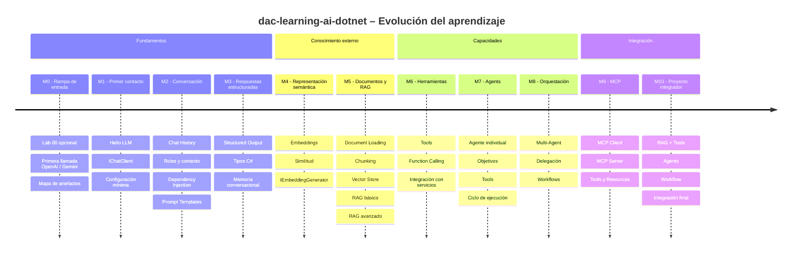
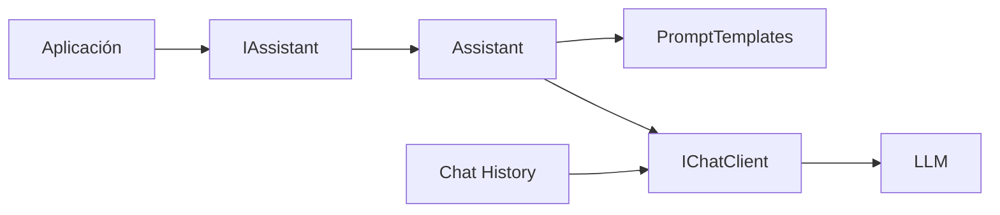
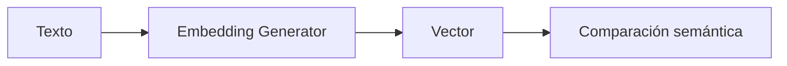
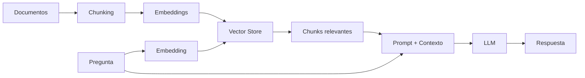
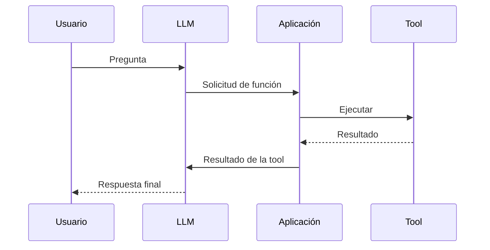
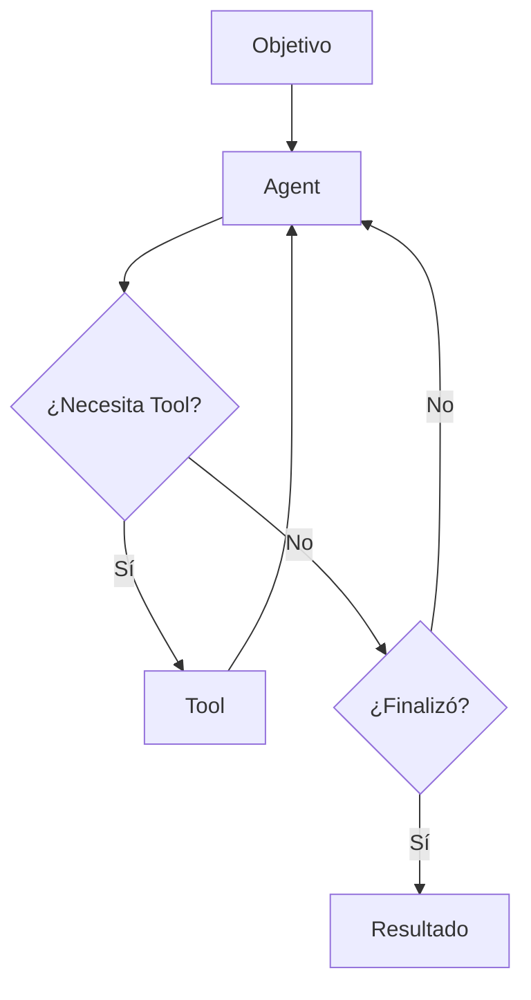
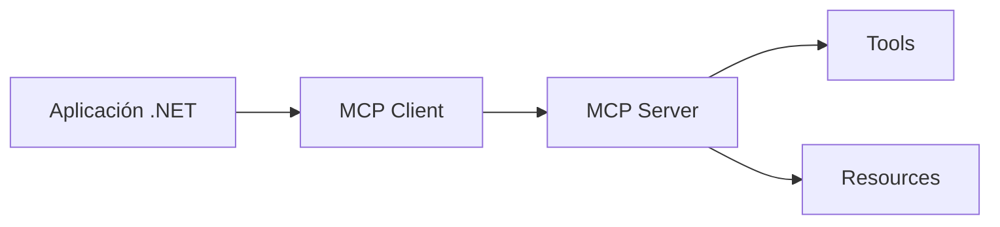
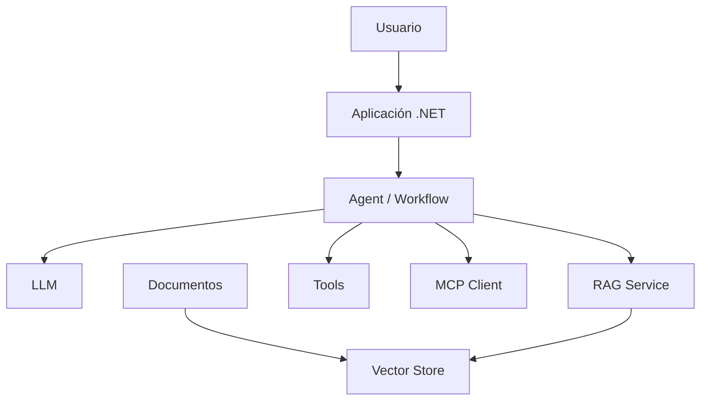

# DAC Learning AI .NET – Roadmap

**Proyecto:** dac-learning-ai-dotnet

> Roadmap de aprendizaje incremental para construir aplicaciones con IA generativa utilizando herramientas y patrones propios del ecosistema .NET.

---

## Visión de evolución



---

## Estado general

| Hito | Tema | Labs | Estado |
|---|---|---:|---|
| M0 | Rampa de entrada y artefactos base | 00 | ✅ Implementado |
| M1 | Primer contacto con LLM | 01 | ✅ Implementado |
| M2 | Conversación, DI y prompts | 02–04 | ✅ Implementado |
| M3 | Structured Output y memoria | 05–06 | ✅ Implementado |
| M4 | Embeddings | 07 | ✅ Implementado |
| M5 | Documentos y RAG | 08–10 | 🚧 En progreso |
| M6 | Tools y Function Calling | 11–12 | ⏳ Pendiente |
| M7 | Agents | 13 | ⏳ Pendiente |
| M8 | Multi-Agent y Workflows | 14–15 | ⏳ Pendiente |
| M9 | MCP | 16 | ⏳ Pendiente |
| M10 | Proyecto integrador | 17 | ⏳ Pendiente |


### Simplificación transversal de configuración

La configuración evoluciona cuando aparece una nueva capacidad, siguiendo KISS. Hasta Lab 06 utilizamos capacidades generativas/chat:

```env
AI_PROVIDER=
AI_MODEL=
AI_API_KEY=
AI_URL=
```

Desde Lab 07 incorporamos embeddings y agregamos `AI_EMBEDDING_MODEL`:

```env
AI_PROVIDER=
AI_MODEL=
AI_EMBEDDING_MODEL=
AI_API_KEY=
AI_URL=
```

Desde Lab 07, `AI_MODEL` identifica el modelo de chat y `AI_EMBEDDING_MODEL` el modelo de embeddings. Lab 08 trabaja offline con documentos locales y no utiliza configuración de IA. Cada laboratorio que llama a modelos requiere los que utiliza; ambos comparten proveedor, credencial y endpoint.

Chat/generación transforma texto en respuestas; embeddings transforma texto en vectores. No todos los modelos soportan ambas capacidades y pertenecer al mismo proveedor no implica que sean el mismo modelo. Esta separación prepara los futuros labs de RAG: recuperación semántica con embeddings y generación de respuestas con contexto.

La configuración concreta debe quedar encapsulada fuera del flujo principal del ejercicio siempre que no sea el tema que se está estudiando.


---

# M0 — Rampa de entrada

**Objetivo:** permitir una primera ejecución exitosa con la menor cantidad posible de código y ofrecer una guía opcional de los artefactos que aparecerán durante Fundamentos.

**Estado:** ✅ Implementado

### Lab 00 — Introducción

| # | Estado | Alcance |
|---|---|---|
| 0.1 | ✅ | Ejecutar una llamada mínima con OpenAI |
| 0.2 | ✅ | Ejecutar una llamada mínima con Gemini |
| 0.3 | ✅ | Identificar proveedor, modelo, cliente, `IChatClient`, prompt y respuesta |
| 0.4 | ✅ | Documentar las abstracciones principales de Fundamentos |
| 0.5 | ✅ | Explicar que Lab 00 es opcional y no forma parte de la progresión obligatoria |

### Criterio pedagógico

Lab 00 prioriza el **primer éxito ejecutable** antes que la configuración correcta de una aplicación real.

Por eso sus dos ejemplos son deliberadamente mínimos y utilizan un placeholder de API key en el propio código.

A partir del Lab 01 la configuración se externaliza.

```text
Lab 00
primera llamada funcionando
        ↓
Lab 01+
organización incremental del código
```

---

# M1 — Primer contacto con un LLM

**Objetivo:** realizar una interacción mínima con un modelo de lenguaje desde .NET.

**Estado:** ✅ Implementado

### Lab 01 — Hello LLM

| # | Estado | Alcance |
|---|---|---|
| 1.1 | ✅ | Crear una aplicación Console mínima |
| 1.2 | ✅ | Configurar acceso al modelo mediante variable de entorno |
| 1.3 | ✅ | Utilizar `IChatClient` como abstracción principal |
| 1.4 | ✅ | Enviar un prompt simple |
| 1.5 | ✅ | Mostrar la respuesta del modelo |
| 1.6 | ✅ | Documentar ejecución desde VS Code Insiders |

### Conceptos incorporados

- cliente de chat;
- prompt;
- respuesta;
- configuración externa;
- separación mínima respecto del proveedor.

### Fuera de alcance

- historial;
- memoria;
- Dependency Injection;
- Semantic Kernel;
- tools;
- RAG.

### Resultado esperado

```text
Prompt
   ↓
IChatClient
   ↓
Modelo
   ↓
Respuesta
```

---

# M2 — Conversación, servicios y prompts

**Objetivo:** evolucionar desde llamadas aisladas hacia una aplicación con contexto conversacional, servicios desacoplados mediante DI y prompts parametrizados.

**Estado:** ✅ Implementado

### Lab 02 — Chat History

| # | Estado | Alcance |
|---|---|---|
| 2.1 | ✅ | Comparar llamadas independientes con una conversación que conserva contexto |
| 2.2 | ✅ | Introducir una colección de `ChatMessage` |
| 2.3 | ✅ | Reenviar el historial completo en cada nuevo turno |
| 2.4 | ✅ | Diferenciar historial conversacional de memoria persistente |

### Lab 03 — Services y Dependency Injection

| # | Estado | Alcance |
|---|---|---|
| 3.1 | ✅ | Incorporar `ServiceCollection` y el contenedor de DI de .NET |
| 3.2 | ✅ | Registrar `IChatClient` y resolverlo mediante inyección por constructor |
| 3.3 | ✅ | Introducir `IAssistant` y su implementación `Assistant` |
| 3.4 | ✅ | Separar creación del cliente, configuración y lógica de aplicación |

### Lab 04 — Prompt Templates

| # | Estado | Alcance |
|---|---|---|
| 4.1 | ✅ | Crear prompts parametrizados |
| 4.2 | ✅ | Extraer la construcción de prompts a `PromptTemplates` |
| 4.3 | ✅ | Reutilizar templates con distintos valores |
| 4.4 | ✅ | Variar instrucciones dinámicamente mediante parámetros como idioma, cantidad de líneas y rol |

### Resultado alcanzado



Al completar M2 ya están incorporados los tres bloques que preparan los siguientes laboratorios:

```text
contexto conversacional
+
servicios desacoplados mediante DI
+
prompts dinámicos reutilizables
```

---

# M3 — Structured Output y memoria

**Objetivo:** dejar de tratar todas las respuestas del modelo como texto libre.

**Estado:** ✅ Implementado

### Lab 05 — Structured Output

| # | Estado | Alcance |
|---|---|---|
| 5.1 | ✅ | Solicitar respuestas estructuradas mediante tipos C# |
| 5.2 | ✅ | Utilizar `GetResponseAsync<T>()` y `ChatResponse<T>` |
| 5.3 | ✅ | Modelar resultados con `Persona`, `Personas` y `Producto` |
| 5.4 | ✅ | Manejar materialización inválida mediante `TryGetResult` |
| 5.5 | ✅ | Utilizar un objeto raíz para colecciones estructuradas |

### Lab 06 — Memoria conversacional avanzada

| # | Estado | Alcance |
|---|---|---|
| 6.1 | ✅ | Aislar conversaciones mediante `sessionId` |
| 6.2 | ✅ | Introducir `IChatMemoryStore` como contrato de almacenamiento |
| 6.3 | ✅ | Implementar `InMemoryChatMemoryStore` con ventana máxima |
| 6.4 | ✅ | Comprobar memoria independiente entre múltiples sesiones |

### Resultado alcanzado

```text
LLM
 ↓
Structured Output
 ↓
Tipo C#
 ↓
Aplicación
```

---

# M4 — Embeddings

**Objetivo:** comprender cómo representar texto de forma semántica y comparar significado.

**Estado:** ✅ Implementado

### Lab 07 — Embeddings

**Estado:** ✅ Implementado

| # | Estado | Alcance |
|---|---|---|
| 7.1 | ✅ | Generar embeddings de una consulta y documentos |
| 7.2 | ✅ | Utilizar `IEmbeddingGenerator` |
| 7.3 | ✅ | Comparar vectores de igual dimensión |
| 7.4 | ✅ | Implementar similitud coseno explícitamente |
| 7.5 | ✅ | Comprobar ranking por cercanía semántica |

### Flujo



---

# M5 — Documentos y RAG

**Objetivo:** incorporar conocimiento externo y construir un pipeline RAG completo.

**Estado:** 🚧 En progreso

### Lab 08 — Document Loading

**Estado:** ✅ Implementado

| # | Estado | Alcance |
|---|---|---|
| 8.1 | ✅ | Leer documentos locales .txt y .md |
| 8.2 | ✅ | Leer contenido como texto plano |
| 8.3 | ✅ | Normalizar saltos de línea y extremos |
| 8.4 | ✅ | Aplicar chunking por caracteres con overlap |
| 8.5 | ✅ | Asociar origen y posición: Source e Index |

### Lab 09 — RAG básico

**Estado:** ✅ Implementado mediante 09a y 09b

El [Lab 09](labs/lab-09-rag-basico/README.md) se divide en dos evoluciones: observar primero el pipeline y después encapsularlo.

#### Lab 09a — RAG explícito

**Estado:** ✅ Implementado

Un único proyecto Console con indexación y consulta visibles en `Program.cs`, sin un servicio RAG de alto nivel.

| # | Estado | Alcance |
|---|---|---|
| 9.1 | ✅ | Generar embeddings de los chunks del documento |
| 9.2 | ✅ | Almacenar vectores asociados a chunks en memoria |
| 9.3 | ✅ | Generar embedding de una consulta |
| 9.4 | ✅ | Recuperar topK chunks por similitud coseno |
| 9.5 | ✅ | Construir contexto y prompt mediante un template |
| 9.6 | ✅ | Generar respuesta basada en contexto recuperado |

#### Lab 09b — RAG con RagService

**Estado:** ✅ Implementado

El [Lab 09b](labs/lab-09-rag-basico/lab-09b-rag-service/README.md) encapsula el mismo pipeline en `IRagService` y `RagService`. Devuelve respuesta y chunks recuperados mediante `RagResponse`, con DI como mecanismo de composición. El store Singleton conserva el índice y el servicio Transient coordina sin almacenar estado propio.

M5 continúa en progreso porque Lab 10 - RAG avanzado sigue pendiente.

### Lab 10 — RAG avanzado

**Estado:** ⏳ Pendiente

| # | Estado | Alcance |
|---|---|---|
| 10.1 | ⏳ | Comparar estrategias de chunking |
| 10.2 | ⏳ | Utilizar `top-k` |
| 10.3 | ⏳ | Aplicar score mínimo |
| 10.4 | ⏳ | Incorporar filtros por metadata |
| 10.5 | ⏳ | Introducir ranking o re-ranking |
| 10.6 | ⏳ | Evaluar calidad de recuperación |

### Arquitectura conceptual



---

# M6 — Tools y Function Calling

**Objetivo:** permitir que el modelo utilice capacidades externas controladas por la aplicación.

**Estado:** ⏳ Pendiente

### Lab 11 — Tools

| # | Estado | Alcance |
|---|---|---|
| 11.1 | ⏳ | Definir una función como herramienta |
| 11.2 | ⏳ | Describir su finalidad |
| 11.3 | ⏳ | Definir parámetros |
| 11.4 | ⏳ | Exponer servicios locales como tools |

### Lab 12 — Function Calling

| # | Estado | Alcance |
|---|---|---|
| 12.1 | ⏳ | Permitir que el modelo seleccione una función |
| 12.2 | ⏳ | Interpretar argumentos |
| 12.3 | ⏳ | Ejecutar la función |
| 12.4 | ⏳ | Devolver el resultado al modelo |
| 12.5 | ⏳ | Generar la respuesta final |



---

# M7 — Agents

**Objetivo:** introducir comportamiento agéntico de forma controlada.

**Estado:** ⏳ Pendiente

### Lab 13 — Agents

| # | Estado | Alcance |
|---|---|---|
| 13.1 | ⏳ | Definir objetivo e instrucciones |
| 13.2 | ⏳ | Asignar tools al agente |
| 13.3 | ⏳ | Ejecutar un ciclo de decisión y acción |
| 13.4 | ⏳ | Establecer condición de finalización |
| 13.5 | ⏳ | Incorporar límites de ejecución |
| 13.6 | ⏳ | Observar las acciones realizadas |



---

# M8 — Multi-Agent y Workflows

**Objetivo:** separar responsabilidades y coordinar múltiples participantes.

**Estado:** ⏳ Pendiente

### Lab 14 — Multi-Agent

| # | Estado | Alcance |
|---|---|---|
| 14.1 | ⏳ | Crear agentes especializados |
| 14.2 | ⏳ | Delegar tareas |
| 14.3 | ⏳ | Compartir o transferir contexto |
| 14.4 | ⏳ | Consolidar resultados |

### Lab 15 — Workflows

| # | Estado | Alcance |
|---|---|---|
| 15.1 | ⏳ | Definir pasos explícitos |
| 15.2 | ⏳ | Incorporar estado |
| 15.3 | ⏳ | Incorporar bifurcaciones |
| 15.4 | ⏳ | Ejecutar pasos secuenciales |
| 15.5 | ⏳ | Evaluar ejecución paralela |
| 15.6 | ⏳ | Integrar agents y funciones dentro del flujo |

### Diferencia conceptual

```text
Agent
  decide parte del camino

Workflow
  define explícitamente el camino
```

---

# M9 — Model Context Protocol

**Objetivo:** comprender cómo conectar herramientas y recursos mediante un protocolo estándar.

**Estado:** ⏳ Pendiente

### Lab 16 — MCP

| # | Estado | Alcance |
|---|---|---|
| 16.1 | ⏳ | Comprender la arquitectura MCP |
| 16.2 | ⏳ | Implementar o utilizar un MCP Client |
| 16.3 | ⏳ | Conectarse a un MCP Server |
| 16.4 | ⏳ | Descubrir tools |
| 16.5 | ⏳ | Consumir resources |
| 16.6 | ⏳ | Ejecutar una tool remota |



---

# M10 — Proyecto integrador

**Objetivo:** integrar los conceptos estudiados en una solución pequeña y comprensible.

**Estado:** ⏳ Pendiente

### Lab 17 — Proyecto final

| # | Estado | Alcance |
|---|---|---|
| 17.1 | ⏳ | Utilizar `IChatClient` |
| 17.2 | ⏳ | Configurar servicios mediante DI |
| 17.3 | ⏳ | Utilizar prompts reutilizables |
| 17.4 | ⏳ | Incorporar structured output |
| 17.5 | ⏳ | Incorporar documentos y embeddings |
| 17.6 | ⏳ | Implementar un flujo RAG |
| 17.7 | ⏳ | Incorporar al menos una tool |
| 17.8 | ⏳ | Utilizar function calling |
| 17.9 | ⏳ | Incorporar al menos un agent |
| 17.10 | ⏳ | Orquestar mediante un workflow |
| 17.11 | ⏳ | Evaluar integración MCP |

### Arquitectura orientativa



---

## Dependencias entre hitos

```mermaid
flowchart LR
    M0[M0<br/>Lab 00 opcional]
    M1[M1<br/>Hello LLM]
    M2[M2<br/>Conversación]
    M3[M3<br/>Structured Output]
    M4[M4<br/>Embeddings]
    M5[M5<br/>RAG]
    M6[M6<br/>Tools]
    M7[M7<br/>Agents]
    M8[M8<br/>Multi-Agent / Workflows]
    M9[M9<br/>MCP]
    M10[M10<br/>Proyecto Final]

    M0 -.-> M1
    M1 --> M2
    M2 --> M3
    M3 --> M4
    M4 --> M5
    M5 --> M6
    M6 --> M7
    M7 --> M8
    M8 --> M9
    M9 --> M10
```



---

## Criterio de finalización de un laboratorio

Un laboratorio se considera completo cuando dispone de:

- [ ] objetivo claro;
- [ ] explicación conceptual;
- [ ] código mínimo ejecutable;
- [ ] instrucciones de ejecución;
- [ ] resultado esperado;
- [ ] README propio;
- [ ] explicación de las piezas principales;
- [ ] commit estable en Git.

---

## Posibles extensiones futuras

Estas líneas quedan deliberadamente fuera del roadmap principal:

- modelos locales con Ollama;
- Azure OpenAI;
- observabilidad;
- evaluación automática de respuestas;
- evaluación de RAG;
- guardrails;
- persistencia avanzada;
- bases vectoriales externas;
- multimodalidad;
- audio;
- visión;
- GraphRAG;
- integración con IDEs.

Se incorporarán como laboratorios adicionales solamente si aportan valor al recorrido principal.
