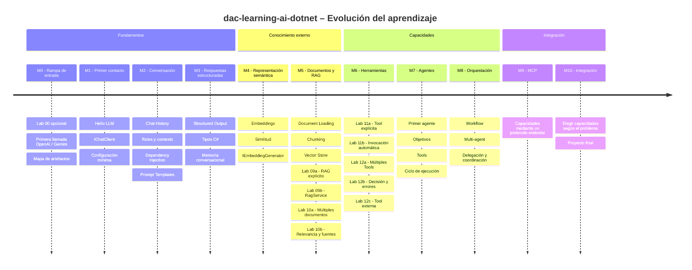
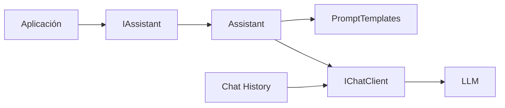
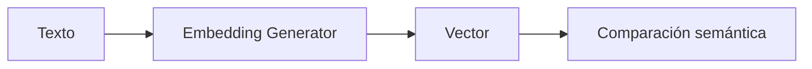
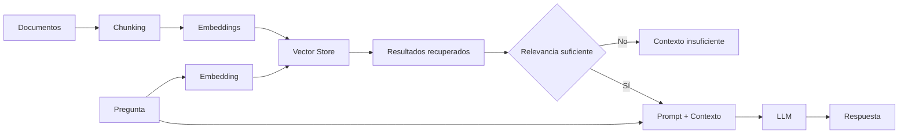
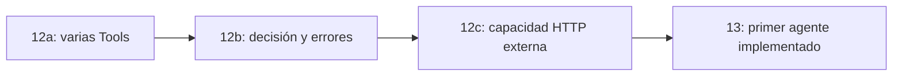
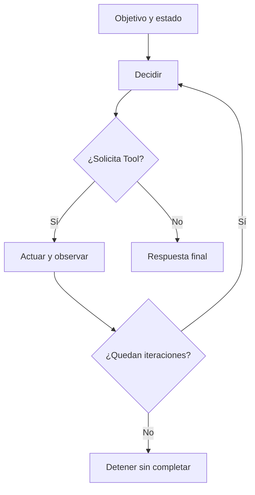
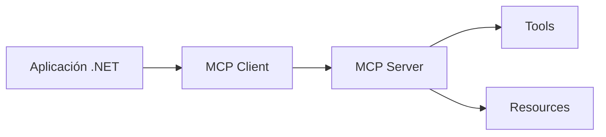

# DAC Learning AI .NET – Roadmap

**Proyecto:** dac-learning-ai-dotnet

> Roadmap de aprendizaje incremental para construir aplicaciones con IA generativa utilizando herramientas y patrones propios del ecosistema .NET.

El recorrido numerado de `labs/` se complementa con [`reference/` — Implementaciones de referencia](reference/README.md), un carril paralelo para aplicar los conceptos con herramientas e infraestructura más cercanas a escenarios reales.

Primero entender, después abstraer y finalmente integrar. Cada paso permite experimentar y observar limitaciones antes de introducir otra capacidad. El [enfoque pedagógico y la evolución del roadmap](docs/04-enfoque-pedagogico-y-evolucion-del-roadmap.md) explican esta maduración del recorrido a partir de los laboratorios implementados.

---

## Visión de evolución



---

## Estado general

| Hito | Tema | Labs | Estado |
|---|---|---:|---|
| M0 | Rampa de entrada y artefactos base | 00 | ✅ Implementado |
| M1 | Primer contacto con LLM | 01 | ✅ Implementado |
| M2 | Conversación, DI y prompts | 02–04 | ✅ Implementado |
| M3 | Structured Output y memoria | 05–06 | ✅ Implementado |
| M4 | Embeddings | 07 | ✅ Implementado |
| M5 | Documentos y RAG | 08–10 | ✅ Implementado |
| M6 | Tools y Function Calling | 11–12 | ✅ Implementado |
| M7 | Primer agente | 13 | ✅ Implementado |
| M8 | Orquestación: Workflow y Multi-agent | 14–15 | ⏳ Pendiente |
| M9 | MCP | 16 | ⏳ Pendiente |
| M10 | Integración consciente | 17 | ⏳ Pendiente |

Los Labs 00–13 están implementados; Labs 09, 10 y 11 comprenden dos sublaboratorios ejecutables e independientes cada uno, y Lab 12 comprende tres. Dentro de M5:

| Laboratorio | Estado |
|---|---|
| [Lab 08 - Document Loading y Chunking](labs/lab-08-document-loading/README.md) | ✅ Implementado |
| [Lab 09a - RAG explícito](labs/lab-09-rag-basico/lab-09a-rag-explicito/README.md) | ✅ Implementado |
| [Lab 09b - RAG con RagService](labs/lab-09-rag-basico/lab-09b-rag-service/README.md) | ✅ Implementado |
| [Lab 10 - Retrieval y calidad](labs/lab-10-retrieval-calidad/README.md) | ✅ Implementado |
| [Lab 10a - Múltiples documentos](labs/lab-10-retrieval-calidad/lab-10a-multiples-documentos/README.md) | ✅ Implementado |
| [Lab 10b - Relevancia, threshold y fuentes](labs/lab-10-retrieval-calidad/lab-10b-relevancia-threshold-fuentes/README.md) | ✅ Implementado |

M5 está implementado: Labs 08, 09a, 09b, 10a y 10b cuentan con proyectos ejecutables y documentación. Lab 11 incorpora una Tool local: 11a muestra el ciclo explícito y 11b delega su coordinación a `FunctionInvokingChatClient`. M6 está implementado: Lab 12a ofrece varias Tools, 12b observa decisión y errores y 12c integra una API HTTP. M7 está implementado: [Lab 13](labs/lab-13-primer-agente/README.md) diagnostica incidentes con tres Tools locales, estado explícito y un máximo de cinco iteraciones. Los Labs 14–17 continúan pendientes. La [validación de Lab 11](labs/lab-11-tools/README.md#validación-y-compatibilidad) documenta el ciclo completo de ambos sublabs con Gemini y la conservación de metadata necesaria en cada caso.


### Simplificación transversal de configuración

La configuración evoluciona cuando aparece una nueva capacidad, siguiendo KISS. Hasta Lab 06 utilizamos capacidades generativas/chat:

```env
AI_PROVIDER=
AI_MODEL=
AI_API_KEY=
AI_URL=
```

Desde Lab 07 incorporamos embeddings y agregamos `AI_EMBEDDING_MODEL`:

```env
AI_PROVIDER=
AI_MODEL=
AI_EMBEDDING_MODEL=
AI_API_KEY=
AI_URL=
```

Desde Lab 07, `AI_MODEL` identifica el modelo de chat y `AI_EMBEDDING_MODEL` el modelo de embeddings. Lab 08 trabaja offline con documentos locales y no utiliza configuración de IA. Cada laboratorio que llama a modelos requiere los que utiliza; ambos comparten proveedor, credencial y endpoint.

Chat/generación transforma texto en respuestas; embeddings transforma texto en vectores. No todos los modelos soportan ambas capacidades y pertenecer al mismo proveedor no implica que sean el mismo modelo. Lab 09a y Lab 09b ya utilizan ambos modelos: embeddings para recuperar fragmentos y chat para generar respuestas con ese contexto.

La configuración concreta debe quedar encapsulada fuera del flujo principal del ejercicio siempre que no sea el tema que se está estudiando.


---

# M0 — Rampa de entrada

**Objetivo:** permitir una primera ejecución exitosa con la menor cantidad posible de código y ofrecer una guía opcional de los artefactos que aparecerán durante Fundamentos.

**Estado:** ✅ Implementado

### Lab 00 — Introducción

| # | Estado | Alcance |
|---|---|---|
| 0.1 | ✅ | Ejecutar una llamada mínima con OpenAI |
| 0.2 | ✅ | Ejecutar una llamada mínima con Gemini |
| 0.3 | ✅ | Identificar proveedor, modelo, cliente, `IChatClient`, prompt y respuesta |
| 0.4 | ✅ | Documentar las abstracciones principales de Fundamentos |
| 0.5 | ✅ | Explicar que Lab 00 es opcional y no forma parte de la progresión obligatoria |

### Criterio pedagógico

Lab 00 prioriza el **primer éxito ejecutable** antes que la configuración correcta de una aplicación real.

Por eso sus dos ejemplos son deliberadamente mínimos y utilizan un placeholder de API key en el propio código.

A partir del Lab 01 la configuración se externaliza.

```text
Lab 00
primera llamada funcionando
        ↓
Lab 01+
organización incremental del código
```

---

# M1 — Primer contacto con un LLM

**Objetivo:** realizar una interacción mínima con un modelo de lenguaje desde .NET.

**Estado:** ✅ Implementado

### Lab 01 — Hello LLM

| # | Estado | Alcance |
|---|---|---|
| 1.1 | ✅ | Crear una aplicación Console mínima |
| 1.2 | ✅ | Configurar acceso al modelo mediante variable de entorno |
| 1.3 | ✅ | Utilizar `IChatClient` como abstracción principal |
| 1.4 | ✅ | Enviar un prompt simple |
| 1.5 | ✅ | Mostrar la respuesta del modelo |
| 1.6 | ✅ | Documentar ejecución desde VS Code Insiders |

### Conceptos incorporados

- cliente de chat;
- prompt;
- respuesta;
- configuración externa;
- separación mínima respecto del proveedor.

### Fuera de alcance

- historial;
- memoria;
- Dependency Injection;
- Semantic Kernel;
- tools;
- RAG.

### Resultado esperado

```text
Prompt
   ↓
IChatClient
   ↓
Modelo
   ↓
Respuesta
```

---

# M2 — Conversación, servicios y prompts

**Objetivo:** evolucionar desde llamadas aisladas hacia una aplicación con contexto conversacional, servicios desacoplados mediante DI y prompts parametrizados.

**Estado:** ✅ Implementado

### Lab 02 — Chat History

| # | Estado | Alcance |
|---|---|---|
| 2.1 | ✅ | Comparar llamadas independientes con una conversación que conserva contexto |
| 2.2 | ✅ | Introducir una colección de `ChatMessage` |
| 2.3 | ✅ | Reenviar el historial completo en cada nuevo turno |
| 2.4 | ✅ | Diferenciar historial conversacional de memoria persistente |

### Lab 03 — Services y Dependency Injection

| # | Estado | Alcance |
|---|---|---|
| 3.1 | ✅ | Incorporar `ServiceCollection` y el contenedor de DI de .NET |
| 3.2 | ✅ | Registrar `IChatClient` y resolverlo mediante inyección por constructor |
| 3.3 | ✅ | Introducir `IAssistant` y su implementación `Assistant` |
| 3.4 | ✅ | Separar creación del cliente, configuración y lógica de aplicación |

### Lab 04 — Prompt Templates

| # | Estado | Alcance |
|---|---|---|
| 4.1 | ✅ | Crear prompts parametrizados |
| 4.2 | ✅ | Extraer la construcción de prompts a `PromptTemplates` |
| 4.3 | ✅ | Reutilizar templates con distintos valores |
| 4.4 | ✅ | Variar instrucciones dinámicamente mediante parámetros como idioma, cantidad de líneas y rol |

### Resultado alcanzado



Al completar M2 ya están incorporados los tres bloques que preparan los siguientes laboratorios:

```text
contexto conversacional
+
servicios desacoplados mediante DI
+
prompts dinámicos reutilizables
```

---

# M3 — Structured Output y memoria

**Objetivo:** dejar de tratar todas las respuestas del modelo como texto libre.

**Estado:** ✅ Implementado

### Lab 05 — Structured Output

| # | Estado | Alcance |
|---|---|---|
| 5.1 | ✅ | Solicitar respuestas estructuradas mediante tipos C# |
| 5.2 | ✅ | Utilizar `GetResponseAsync<T>()` y `ChatResponse<T>` |
| 5.3 | ✅ | Modelar resultados con `Persona`, `Personas` y `Producto` |
| 5.4 | ✅ | Manejar materialización inválida mediante `TryGetResult` |
| 5.5 | ✅ | Utilizar un objeto raíz para colecciones estructuradas |

### Lab 06 — Memoria conversacional avanzada

| # | Estado | Alcance |
|---|---|---|
| 6.1 | ✅ | Aislar conversaciones mediante `sessionId` |
| 6.2 | ✅ | Introducir `IChatMemoryStore` como contrato de almacenamiento |
| 6.3 | ✅ | Implementar `InMemoryChatMemoryStore` con ventana máxima |
| 6.4 | ✅ | Comprobar memoria independiente entre múltiples sesiones |

### Resultado alcanzado

```text
LLM
 ↓
Structured Output
 ↓
Tipo C#
 ↓
Aplicación
```

---

# M4 — Embeddings

**Objetivo:** comprender cómo representar texto de forma semántica y comparar significado.

**Estado:** ✅ Implementado

### Lab 07 — Embeddings

**Estado:** ✅ Implementado

| # | Estado | Alcance |
|---|---|---|
| 7.1 | ✅ | Generar embeddings de una consulta y documentos |
| 7.2 | ✅ | Utilizar `IEmbeddingGenerator` |
| 7.3 | ✅ | Comparar vectores de igual dimensión |
| 7.4 | ✅ | Implementar similitud coseno explícitamente |
| 7.5 | ✅ | Comprobar ranking por cercanía semántica |

### Flujo



---

# M5 — Documentos y RAG

**Objetivo:** preparar documentos, comprender y encapsular un pipeline RAG, y trabajar la calidad de recuperación hasta múltiples documentos, relevancia y fuentes.

**Estado:** ✅ Implementado

### Lab 08 — Document Loading + Chunking

**Estado:** ✅ Implementado

| # | Estado | Alcance |
|---|---|---|
| 8.1 | ✅ | Leer documentos locales .txt y .md |
| 8.2 | ✅ | Leer contenido como texto plano |
| 8.3 | ✅ | Normalizar saltos de línea y extremos |
| 8.4 | ✅ | Aplicar chunking por caracteres con overlap |
| 8.5 | ✅ | Asociar origen y posición: Source e Index |

### Lab 09 — RAG básico

**Estado:** ✅ Implementado mediante 09a y 09b

El [Lab 09](labs/lab-09-rag-basico/README.md) se divide en dos evoluciones: observar primero el pipeline y después encapsularlo.

#### Lab 09a — RAG explícito

**Estado:** ✅ Implementado

El [Lab 09a](labs/lab-09-rag-basico/lab-09a-rag-explicito/README.md) es un proyecto Console con indexación y consulta visibles en `Program.cs`, sin un servicio RAG de alto nivel.

| # | Estado | Alcance |
|---|---|---|
| 9.1 | ✅ | Generar embeddings de los chunks del documento |
| 9.2 | ✅ | Almacenar vectores asociados a chunks en memoria |
| 9.3 | ✅ | Generar embedding de una consulta |
| 9.4 | ✅ | Recuperar topK chunks por similitud coseno |
| 9.5 | ✅ | Construir contexto y prompt mediante un template |
| 9.6 | ✅ | Generar respuesta basada en contexto recuperado |

#### Lab 09b — RAG con RagService

**Estado:** ✅ Implementado

El [Lab 09b](labs/lab-09-rag-basico/lab-09b-rag-service/README.md) encapsula el mismo pipeline en `IRagService` y `RagService`. Devuelve respuesta y chunks recuperados mediante `RagResponse`, con DI como mecanismo de composición. El store Singleton conserva el índice y el servicio Transient coordina sin almacenar estado propio.

| Pieza | Estado | Alcance |
|---|---|---|
| `IRagService` | ✅ | Exponer indexación y consulta mediante `IndexDocumentAsync` y `AskAsync` |
| `RagService` | ✅ | Coordinar el pipeline conocido sin lógica de consola |
| `RagResponse` | ✅ | Devolver respuesta y fragmentos recuperados |
| DI | ✅ | Componer clientes, store Singleton y servicio Transient |
| `Program.cs` | ✅ | Invocar el servicio y presentar fuentes y respuesta |

M5 queda implementado con ambos sublabs de Lab 10, cerrando el bloque introductorio de RAG.

### Lab 10 — Retrieval y calidad

**Estado:** ✅ Implementado

Cerrar el bloque introductorio/intermedio de RAG con un corpus de documentos, una regla experimental de relevancia y fuentes observables. Ambos sublabs están disponibles:

```text
lab-10-retrieval-calidad/
├── lab-10a-multiples-documentos/
└── lab-10b-relevancia-threshold-fuentes/
```

Cada carpeta contiene su proyecto ejecutable, documentos y lecturas opcionales. El corpus y la infraestructura conocida se conservan en ambos ejemplos.

#### Lab 10a — Múltiples documentos

**Estado:** ✅ Implementado

El [Lab 10a](labs/lab-10-retrieval-calidad/lab-10a-multiples-documentos/README.md) pasa de un documento a un corpus: cuatro archivos Markdown → chunks con fuente → embeddings → un único índice en memoria. `Program.cs` mantiene visible la indexación por documento y la consulta sobre todo el corpus.

| # | Estado | Alcance |
|---|---|---|
| 10a.1 | ✅ | Indexar múltiples documentos como un corpus |
| 10a.2 | ✅ | Conservar `Source` y la posición local de cada chunk |
| 10a.3 | ✅ | Recuperar fragmentos desde diferentes fuentes con un único índice en memoria |

#### Lab 10b — Relevancia, threshold y fuentes

**Estado:** ✅ Implementado

El [Lab 10b](labs/lab-10-retrieval-calidad/lab-10b-relevancia-threshold-fuentes/README.md) ejecuta una consulta relacionada y otra ajena al corpus. Muestra candidatos, filtra explícitamente por similitud y evita la llamada generativa si no queda contexto aceptado. Las fuentes se obtienen de los resultados enviados al prompt.

`topK` ya existe en Lab 09: devuelve hasta K resultados, si están disponibles, aunque tengan poca relación con la pregunta. Un límite de cantidad no garantiza relevancia.

| # | Estado | Alcance |
|---|---|---|
| 10b.1 | ✅ | Observar resultados poco relevantes aun siendo los mejores del índice |
| 10b.2 | ✅ | Introducir `minimumSimilarity` y comprobarlo empíricamente con las dos preguntas |
| 10b.3 | ✅ | Informar que no hay contexto suficiente y omitir generación si ningún fragmento alcanza el umbral |
| 10b.4 | ✅ | Construir contexto con resultados aceptados y mostrar sus fuentes junto con la respuesta |

El flujo es pregunta → retrieval → comprobar relevancia → informar contexto insuficiente o construir contexto y llamar al LLM. `minimumSimilarity = 0.70` es experimental y permitió separar ambos casos con `gemini-embedding-001`. No es universal ni un porcentaje: depende del modelo, corpus, preguntas, chunking, distribución de scores y dominio.

El bloque recorre embeddings, document loading, chunking, RAG explícito, `RagService`, múltiples documentos, retrieval, relevancia y fuentes. Es una base práctica; las técnicas de mayor complejidad quedan en las extensiones futuras.

### Arquitectura conceptual



El control de relevancia está implementado en Lab 10b; Lab 09 conserva recuperación por `topK` y generación con contexto sin ese filtro.

---

# M6 — Tools y Function Calling

**Objetivo:** comprender una solicitud de tool y después la selección entre varias herramientas, con ejecución controlada por la aplicación.

**Estado:** ✅ Implementado

### Lab 11 — Tools

**Estado:** ✅ Implementado

Una tool representa una operación de código .NET. El modelo solicita su ejecución mediante function calling; la aplicación interpreta los argumentos, ejecuta la función y devuelve el resultado. El modelo no ejecuta el código por sí mismo.

[Lab 11](labs/lab-11-tools/README.md) comprende dos experiencias con `CalcularTotalConIva` y la misma pregunta. Primero entendemos el mecanismo y después utilizamos una abstracción existente para coordinarlo.

| Sublaboratorio | Alcance | Estado |
|---|---|---|
| [11a - Primer Tool explícito](labs/lab-11-tools/lab-11a-tool-explicita/README.md) | Solicitud, argumentos, ejecución, Function Result y continuación visibles | ✅ Implementado |
| [11b - Invocación automática de Tools](labs/lab-11-tools/lab-11b-tool-invocation/README.md) | El mismo ejercicio con `ChatClientBuilder.UseFunctionInvocation()` | ✅ Implementado |

Ambos compilan con .NET 10 y completaron el ciclo con Gemini: .NET obtuvo `1210` y el modelo devolvió la respuesta final. Gemini hizo visible la necesidad de preservar metadata nativa al continuar. Ambos sublabs conservan la representación recibida del SDK OpenAI sin condiciones por proveedor: explícitamente en 11a y en el cliente base en 11b. Otro SDK puede requerir otro tratamiento. La invocación automática continúa a cargo de `FunctionInvokingChatClient`.

| # | Estado | Alcance |
|---|---|---|
| 11.1 | ✅ | Exponer una función pequeña como tool y describir su finalidad |
| 11.2 | ✅ | Observar la solicitud de function calling y sus argumentos |
| 11.3 | ✅ | Ejecutar código .NET y devolver su resultado al modelo |
| 11.4 | ✅ | Obtener una respuesta final y distinguir la solicitud del modelo de la ejecución real |
| 11.5 | ✅ | Automatizar la invocación con `FunctionInvokingChatClient` en 11b |
| 11.6 | ✅ | Comparar responsabilidades entre el ciclo explícito y su abstracción |

### Lab 12 — Function Calling

**Estado:** ✅ Implementado

[Lab 12](labs/lab-12-function-calling/README.md) continúa desde 11b sin volver al ciclo manual. La aplicación ofrece capacidades; el modelo solicita su uso y el código se ejecuta en .NET.

| Sublaboratorio | Alcance | Estado |
|---|---|---|
| [12a - Múltiples Tools](labs/lab-12-function-calling/lab-12a-multiples-tools/README.md) | IVA, descuento y temperatura disponibles simultáneamente | ✅ Implementado |
| [12b - Decisión y errores](labs/lab-12-function-calling/lab-12b-decision-y-errores/README.md) | Respuesta sin Tool y excepción de validación | ✅ Implementado |
| [12c - Tool externa](labs/lab-12-function-calling/lab-12c-tool-externa/README.md) | Consulta HTTP de países y errores mínimos | ✅ Implementado |

Los tres compilan con .NET 10 y completaron la ejecución real con Gemini. En 12a se observaron tres selecciones y cálculos; en 12b, respuesta directa y rechazo de un descuento del 150%. El framework devolvió el error al modelo con `IncludeDetailedErrors`. En 12c se verificaron HTTP 200 para Argentina y Uruguay y HTTP 404 para un país inexistente.

12c utiliza `countries.dev` sin autenticación adicional: el endpoint antiguo de REST Countries informó que estaba retirado. Se consulta nombre, capital, región y población publicada; no se presenta esa población como un conteo en tiempo real.

| # | Estado | Alcance |
|---|---|---|
| 12.1 | ✅ | Ofrecer varias Tools con finalidades y argumentos claros |
| 12.2 | ✅ | Observar cuál se solicita y cuándo no hace falta ninguna |
| 12.3 | ✅ | Conservar argumentos solicitados y validar invariantes de la función |
| 12.4 | ✅ | Comprobar cómo el framework devuelve un error de Tool al modelo |
| 12.5 | ✅ | Diferenciar Tool Calling de un agente orientado a un objetivo |
| 12.6 | ✅ | Contrastar una Tool local con otra que encapsula HTTP |



Tener Tools, incluso externas, no implementa un agente ni MCP. Lab 13 ya implementa decisiones sucesivas hacia un objetivo con estado y límites, sin MCP.

---

# M7 — Agentes

**Objetivo:** introducir un agente pequeño con objetivo, herramientas, estado/contexto y decisiones iterativas controladas.

**Estado:** ✅ Implementado

### Lab 13 — Primer agente

**Estado:** ✅ Implementado

Tool calling es una capacidad; un agente coordina decisiones y acciones hacia un objetivo. [Lab 13](labs/lab-13-primer-agente/README.md) usa el dominio de incidentes: consulta estado, busca una recomendación o registra un caso local según lo observado. El loop de Program conserva AgentState y limita a cinco decisiones, incluida la respuesta final. Function Calling sigue abstraído con UseFunctionInvocation y FunctionInvocationContext.Terminate devuelve el control después de una acción. Los tres escenarios completaron 2, 3 y 4 iteraciones con Gemini; esas decisiones no son garantías universales.

| # | Estado | Alcance |
|---|---|---|
| 13.1 | ✅ | Definir objetivo e instrucciones |
| 13.2 | ✅ | Asignar tools al agente |
| 13.3 | ✅ | Mantener estado/contexto y ejecutar un ciclo de decisión y acción |
| 13.4 | ✅ | Establecer condición de finalización |
| 13.5 | ✅ | Incorporar límites de ejecución |
| 13.6 | ✅ | Observar las acciones realizadas |



---

# M8 — Orquestación

**Objetivo:** estudiar primero un proceso explícito y después la coordinación entre pocos agentes, eligiendo la alternativa que aporte valor.

**Orientación tecnológica futura:** Microsoft Agent Framework será el framework principal a considerar para workflows y coordinación agéntica. El diseño deberá mantener visibles pasos, decisiones y responsabilidades; se elegirán APIs y alcance al implementar, sin agregar agentes a un proceso que no los necesita.

**Estado:** ⏳ Pendiente

### Lab 14 — Workflow

**Estado:** ⏳ Pendiente

Un proceso conocido puede resolverse con pasos y bifurcaciones controlados por la aplicación. Su estructura puede ser determinista aunque incluya llamadas a modelos. Workflow y agente son conceptos distintos.

| # | Estado | Alcance |
|---|---|---|
| 14.1 | ⏳ | Definir una secuencia explícita de pasos |
| 14.2 | ⏳ | Pasar resultados de un paso al siguiente |
| 14.3 | ⏳ | Incorporar una decisión y bifurcaciones visibles |
| 14.4 | ⏳ | Justificar cuándo un workflow es suficiente sin incorporar un agente |

### Lab 15 — Multi-agent

**Estado:** ⏳ Pendiente

Introducir especialización, delegación y coordinación después de conocer tools, agentes y workflows. Usar pocos agentes y observar qué aporta la separación: más agentes no implica una mejor solución.

Se considerarán las capacidades de delegación, handoff y orquestación de Microsoft Agent Framework cuando resuelvan el caso didáctico. No se fijan todavía APIs ni se amplía el alcance a todos esos patrones.

| # | Estado | Alcance |
|---|---|---|
| 15.1 | ⏳ | Definir responsabilidades para pocos agentes especializados |
| 15.2 | ⏳ | Delegar tareas desde un coordinador |
| 15.3 | ⏳ | Intercambiar y consolidar resultados |
| 15.4 | ⏳ | Evaluar si la coordinación agrega valor frente a una solución más simple |

### Diferencia conceptual

```text
Tool
  expone una operación ejecutada por la aplicación

Agente
  decide acciones iterativamente hacia un objetivo

Workflow
  sigue pasos y bifurcaciones definidos por la aplicación
```

---

# M9 — Model Context Protocol

**Objetivo:** comprender cómo exponer y consumir capacidades mediante un protocolo estándar, después de conocer tools y agentes.

**Estado:** ⏳ Pendiente

### Lab 16 — MCP

**Estado:** ⏳ Pendiente

Hasta aquí las herramientas se integran en nuestra aplicación. MCP aparece para estudiar cómo compartir y consumir capacidades mediante un protocolo estándar. Consumir un servidor y crear un servidor mínimo son posibilidades; la estructura de sublabs se definirá al diseñar el laboratorio.

| # | Estado | Alcance |
|---|---|---|
| 16.1 | ⏳ | Comprender la arquitectura MCP |
| 16.2 | ⏳ | Reconocer los roles de cliente y servidor |
| 16.3 | ⏳ | Diseñar un ejercicio mínimo para exponer y consumir capacidades |
| 16.4 | ⏳ | Observar descubrimiento e invocación de una tool mediante el protocolo |



---

# M10 — Integración

**Objetivo:** elegir e integrar conscientemente las capacidades necesarias para resolver un problema pequeño.

**Estado:** ⏳ Pendiente

### Lab 17 — Proyecto final

**Estado:** ⏳ Pendiente

El desafío debe permitir justificar qué usar y qué dejar afuera. Según el problema, puede hacer falta RAG, una tool, un workflow, un agente o MCP. Ninguna de esas capacidades es obligatoria por haber sido estudiada.

| # | Estado | Alcance |
|---|---|---|
| 17.1 | ⏳ | Definir el problema y criterios de aceptación observables |
| 17.2 | ⏳ | Justificar qué capacidades aportan valor y cuáles no hacen falta |
| 17.3 | ⏳ | Elegir herramientas, workflow o agente según la necesidad |
| 17.4 | ⏳ | Evaluar RAG si se necesita conocimiento documental y MCP si aporta interoperabilidad |
| 17.5 | ⏳ | Implementar una solución mínima y verificarla con casos concretos |
| 17.6 | ⏳ | Documentar decisiones, resultados y limitaciones |

### Decisión antes de integrar

```text
problema concreto
    ↓
capacidades justificadas
    ↓
solución mínima
    ↓
validación y límites
```

---

## Implementaciones de referencia

En paralelo al recorrido incremental de Labs, el proyecto incorpora un carril de implementaciones aplicadas. Pueden desarrollarse cuando el bloque conceptual correspondiente tenga suficiente madurez, sin esperar a finalizar todos los laboratorios.

No forman parte de la secuencia numerada ni agregan milestones. [RAG con Vector Store real](reference/rag-vector-store/README.md) y [RAG Hybrid Search + BM25](reference/rag-hybrid-search/README.md) están implementadas y validadas con Qdrant. RAG Semantic Chunking y el agente con Microsoft Agent Framework continúan planificados, sin carpetas creadas.

| Implementación / candidata | Ruta | Problema que resuelve o abordará | Estado |
|---|---|---|---|
| RAG con Vector Store real | [`reference/rag-vector-store/`](reference/rag-vector-store/README.md) | Reemplazar `InMemoryVectorStore` y búsqueda lineal por Qdrant persistente con Microsoft.Extensions.AI y Microsoft.Extensions.VectorData | ✅ Implementada |
| RAG Hybrid Search + BM25 | [`reference/rag-hybrid-search/`](reference/rag-hybrid-search/README.md) | Combinar Qdrant dense y Lucene.NET BM25 mediante RRF propio, filtros nativos y contexto para RAG | ✅ Implementada |
| RAG Semantic Chunking | `reference/rag-semantic-chunking/` | Estudiar cómo la construcción de chunks afecta la recuperación | ⏳ Planificada |
| Agente con Microsoft Agent Framework | `reference/agent-framework/` | Retomar incidentes de Lab 13 y delegar infraestructura agéntica después de comprender el Agent Loop | ⏳ Planificada |

Microsoft.Extensions.AI mantiene las abstracciones base. Microsoft.Extensions.VectorData aporta la infraestructura de acceso vectorial. Microsoft Agent Framework es el framework objetivo para nuevos escenarios agénticos, después del Agent Loop explícito de Lab 13; lo complementa sin migrar ese laboratorio. El carril RAG evoluciona de Vector Store real → Hybrid Search → Semantic Chunking; la referencia agéntica conserva su planificación independiente.

La primera referencia utiliza Qdrant, con ingesta/consulta separadas, embeddings explícitos, metadata, fuentes y tests unitarios. Se verificaron dos ingestas sin duplicados y consulta después de recrear el contenedor conservando el volumen. Las [reglas del carril](reference/README.md#documentación-obligatoria-de-cada-implementación) exigen explicar el problema, conocimientos previos, arquitectura, dependencias, preparación del entorno, configuración, ejecución y limitaciones.

Hybrid Search delega BM25 e índice invertido persistente a Lucene.NET, mantiene Qdrant dense y RRF propio, tres modos comparables y filtros nativos antes del topK. Lucene.NET 4.8.0-beta00018 es prerelease; se verificó con .NET 10. Incluye ingesta dual, respuestas RAG, unit tests sin servicios externos, integración local Lucene e integración Qdrant/Hybrid. Todas las referencias deben incluir `docs/`, Mermaid, fuentes oficiales, comentarios pedagógicos y tests, sin sobrearquitectura ni sustituciones artesanales de infraestructura por el tamaño del corpus.

## Dependencias entre hitos

```mermaid
flowchart LR
    M0[M0<br/>Lab 00 opcional]
    M1[M1<br/>Hello LLM]
    M2[M2<br/>Conversación]
    M3[M3<br/>Structured Output]
    M4[M4<br/>Embeddings]
    M5[M5<br/>RAG]
    M6[M6<br/>Tools]
    M7[M7<br/>Primer agente]
    M8[M8<br/>Workflow / Multi-agent]
    M9[M9<br/>MCP]
    M10[M10<br/>Proyecto Final]

    M0 -.-> M1
    M1 --> M2
    M2 --> M3
    M3 --> M4
    M4 --> M5
    M5 --> M6
    M6 --> M7
    M7 --> M8
    M8 --> M9
    M9 --> M10
```



---

## Criterio de finalización de un laboratorio

Un laboratorio se considera completo cuando dispone de:

- [ ] objetivo claro;
- [ ] explicación conceptual;
- [ ] código mínimo ejecutable;
- [ ] instrucciones de ejecución;
- [ ] resultado esperado;
- [ ] README propio;
- [ ] explicación de las piezas principales;
- [ ] commit estable en Git.

---

## Posibles extensiones futuras

Son áreas de profundización fuera de los Labs 00–17, sin numeración ni estructura definitiva. La base del recorrido permitirá estudiarlas con más contexto; esta lista permanece abierta.

### Extensión - RAG avanzado

Posibles temas:

- filtros por metadata y técnicas de recuperación sobre bases vectoriales reales;
- hybrid search y BM25;
- re-ranking, query rewriting y multi-query;
- chunking semántico;
- evaluación de retrieval y de respuestas;
- observabilidad y citaciones avanzadas.

### Otras líneas posibles

- Agents avanzado;
- MCP avanzado;
- evaluación y observabilidad;

- modelos locales con Ollama;
- Azure OpenAI;
- guardrails;
- persistencia avanzada;
- multimodalidad;
- audio;
- visión;
- GraphRAG;
- integración con IDEs.

La primera aplicación de infraestructura vectorial ya está implementada en `reference/`; no hace falta esperar una serie de RAG avanzado para estudiar su aporte. Las extensiones podrán profundizar después en técnicas más complejas.

Estas posibilidades podrán tomar forma como series específicas si aportan valor. El [documento de enfoque pedagógico](docs/04-enfoque-pedagogico-y-evolucion-del-roadmap.md) explica por qué se separan del recorrido principal.
