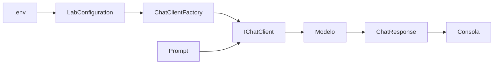

# Lab 01 - Hello LLM

## Objetivo

Realizar la primera llamada a un modelo de lenguaje desde una aplicación de consola .NET.

La pregunta que guía el laboratorio es muy simple:

> ¿Cuál es el mínimo necesario para enviar un prompt a un LLM desde C# y obtener una respuesta?

El foco está en este flujo:

```text
prompt
  ↓
IChatClient
  ↓
modelo
  ↓
respuesta
```

Todavía no trabajamos con memoria, Dependency Injection, Prompt Templates, Structured Output, tools, agentes ni RAG.

---

## Antes de empezar

Si querés ver primero una llamada todavía más mínima, sin configuración externa ni clases auxiliares, revisá el **Lab 00**.

El Lab 01 da el siguiente paso: conserva un código principal pequeño, pero ya separa la configuración y la creación del cliente.

---

## Stack

- .NET 10
- C#
- Visual Studio Code Insiders
- `Microsoft.Extensions.AI`
- `Microsoft.Extensions.AI.OpenAI`
- OpenAI, Gemini u OpenRouter mediante una configuración común

La aplicación trabaja con:

```csharp
IChatClient
```

como abstracción común.

---

## Estructura

```text
lab-01-hello-llm/
├── docs/
│   ├── 01-lab-configuration.md
│   ├── 02-chat-client-factory.md
│   └── 03-lab-console.md
├── Lab01.HelloLlm.csproj
├── LabConfiguration.cs
├── ChatClientFactory.cs
├── LabConsole.cs
├── Program.cs
└── README.md
```

Las clases auxiliares existen para sacar del `Program.cs` código necesario para ejecutar el laboratorio, pero que no forma parte del concepto principal.

---

## Configuración común

El laboratorio utiliza el `.env` ubicado en la raíz del repositorio.

```text
dac-learning-ai-dotnet/
├── .env
├── .env.example
└── labs/
    └── lab-01-hello-llm/
```

La configuración tiene solamente cuatro variables:

```env
AI_PROVIDER=gemini
AI_MODEL=gemini-3.5-flash-lite
AI_API_KEY=tu-api-key
AI_URL=https://generativelanguage.googleapis.com/v1beta/openai/
```

### Variables

| Variable | Obligatoria | Objetivo |
|---|---:|---|
| `AI_PROVIDER` | Sí | Identifica el proveedor activo |
| `AI_MODEL` | Sí | Modelo que se utilizará |
| `AI_API_KEY` | Sí | Credencial de acceso |
| `AI_URL` | No | Endpoint alternativo cuando el proveedor lo requiere |

No existen modelos por defecto escondidos en el código.

El modelo utilizado queda visible en el `.env`.

---

## Ejemplos de configuración

### Gemini

```env
AI_PROVIDER=gemini
AI_MODEL=gemini-3.5-flash-lite
AI_API_KEY=tu-api-key
AI_URL=https://generativelanguage.googleapis.com/v1beta/openai/
```

### OpenAI

```env
AI_PROVIDER=openai
AI_MODEL=gpt-4o-mini
AI_API_KEY=tu-api-key
AI_URL=
```

### OpenRouter

```env
AI_PROVIDER=openrouter
AI_MODEL=openrouter/free
AI_API_KEY=tu-api-key
AI_URL=https://openrouter.ai/api/v1
```

Para cambiar de proveedor alcanza con cambiar la configuración activa.

---

## Ejecutar

Desde la raíz del repositorio:

```powershell
cd labs\lab-01-hello-llm
dotnet restore
dotnet run
```

Una salida aproximada será:

```text
Proveedor: gemini
Modelo: gemini-3.5-flash-lite
Prompt: Explica en una sola oración qué es un modelo de lenguaje.

Respuesta:
Un modelo de lenguaje es ...
```

La respuesta exacta puede variar.

---

## El código que importa

El flujo principal de `Program.cs` queda reducido a pocas operaciones:

```csharp
IChatClient chatClient =
    ChatClientFactory.Create(configuration);

const string prompt =
    "Explica en una sola oración qué es un modelo de lenguaje.";

ChatResponse response =
    await chatClient.GetResponseAsync(prompt);

LabConsole.WriteResponse(response.Text);
```

El concepto central está a la vista:

```text
crear cliente
     ↓
definir prompt
     ↓
enviar
     ↓
recibir respuesta
```

---

## Flujo de ejecución



El diagrama muestra dos caminos que se unen:

- `.env` prepara el cliente;
- el `prompt` representa la operación que queremos aprender.

Una vez creado `IChatClient`, el resto del laboratorio ya no necesita conocer detalles del proveedor.

---

## ¿Por qué hay clases auxiliares?

`Program.cs` podría contener toda la configuración, validación y construcción del cliente.

No lo hacemos porque ese código es **necesario para ejecutar**, pero no es el objetivo pedagógico del Lab 01.

La separación busca distinguir:

```text
código que queremos estudiar
          de
código que permite ejecutar el ejemplo
```

---

## Lecturas opcionales

No necesitás leer estos documentos para completar el laboratorio.

Están disponibles para quien quiera entender qué esconden las clases auxiliares:

- [`LabConfiguration`: carga y validación de configuración](docs/01-lab-configuration.md)
- [`ChatClientFactory`: creación del `IChatClient`](docs/02-chat-client-factory.md)

Podés ignorarlos inicialmente y volver cuando alguna de esas piezas te genere curiosidad.

---

## ¿Por qué `IChatClient`?

`IChatClient` evita que el código que consume el modelo dependa directamente de un cliente concreto.

Después de crear el cliente, el código principal utiliza siempre:

```csharp
await chatClient.GetResponseAsync(prompt);
```

El objetivo pedagógico es que la interacción con el modelo se mantenga igual aunque cambie la configuración.

---

## Qué NO hace todavía este laboratorio

No existe todavía una conversación.

Cada solicitud es:

```text
prompt → modelo → respuesta
```

No hay:

- historial;
- memoria;
- servicios de aplicación;
- Dependency Injection;
- Prompt Templates;
- Structured Output;
- embeddings;
- RAG.

Esos conceptos aparecerán progresivamente en los siguientes laboratorios.

---

## Resultado esperado

Al finalizar deberías poder explicar:

1. qué representa `IChatClient`;
2. qué representa un prompt;
3. cómo se envía un prompt al modelo;
4. qué es `ChatResponse`;
5. dónde se encuentra el texto devuelto;
6. por qué la configuración del proveedor no necesita ocupar el código principal.

---

## Siguiente laboratorio

**Lab 02 - Chat History**

El siguiente paso será comprobar qué ocurre cuando necesitamos conservar el contexto entre varios mensajes.
