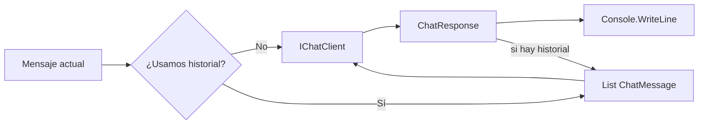

# Lab 02 - Chat History

## Objetivo

Comprender la diferencia entre:

```text
llamadas independientes
```

y:

```text
una conversación que reenvía su historial
```

Vamos a utilizar exactamente los mismos mensajes en ambos casos:

```text
Mi nombre es Daniel
¿Cómo me llamo?
```

La diferencia estará únicamente en el contexto enviado al modelo.

---

## Antes de empezar

El Lab 01 mostró una llamada simple:

```text
prompt → modelo → respuesta
```

En este laboratorio damos el siguiente paso:

```text
varios mensajes → historial → modelo
```

La configuración y la creación del cliente siguen separadas del concepto principal.

---

## Estructura

```text
lab-02-chat-history/
├── docs/
│   ├── 01-lab-configuration.md
│   └── 02-chat-client-factory.md
├── ChatClientFactory.cs
├── LabConfiguration.cs
├── Lab02.ChatHistory.csproj
├── Program.cs
├── Program.cs.mmd
└── README.md
```

Las clases auxiliares permiten que `Program.cs` se concentre en lo que queremos observar:

```text
sin historial
vs
con historial
```

---

## Configuración

El laboratorio utiliza el `.env` común ubicado en la raíz del repositorio:

```env
AI_PROVIDER=gemini
AI_MODEL=gemini-3.5-flash-lite
AI_API_KEY=tu-api-key
AI_URL=https://generativelanguage.googleapis.com/v1beta/openai/
```

### Variables

| Variable | Obligatoria | Objetivo |
|---|---:|---|
| `AI_PROVIDER` | Sí | Identifica el proveedor activo |
| `AI_MODEL` | Sí | Modelo utilizado |
| `AI_API_KEY` | Sí | Credencial de acceso |
| `AI_URL` | No | Endpoint alternativo |

No existen modelos por defecto escondidos en el código.

Si `AI_URL` está vacío, se utiliza el endpoint estándar del cliente.

---

# Caso 1 - Sin historial

Primero hacemos dos llamadas independientes.

```csharp
ChatResponse r1 =
    await chatClient.GetResponseAsync(firstMessage);

ChatResponse r2 =
    await chatClient.GetResponseAsync(secondMessage);
```

La segunda llamada recibe solamente:

```text
¿Cómo me llamo?
```

No recibe el mensaje anterior.

Conceptualmente:

```text
Mi nombre es Daniel
        ↓
      modelo
        ↓
    respuesta


¿Cómo me llamo?
        ↓
      modelo
        ↓
    respuesta
```

Por eso el modelo no dispone del dato `"Daniel"` en la segunda llamada.

---

# Caso 2 - Con historial

Ahora creamos:

```csharp
List<ChatMessage> history = [];
```

y agregamos los mensajes a esa colección.

Primer mensaje:

```csharp
history.Add(
    new ChatMessage(
        ChatRole.User,
        firstMessage));
```

Luego enviamos el historial completo:

```csharp
ChatResponse response =
    await chatClient.GetResponseAsync(history);
```

La respuesta también se incorpora al historial:

```csharp
foreach (ChatMessage responseMessage in response.Messages)
{
    history.Add(responseMessage);
}
```

Cuando llega la siguiente pregunta:

```text
¿Cómo me llamo?
```

el modelo recibe algo equivalente a:

```text
Usuario: Mi nombre es Daniel
Asistente: ...
Usuario: ¿Cómo me llamo?
```

Ahora sí dispone del contexto anterior.

---

## Flujo de ejecución



La idea importante es sencilla:

```text
sin historial
    ↓
solo se envía el mensaje actual

con historial
    ↓
se envían también los mensajes anteriores
```

---

## El código que importa

### Sin historial

```csharp
ChatResponse r1 =
    await chatClient.GetResponseAsync(firstMessage);

ChatResponse r2 =
    await chatClient.GetResponseAsync(secondMessage);
```

### Con historial

```csharp
List<ChatMessage> history = [];

history.Add(
    new ChatMessage(ChatRole.User, firstMessage));

ChatResponse response =
    await chatClient.GetResponseAsync(history);

foreach (ChatMessage responseMessage in response.Messages)
{
    history.Add(responseMessage);
}
```

Todo el resto existe para poder ejecutar y visualizar el ejemplo.

---

## Ejecutar

Desde:

```powershell
cd labs\lab-02-chat-history
```

ejecutar:

```powershell
dotnet restore
dotnet run
```

Una salida típica será:

```text
Proveedor: gemini
Modelo: gemini-3.5-flash-lite

=== SIN MEMORIA ===
Usuario: Mi nombre es Daniel
Asistente: ¡Mucho gusto, Daniel!

Usuario: ¿Cómo me llamo?
Asistente: No tengo forma de saber tu nombre.

=== CON MEMORIA ===
Usuario: Mi nombre es Daniel
Asistente: ¡Mucho gusto, Daniel!

Usuario: ¿Cómo me llamo?
Asistente: Te llamas Daniel.
```

La redacción exacta depende del modelo.

El resultado importante es:

```text
sin historial → no conoce el nombre
con historial → conoce el nombre
```

---

## Un detalle importante: el modelo no recuerda

Aunque la salida del programa diga:

```text
CON MEMORIA
```

el modelo no está conservando por sí mismo el estado de nuestra aplicación.

Es nuestra aplicación la que vuelve a enviar:

```text
mensajes anteriores
+
mensaje actual
```

en cada llamada.

Por eso, en este punto, es más preciso pensar en:

```text
historial conversacional
```

que en memoria persistente.

La memoria más avanzada aparecerá más adelante.

---

## `ChatMessage`

`ChatMessage` representa un mensaje dentro de una conversación.

En este laboratorio utilizamos:

```csharp
new ChatMessage(
    ChatRole.User,
    firstMessage)
```

donde:

```text
ChatRole.User
```

indica que el mensaje pertenece al usuario.

Las respuestas recibidas mediante:

```csharp
response.Messages
```

también se guardan para que puedan formar parte del siguiente contexto.

---

## Lecturas opcionales

No necesitás leer estos documentos para comprender el objetivo del Lab 02.

Están disponibles para quien quiera revisar la infraestructura reutilizada:

- [`LabConfiguration`: carga y validación de configuración](docs/01-lab-configuration.md)
- [`ChatClientFactory`: creación de `IChatClient`](docs/02-chat-client-factory.md)

El concepto nuevo de este laboratorio está directamente en `Program.cs`.

---

## Qué NO hacemos todavía

No incorporamos:

- Dependency Injection;
- servicios propios;
- persistencia;
- límite de ventana;
- resumen de conversaciones;
- memoria por sesión;
- RAG;
- tools.

La lista:

```csharp
List<ChatMessage>
```

vive únicamente durante la ejecución actual del programa.

---

## Resultado esperado

Al finalizar deberías poder explicar:

1. por qué dos llamadas independientes no comparten contexto;
2. qué representa `List<ChatMessage>`;
3. qué representa `ChatMessage`;
4. por qué guardamos también las respuestas del asistente;
5. por qué el modelo conoce el nombre en el segundo caso;
6. por qué el historial pertenece a la aplicación y no al modelo.

---

## Siguiente laboratorio

**Lab 03 - Services y Dependency Injection**

Después de comprender explícitamente cómo se maneja el historial, el siguiente paso será separar responsabilidades y comenzar a utilizar servicios e inyección de dependencias.
