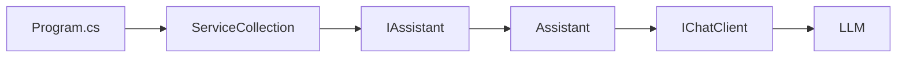

# Lab 03 - Services y Dependency Injection

## Objetivo

Separar el código que **usa capacidades de IA** del código que **crea y configura el cliente del proveedor**.

Hasta ahora, en los primeros laboratorios, `Program.cs` hacía casi todo:

```text
leer configuración
crear cliente
construir mensajes
llamar al modelo
mostrar resultado
```

En este laboratorio empezamos a repartir responsabilidades.

La estructura principal será:

```text
Program.cs
   ↓
IAssistant
   ↓
Assistant
   ↓
IChatClient
```

y utilizaremos el contenedor de Dependency Injection de .NET para construir las dependencias.

---

## El ejercicio

El servicio ofrece tres operaciones:

```text
chat
traducir
resumir
```

Desde `Program.cs` queremos poder escribir:

```csharp
await assistant.ChatAsync(...);
await assistant.TraducirAsync(...);
await assistant.ResumirAsync(...);
```

sin preocuparnos en ese punto por:

- qué proveedor se está usando;
- qué modelo está configurado;
- cómo se crea `IChatClient`;
- cómo se arma el prompt interno de cada operación.

---

## 1. La interfaz

Definimos:

```csharp
public interface IAssistant
{
    Task<string> ChatAsync(string message);

    Task<string> TraducirAsync(string texto);

    Task<string> ResumirAsync(string texto);
}
```

La interfaz describe **qué puede hacer** el servicio.

No dice cómo lo hace.

---

## 2. La implementación

La clase:

```csharp
public sealed class Assistant : IAssistant
```

recibe `IChatClient` por constructor:

```csharp
public Assistant(IChatClient chatClient)
{
    _chatClient = chatClient;
}
```

Esto es inyección de dependencias por constructor.

`Assistant` no crea el cliente.

Lo recibe ya construido.

---

## 3. Chat libre

El método:

```csharp
public async Task<string> ChatAsync(string message)
```

envía directamente el mensaje recibido:

```csharp
ChatResponse response =
    await _chatClient.GetResponseAsync(message);
```

Flujo:

```text
ChatAsync(message)
      ↓
 IChatClient
      ↓
     LLM
```

---

## 4. Traducir

Desde `Program.cs` se llama:

```csharp
await assistant.TraducirAsync(
    "Las abstracciones describen el contrato."
);
```

Pero `Assistant` transforma internamente esa intención en un prompt:

```csharp
string prompt =
    $"Traduce al inglés: {texto}";
```

Quien consume `IAssistant` no necesita construir ese prompt.

---

## 5. Resumir

Ocurre lo mismo con:

```csharp
await assistant.ResumirAsync(texto);
```

La implementación construye:

```csharp
string prompt =
    $"Resume en una frase: {texto}";
```

La aplicación trabaja con una operación de negocio simple:

```text
ResumirAsync(...)
```

y no con detalles del prompt.

---

## 6. Dependency Injection

Creamos el contenedor:

```csharp
ServiceCollection services = new();
```

Registramos `IChatClient`:

```csharp
services.AddSingleton<IChatClient>(
    _ => AiClientFactory.CreateFromEnvironment());
```

Registramos nuestro servicio:

```csharp
services.AddTransient<IAssistant, Assistant>();
```

Luego construimos el contenedor:

```csharp
using ServiceProvider serviceProvider =
    services.BuildServiceProvider();
```

y pedimos:

```csharp
IAssistant assistant =
    serviceProvider.GetRequiredService<IAssistant>();
```

No hacemos:

```csharp
new Assistant(...)
```

El contenedor construye `Assistant` y le entrega automáticamente el `IChatClient` registrado.

---

## 7. Singleton y Transient

En este laboratorio usamos:

```csharp
AddSingleton<IChatClient>(...)
```

porque queremos una única instancia del cliente durante la ejecución.

Y:

```csharp
AddTransient<IAssistant, Assistant>()
```

porque cada resolución de `IAssistant` puede producir una nueva instancia.

No es necesario profundizar todavía en todos los ciclos de vida.

Lo importante es reconocer que el contenedor sabe:

```text
IAssistant → Assistant
IChatClient → instancia registrada
```

y puede construir el grafo de dependencias.

---

## 8. Flujo completo



Desde el punto de vista de `Program.cs`, el trabajo queda reducido a:

```text
resolver IAssistant
        ↓
invocar operaciones
```

---

## 9. AiClientFactory

El detalle de creación del cliente quedó aislado en:

```text
AiClientFactory.cs
```

Ese archivo se encarga de:

- leer `AI_PROVIDER`;
- obtener la API key;
- resolver el modelo;
- configurar el endpoint;
- crear `IChatClient`.

La intención es que esa lógica no distraiga del objetivo principal del laboratorio.

---

## 10. Estructura

```text
lab-03-services-di/
├── AiClientFactory.cs
├── Assistant.cs
├── IAssistant.cs
├── Lab03.ServicesDi.csproj
├── Program.cs
└── README.md
```

---

## 11. Responsabilidad de cada archivo

### `Program.cs`

Configura DI y ejecuta el ejercicio.

### `IAssistant.cs`

Define el contrato del servicio.

### `Assistant.cs`

Implementa:

- chat;
- traducción;
- resumen.

También encapsula los prompts.

### `AiClientFactory.cs`

Construye `IChatClient` según la configuración común del proyecto.

---

## 12. Configuración

El laboratorio reutiliza el `.env` ubicado en la raíz:

```text
dac-learning-ai-dotnet/
├── .env
├── .env.example
└── labs/
    ├── lab-01-hello-llm/
    ├── lab-02-chat-history/
    └── lab-03-services-di/
```

Ejemplo:

```env
AI_PROVIDER=gemini
AI_MODEL=

OPENAI_API_KEY=
GEMINI_API_KEY=tu-api-key
OPENROUTER_API_KEY=
```

Para Gemini, el modelo por defecto utilizado es:

```text
gemini-3.5-flash-lite
```

---

## 13. Ejecutar

Desde:

```powershell
cd labs\lab-03-services-di
```

ejecutar:

```powershell
dotnet restore
dotnet build
dotnet run
```

---

## 14. Salida esperada

La salida tendrá una forma similar a:

```text
Proveedor: Gemini
Modelo: gemini-3.5-flash-lite

=== CHAT ===
Usuario: ¿Qué es Microsoft.Extensions.AI?
Asistente: ...

=== TRADUCIR ===
Usuario: Las abstracciones describen el contrato.
Asistente: The abstractions describe the contract.

=== RESUMIR ===
Usuario: Microsoft.Extensions.AI proporciona...
Asistente: ...
```

La redacción exacta dependerá del modelo.

---

## 15. Qué cambió respecto del Lab 02

En Lab 02, `Program.cs` conocía directamente:

```text
IChatClient
```

En Lab 03, `Program.cs` trabaja con:

```text
IAssistant
```

La dependencia concreta queda un nivel más abajo:

```text
Program.cs
   ↓
IAssistant
   ↓
Assistant
   ↓
IChatClient
```

Esto reduce el acoplamiento.

---

## 16. Qué aprendemos

Al finalizar este laboratorio deberías poder explicar:

1. qué diferencia hay entre una interfaz y su implementación;
2. qué significa inyección por constructor;
3. para qué sirve `ServiceCollection`;
4. qué hace `AddSingleton`;
5. qué hace `AddTransient`;
6. por qué `Program.cs` ya no necesita construir `Assistant`;
7. por qué `Assistant` recibe `IChatClient` en lugar de crearlo;
8. cómo una operación como `TraducirAsync()` puede encapsular un prompt.

---

## 17. Qué NO hacemos todavía

No incorporamos todavía:

- prompt templates formales;
- archivos de prompts;
- structured output;
- memoria dentro de `Assistant`;
- Semantic Kernel;
- tools;
- RAG.

Aunque `TraducirAsync()` y `ResumirAsync()` construyen prompts, todavía son strings simples dentro del código.

Ese será justamente el punto de partida del siguiente laboratorio.

---

## Siguiente laboratorio

**Lab 04 - Prompt Templates**

En este laboratorio los prompts todavía están escritos así:

```csharp
$"Traduce al inglés: {texto}"
```

El próximo paso será separar y parametrizar esa construcción de forma más explícita.
