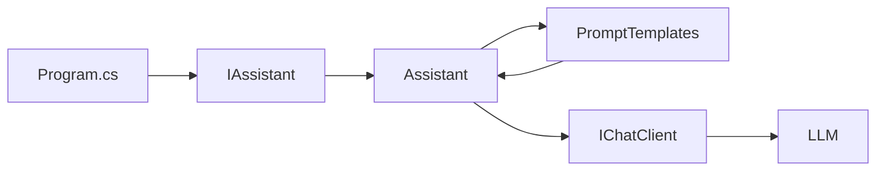

# Lab 04 - Prompt Templates

## Objetivo

Comprender cómo construir prompts dinámicos y reutilizables a partir de parámetros.

En el Lab 03, `Assistant` construía los prompts directamente dentro de cada método:

```csharp
string prompt =
    $"Traduce al inglés: {texto}";
```

Eso funciona, pero mezcla dos responsabilidades:

```text
Assistant
├── coordina la llamada al modelo
└── define la estructura del prompt
```

En este laboratorio separamos ambas cosas.

La nueva estructura es:

```text
Assistant
    ↓
PromptTemplates
    ↓
IChatClient
```

---

## Qué es un Prompt Template

Un Prompt Template es una estructura de texto que contiene partes fijas y partes variables.

Ejemplo:

```text
Traduce al {idioma}.

Texto:
{texto}
```

Las variables:

```text
idioma
texto
```

cambian en cada llamada.

La estructura del prompt se mantiene.

---

## 1. Primer ejemplo — Traducción

Queremos llamar:

```csharp
await assistant.TraducirAsync(
    "inglés",
    "Las abstracciones describen el prompt."
);
```

El template es:

```text
Traduce al {idioma}.

Texto:
{texto}
```

Con esos valores se transforma en:

```text
Traduce al inglés.

Texto:
Las abstracciones describen el prompt.
```

---

## 2. PromptTemplates

Creamos una clase dedicada:

```csharp
public static class PromptTemplates
```

Su responsabilidad es construir prompts.

Por ejemplo:

```csharp
public static string Traducir(
    string idioma,
    string texto)
{
    return $$"""
    Traduce al {{idioma}}.

    Texto:
    {{texto}}
    """;
}
```

La sintaxis:

```csharp
$$"""
...
{{variable}}
...
"""
```

permite utilizar raw string literals con interpolación.

---

## 3. Assistant deja de conocer el formato

Ahora `Assistant` no arma el texto directamente.

Hace:

```csharp
string prompt =
    PromptTemplates.Traducir(
        idioma,
        texto);
```

y luego:

```csharp
ChatResponse response =
    await _chatClient.GetResponseAsync(prompt);
```

La responsabilidad queda separada:

```text
Assistant
  │
  │ pide un prompt
  ▼
PromptTemplates
  │
  │ devuelve texto
  ▼
IChatClient
```

---

# Ejemplo 1 — Traducción

El método recibe:

```text
idioma
texto
```

Código:

```csharp
await assistant.TraducirAsync(
    "inglés",
    "Las abstracciones describen el prompt."
);
```

Template:

```text
Traduce al {idioma}.

Texto:
{texto}
```

La misma operación puede utilizar:

```text
inglés
francés
italiano
portugués
```

sin cambiar el template.

---

# Ejemplo 2 — Resumen

El método recibe:

```text
lineas
texto
```

La firma es:

```csharp
Task<string> ResumirAsync(
    int lineas,
    string texto);
```

El template:

```text
Resume el siguiente texto en un máximo de {lineas} líneas:

{texto}
```

Por ejemplo:

```csharp
await assistant.ResumirAsync(
    2,
    texto);
```

produce un prompt donde:

```text
{lineas} = 2
```

La cantidad máxima forma parte de la instrucción dinámica.

---

# Ejemplo 3 — Cambio de rol

La tercera operación recibe:

```text
rol
pregunta
```

Template:

```text
Actúa como un {rol}.

Pregunta:

{pregunta}
```

Podemos ejecutar:

```csharp
await assistant.ConsultarAsync(
    "profesor de matemáticas",
    "¿Qué es una derivada?"
);
```

y después:

```csharp
await assistant.ConsultarAsync(
    "abogado",
    "¿Qué es un contrato?"
);
```

El método es exactamente el mismo.

Lo que cambia son los valores del template.

---

## Flujo



---

## Estructura

```text
lab-04-prompt-templates/
├── AiClientFactory.cs
├── Assistant.cs
├── IAssistant.cs
├── PromptTemplates.cs
├── Lab04.PromptTemplates.csproj
├── Program.cs
└── README.md
```

---

## Responsabilidad de cada archivo

### `Program.cs`

Ejecuta los tres ejemplos:

```text
traducción
resumen
cambio de rol
```

### `IAssistant.cs`

Define las operaciones disponibles.

### `Assistant.cs`

Coordina:

```text
template
↓
IChatClient
↓
respuesta
```

### `PromptTemplates.cs`

Contiene la estructura de los prompts.

### `AiClientFactory.cs`

Mantiene aislada la creación del cliente de IA.

---

## Evolución desde el Lab 03

### Lab 03

```text
Assistant
   ↓
construye prompt inline
   ↓
IChatClient
```

### Lab 04

```text
Assistant
   ↓
PromptTemplates
   ↓
IChatClient
```

La diferencia parece pequeña, pero introduce una idea importante:

```text
el prompt también es una pieza de la aplicación
```

y merece una responsabilidad propia.

---

## Configuración

El laboratorio reutiliza el `.env` común de la raíz:

```text
dac-learning-ai-dotnet/
├── .env
├── .env.example
└── labs/
    ├── lab-01-hello-llm/
    ├── lab-02-chat-history/
    ├── lab-03-services-di/
    └── lab-04-prompt-templates/
```

Ejemplo:

```env
AI_PROVIDER=gemini
AI_MODEL=

OPENAI_API_KEY=
GEMINI_API_KEY=tu-api-key
OPENROUTER_API_KEY=
```

---

## Ejecutar

Desde:

```powershell
cd labs\lab-04-prompt-templates
```

ejecutar:

```powershell
dotnet restore
dotnet build
dotnet run
```

---

## Salida esperada

La salida tendrá una forma similar a:

```text
Proveedor: Gemini
Modelo: gemini-3.5-flash-lite

=== TRADUCCIÓN ===
Idioma: inglés
Texto: Las abstracciones describen el prompt.
Asistente: The abstractions describe the prompt.

=== RESUMEN ===
Máximo de líneas: 2
Texto:
...
Asistente: ...

=== CONSULTA COMO PROFESOR ===
Rol: profesor de matemáticas
Pregunta: ¿Qué es una derivada?
Asistente: ...

=== CONSULTA COMO ABOGADO ===
Rol: abogado
Pregunta: ¿Qué es un contrato?
Asistente: ...

=== CONCLUSIÓN ===
Los Prompt Templates permiten construir prompts dinámicos...
```

La redacción exacta depende del modelo.

---

## Por qué no usamos todavía un framework de templates

Podríamos introducir una biblioteca adicional para gestionar prompts.

No lo hacemos todavía.

El objetivo de este laboratorio es entender primero el concepto:

```text
estructura fija
+
variables
=
prompt dinámico
```

La implementación con raw interpolated strings permite ver el mecanismo sin incorporar otra abstracción.

Más adelante, si necesitamos:

- archivos externos;
- versionado de prompts;
- templates complejos;
- composición;
- distintos tipos de mensajes;

podremos introducir herramientas de mayor nivel.

---

## Qué aprendemos

Al finalizar este laboratorio deberías poder explicar:

1. qué es un Prompt Template;
2. qué parte del prompt permanece fija;
3. qué partes son variables;
4. por qué conviene separar prompts del servicio;
5. cómo reutilizar un mismo template con distintos parámetros;
6. cómo un parámetro puede modificar el rol o comportamiento pedido al modelo;
7. qué ventaja aporta `PromptTemplates.cs`.

---

## Qué NO hacemos todavía

No incorporamos:

- structured output;
- JSON tipado;
- validación de respuestas;
- templates externos;
- Semantic Kernel;
- RAG;
- tools.

La respuesta sigue siendo:

```text
string
```

Ese será precisamente el problema que abordaremos en el siguiente laboratorio.

---

## Siguiente laboratorio

**Lab 05 - Structured Output**

Hasta ahora pedimos respuestas en lenguaje natural:

```text
prompt → texto
```

El siguiente paso será pedir una estructura concreta y mapearla a tipos C#:

```text
prompt
  ↓
respuesta estructurada
  ↓
record / class
```
