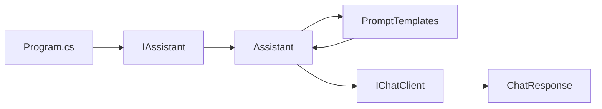

# Lab 04 - Prompt Templates

## Objetivo

Comprender cómo construir **prompts dinámicos y reutilizables** a partir de parámetros, sin mezclar su estructura con la lógica del servicio.

Este laboratorio continúa exactamente desde el diseño alcanzado en el Lab 03:

```text
Program.cs
   ↓ usa
IAssistant
   ↓ implementado por
Assistant
   ↓ necesita
IChatClient
```

Ahora incorporamos una nueva responsabilidad:

```text
PromptTemplates
```

La evolución queda así:

```text
Program.cs
   ↓
IAssistant
   ↓
Assistant
   ├── usa PromptTemplates
   └── usa IChatClient
```

El foco del Lab 04 no es DI ni configuración.

Eso ya fue introducido en el Lab 03.

El concepto nuevo es:

> separar la estructura del prompt de la lógica del servicio.

---

## Qué cambia respecto del Lab 03

En el Lab 03, `Assistant` construía prompts directamente:

```csharp
string prompt =
    $"Traduce al inglés: {texto}";
```

Eso era suficiente para introducir servicios.

Pero ahora queremos que:

```text
Assistant
```

se concentre en coordinar la operación, mientras:

```text
PromptTemplates
```

se ocupa de construir el texto del prompt.

---

# 1. El problema

Si cada método del servicio construye prompts completos, `Assistant` empieza a acumular dos responsabilidades:

```text
Assistant
├── coordina la llamada al modelo
└── define el formato de los prompts
```

En este laboratorio separamos ambas:

```text
Assistant
    ↓ solicita
PromptTemplates
    ↓ devuelve
string prompt
    ↓
Assistant
    ↓ envía
IChatClient
```

---

# 2. `PromptTemplates`

Definimos:

```csharp
public static class PromptTemplates
```

con métodos dedicados a construir prompts.

Por ejemplo:

```csharp
public static string Traducir(
    string idioma,
    string texto)
{
    return $$"""
    Traduce al {{idioma}}.

    Texto:
    {{texto}}
    """;
}
```

El método recibe valores variables:

```text
idioma
texto
```

pero conserva una estructura fija.

---

# 3. Template = estructura fija + variables

Podemos pensar un Prompt Template como:

```text
estructura fija
      +
valores dinámicos
      =
prompt final
```

Ejemplo:

```text
Traduce al {idioma}.

Texto:
{texto}
```

Si:

```text
idioma = inglés
texto  = Las abstracciones describen el prompt.
```

el resultado será:

```text
Traduce al inglés.

Texto:
Las abstracciones describen el prompt.
```

---

# 4. `Assistant` sigue siendo el servicio

Este punto es importante para mantener continuidad con el Lab 03.

No reemplazamos:

```text
IAssistant / Assistant
```

por `PromptTemplates`.

Cumplen responsabilidades distintas.

`IAssistant` continúa definiendo las capacidades disponibles:

```csharp
Task<string> TraducirAsync(
    string idioma,
    string texto);

Task<string> ResumirAsync(
    int lineas,
    string texto);

Task<string> ConsultarAsync(
    string rol,
    string pregunta);
```

`Assistant` implementa esas operaciones.

`PromptTemplates` solamente ayuda a construir el texto que luego será enviado al modelo.

---

## Ejemplo: traducción

`Assistant` hace:

```csharp
string prompt =
    PromptTemplates.Traducir(
        idioma,
        texto);

ChatResponse response =
    await _chatClient.GetResponseAsync(prompt);

return response.Text;
```

La responsabilidad queda así:

```text
IAssistant
    define TraducirAsync

Assistant
    coordina la operación

PromptTemplates
    construye el prompt

IChatClient
    envía el prompt
```

---

# 5. Traducción parametrizada

Ahora la operación recibe:

```text
idioma
texto
```

Por ejemplo:

```csharp
await assistant.TraducirAsync(
    "inglés",
    "Las abstracciones describen el prompt.");
```

El mismo servicio puede utilizar:

```text
inglés
francés
italiano
portugués
```

sin modificar la estructura del template.

---

# 6. Resumen parametrizado

El método:

```csharp
Task<string> ResumirAsync(
    int lineas,
    string texto);
```

permite incorporar otra variable:

```text
cantidad máxima de líneas
```

El template es:

```text
Resume el siguiente texto en un máximo de {lineas} líneas:

{texto}
```

Por ejemplo:

```csharp
await assistant.ResumirAsync(
    2,
    texto);
```

---

# 7. Cambio de rol

La operación:

```csharp
ConsultarAsync(
    string rol,
    string pregunta)
```

utiliza:

```text
Actúa como un {rol}.

Pregunta:

{pregunta}
```

Podemos llamar al mismo método con:

```text
rol = profesor de matemáticas
```

o:

```text
rol = abogado
```

La estructura se mantiene.

Cambian los parámetros.

---

# 8. Flujo de ejecución



El flujo relevante del Lab 04 es:

```text
operación
   ↓
servicio
   ↓
template
   ↓
prompt
   ↓
modelo
```

DI sigue existiendo, pero no aparece como protagonista porque ya fue explicado en el laboratorio anterior.

---

# 9. Dependency Injection continúa igual

La composición del Lab 03 se conserva:

```csharp
services.AddSingleton<IChatClient>(
    _ => AiClientFactory.CreateFromEnvironment());

services.AddTransient<IAssistant, Assistant>();
```

No agregamos `PromptTemplates` al contenedor porque actualmente es una clase:

```csharp
static
```

sin estado ni dependencias.

En este laboratorio basta con utilizarla directamente.

No agregamos una interfaz ni un servicio adicional porque no resolvería un problema real y complicaría el ejemplo.

---

# 10. Configuración

La configuración es exactamente la misma adoptada desde los laboratorios anteriores:

```env
AI_PROVIDER=gemini
AI_MODEL=gemini-3.5-flash-lite
AI_API_KEY=tu-api-key
AI_URL=https://generativelanguage.googleapis.com/v1beta/openai/
```

Variables:

| Variable | Obligatoria | Objetivo |
|---|---:|---|
| `AI_PROVIDER` | Sí | Identifica el proveedor activo |
| `AI_MODEL` | Sí | Modelo utilizado |
| `AI_API_KEY` | Sí | Credencial |
| `AI_URL` | No | Endpoint alternativo |

`Program.cs` no carga el `.env`.

La creación de:

```text
IChatClient
```

continúa encapsulada en:

```text
LabConfiguration
        ↓
AiClientFactory
```

igual que en el Lab 03.

---

# 11. Estructura

```text
lab-04-prompt-templates/
├── docs/
│   ├── 01-prompt-templates.md
│   ├── 02-evolucion-del-servicio.md
│   └── 03-configuracion-y-aiclientfactory.md
├── AiClientFactory.cs
├── Assistant.cs
├── IAssistant.cs
├── LabConfiguration.cs
├── PromptTemplates.cs
├── Lab04.PromptTemplates.csproj
├── Program.cs
└── README.md
```

---

# 12. Responsabilidad de cada archivo

### `IAssistant.cs`

Define las capacidades del servicio:

```text
chat
traducir
resumir
consultar con rol
```

---

### `Assistant.cs`

Implementa esas operaciones.

Coordina:

```text
parámetros
   ↓
PromptTemplates
   ↓
prompt
   ↓
IChatClient
   ↓
respuesta
```

---

### `PromptTemplates.cs`

Define exclusivamente la estructura de los prompts.

No llama al modelo.

No conoce `IChatClient`.

No contiene configuración.

---

### `AiClientFactory.cs`

Construye `IChatClient`.

Es infraestructura heredada del Lab 03.

---

### `LabConfiguration.cs`

Carga y valida:

```text
AI_PROVIDER
AI_MODEL
AI_API_KEY
AI_URL
```

Es infraestructura.

---

### `Program.cs`

Configura DI y ejecuta ejemplos.

No construye prompts ni clientes de IA.

---

# 13. Lecturas opcionales

No necesitás leer estos documentos para completar el laboratorio.

Si querés profundizar:

- [Prompt Templates: qué problema resuelven y cómo funcionan](docs/01-prompt-templates.md)
- [Evolución del servicio desde Lab 03 a Lab 04](docs/02-evolucion-del-servicio.md)
- [`LabConfiguration` y `AiClientFactory`](docs/03-configuracion-y-aiclientfactory.md)

La idea es:

```text
primero ejecutar
      ↓
entender el template
      ↓
profundizar sólo si hace falta
```

---

# 14. Ejecutar

```powershell
cd labs\lab-04-prompt-templates
dotnet restore
dotnet run
```

Una salida aproximada:

```text
=== TRADUCCIÓN ===
Idioma: inglés
Texto: Las abstracciones describen el prompt.
Asistente: The abstractions describe the prompt.

=== RESUMEN ===
Máximo de líneas: 2
Texto:
...
Asistente: ...

=== CONSULTA COMO PROFESOR ===
Rol: profesor de matemáticas
Pregunta: ¿Qué es una derivada?
Asistente: ...

=== CONSULTA COMO ABOGADO ===
Rol: abogado
Pregunta: ¿Qué es un contrato?
Asistente: ...
```

La respuesta exacta depende del modelo.

---

# 15. ¿Por qué no usamos un framework de templates?

Podríamos agregar otra biblioteca.

No lo hacemos.

El objetivo es entender primero:

```text
estructura fija
+
variables
=
prompt dinámico
```

Los raw interpolated strings de C# permiten ver el mecanismo directamente:

```csharp
$$"""
Traduce al {{idioma}}.

Texto:
{{texto}}
"""
```

Aplicamos KISS:

> no agregar una abstracción hasta que exista una necesidad concreta.

---

# 16. Qué aprendemos

Al finalizar deberías poder explicar:

1. qué es un Prompt Template;
2. qué parte permanece fija;
3. qué partes son variables;
4. por qué `PromptTemplates` tiene una responsabilidad diferente a `Assistant`;
5. por qué `Assistant` sigue siendo el servicio;
6. cómo reutilizar un template con distintos parámetros;
7. por qué `PromptTemplates` no necesita DI en este ejemplo;
8. cómo el Lab 04 evoluciona el diseño del Lab 03 sin reemplazarlo.

---

# 17. Qué NO hacemos todavía

No incorporamos:

- Structured Output;
- JSON tipado;
- validación de respuestas;
- templates externos;
- persistencia de prompts;
- Semantic Kernel;
- RAG;
- tools.

La respuesta continúa siendo:

```text
string
```

---

## Siguiente laboratorio

**Lab 05 - Structured Output**

Hasta ahora:

```text
prompt
   ↓
modelo
   ↓
texto libre
```

El siguiente paso será pedir una estructura concreta y mapearla a tipos C#.
