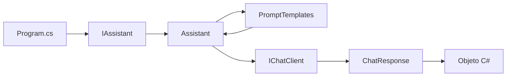

# Lab 05 - Structured Output

## Objetivo

Comprender cómo pasar de respuestas de texto libre a **objetos C# tipados**.

Hasta el Lab 04, el flujo era:

```text
parámetros
   ↓
PromptTemplates
   ↓
prompt
   ↓
LLM
   ↓
string
```

En este laboratorio agregamos un contrato de salida:

```text
parámetros
   ↓
PromptTemplates
   ↓
prompt
   ↓
LLM
   ↓
Structured Output
   ↓
objeto C#
```

El concepto nuevo es:

> pedir al modelo una respuesta compatible con un tipo C# y trabajar con ese objeto directamente.

---

## Continuidad con Lab 04

Conservamos el diseño anterior:

```text
Program.cs
   ↓
IAssistant
   ↓
Assistant
   ├── PromptTemplates
   └── IChatClient
```

Lo que cambia está en el resultado.

Antes:

```csharp
Task<string>
```

Ahora:

```csharp
Task<Persona>
Task<Personas>
Task<Producto>
```

`Assistant` sigue siendo el servicio.

`PromptTemplates` sigue construyendo prompts.

`IChatClient` sigue siendo la dependencia que habla con el modelo.

---

# 1. El problema

Supongamos este texto:

```text
Mi nombre es Daniel y tengo 63 años.
```

Podríamos pedir una respuesta textual como:

```text
Daniel tiene 63 años.
```

Pero si la aplicación necesita utilizar esos datos, todavía tendría que interpretar ese string.

En cambio queremos obtener:

```csharp
Persona persona
```

y luego trabajar directamente con:

```csharp
persona.Nombre
persona.Edad
```

---

# 2. Los tipos C# son el contrato

Definimos:

```csharp
public sealed class Persona
{
    public string Nombre { get; init; } = string.Empty;
    public int Edad { get; init; }
}
```

Ese tipo expresa qué información esperamos.

No queremos:

```text
texto más o menos parecido
```

Queremos:

```text
Nombre
Edad
```

como propiedades conocidas por la aplicación.

---

# 3. `ChatResponse<T>`

Para pedir una respuesta tipada utilizamos:

```csharp
ChatResponse<Persona> response =
    await _chatClient.GetResponseAsync<Persona>(prompt);
```

El tipo:

```csharp
Persona
```

indica qué estructura esperamos obtener.

Podemos leerlo así:

```text
enviar prompt
    ↓
obtener respuesta compatible con Persona
```

---

# 4. El servicio ahora devuelve objetos

La interfaz evoluciona a:

```csharp
public interface IAssistant
{
    Task<Persona> ExtraerPersonaAsync(string texto);

    Task<Personas> ExtraerPersonasAsync(string texto);

    Task<Producto> ExtraerProductoAsync(string texto);
}
```

Esto es importante.

El consumidor de `IAssistant` no recibe JSON ni texto para interpretar.

Recibe directamente:

```text
Persona
Personas
Producto
```

El servicio encapsula también esa responsabilidad.

---

# 5. Ejemplo: una persona

Entrada:

```text
Mi nombre es Daniel y tengo 63 años.
```

Prompt:

```text
Extrae los datos de la persona.

Texto:
Mi nombre es Daniel y tengo 63 años.
```

Resultado esperado:

```csharp
new Persona
{
    Nombre = "Daniel",
    Edad = 63
}
```

`Program.cs` puede usar:

```csharp
persona.Nombre
persona.Edad
```

sin parsear texto.

---

# 6. Ejemplo: varias personas

La entrada contiene:

```text
Daniel
Roberto
Juana
```

En lugar de devolver una lista como raíz utilizamos:

```csharp
public sealed class Personas
{
    public List<Persona> PersonasEncontradas { get; init; } = [];
}
```

El contrato queda:

```text
Personas
   ↓
PersonasEncontradas
   ↓
List<Persona>
```

Esto mantiene una raíz de objeto clara y extensible.

---

# 7. Ejemplo: producto

Definimos:

```csharp
public sealed class Producto
{
    public string Nombre { get; init; } = string.Empty;
    public string Categoria { get; init; } = string.Empty;
}
```

Entrada:

```text
Notebook Lenovo ThinkPad.
```

La aplicación espera un:

```csharp
Producto
```

y no una frase libre.

---

# 8. `TryGetResult`

Aunque solicitemos:

```csharp
ChatResponse<T>
```

la aplicación debe comprobar que existe un resultado compatible.

Por eso `Assistant` utiliza:

```csharp
response.TryGetResult(
    out T? result)
```

Si existe:

```csharp
return result;
```

Si no:

```csharp
throw new InvalidOperationException(...)
```

El servicio no devuelve un objeto incompleto o inexistente silenciosamente.

---

# 9. `GetResultOrThrow<T>`

Las tres operaciones necesitan la misma validación.

En lugar de repetirla, `Assistant` concentra esa lógica en:

```csharp
private static T GetResultOrThrow<T>(
    ChatResponse<T> response)
```

Este helper no es el concepto principal del laboratorio.

Sólo evita duplicación.

Su flujo es:

```text
ChatResponse<T>
      ↓
¿hay T válido?
  ├─ sí → devolver T
  └─ no → error
```

---

# 10. Flujo de ejecución



La evolución principal es:

```text
Lab 04
ChatResponse → string

Lab 05
ChatResponse<T> → T
```

---

# 11. Dependency Injection continúa igual

La composición heredada del Lab 03 y Lab 04 no cambia:

```csharp
services.AddSingleton<IChatClient>(
    _ => AiClientFactory.CreateFromEnvironment());

services.AddTransient<IAssistant, Assistant>();
```

No agregamos los modelos:

```text
Persona
Personas
Producto
```

al contenedor.

Son datos, no servicios.

---

# 12. Configuración

Se utiliza la misma configuración común:

```env
AI_PROVIDER=gemini
AI_MODEL=gemini-3.5-flash-lite
AI_API_KEY=tu-api-key
AI_URL=https://generativelanguage.googleapis.com/v1beta/openai/
```

Variables:

| Variable | Obligatoria | Objetivo |
|---|---:|---|
| `AI_PROVIDER` | Sí | Identifica el proveedor activo |
| `AI_MODEL` | Sí | Modelo utilizado |
| `AI_API_KEY` | Sí | Credencial |
| `AI_URL` | No | Endpoint alternativo |

`Program.cs` no carga `.env`.

La infraestructura permanece:

```text
LabConfiguration
        ↓
AiClientFactory
        ↓
IChatClient
```

---

# 13. Estructura

```text
lab-05-structured-output/
├── docs/
│   ├── 01-structured-output.md
│   ├── 02-contratos-csharp.md
│   ├── 03-chatresponse-generico.md
│   └── 04-configuracion-y-aiclientfactory.md
├── AiClientFactory.cs
├── Assistant.cs
├── IAssistant.cs
├── LabConfiguration.cs
├── Persona.cs
├── Personas.cs
├── Producto.cs
├── PromptTemplates.cs
├── Lab05.StructuredOutput.csproj
├── Program.cs
└── README.md
```

---

# 14. Responsabilidad de cada pieza

### `IAssistant`

Define operaciones de extracción tipada.

---

### `Assistant`

Coordina:

```text
texto
  ↓
PromptTemplates
  ↓
IChatClient
  ↓
ChatResponse<T>
  ↓
T
```

---

### `PromptTemplates`

Construye la instrucción textual para cada extracción.

No conoce los detalles de deserialización.

---

### `Persona`, `Personas`, `Producto`

Son contratos de datos.

Describen la forma que esperamos recibir.

---

### `AiClientFactory`

Construye `IChatClient`.

Es infraestructura reutilizada.

---

### `LabConfiguration`

Carga y valida la configuración.

También es infraestructura.

---

# 15. Lecturas opcionales

El laboratorio puede realizarse sin leer estos documentos.

Para profundizar:

- [Structured Output: qué problema resuelve](docs/01-structured-output.md)
- [Tipos C# como contratos de salida](docs/02-contratos-csharp.md)
- [`ChatResponse<T>`, `GetResponseAsync<T>` y `TryGetResult`](docs/03-chatresponse-generico.md)
- [`LabConfiguration` y `AiClientFactory`](docs/04-configuracion-y-aiclientfactory.md)

---

# 16. Ejecutar

```powershell
cd labs\lab-05-structured-output
dotnet restore
dotnet run
```

Salida aproximada:

```text
=== PERSONA ===
Texto: Mi nombre es Daniel y tengo 63 años.
Nombre: Daniel
Edad: 63

=== PERSONAS ===
Daniel tiene 63 años
Roberto tiene 17 años
Juana tiene 30 años

=== PRODUCTO ===
Texto: Notebook Lenovo ThinkPad.
Nombre: Notebook Lenovo ThinkPad
Categoría: ...
```

Los valores exactos dependen del modelo.

---

# 17. Evolución desde Lab 04

### Lab 04

```text
Prompt Template
      ↓
LLM
      ↓
string
```

### Lab 05

```text
Prompt Template
      ↓
LLM
      ↓
Structured Output
      ↓
tipo C#
```

El cambio importante no es solamente el formato de la respuesta.

Es que el resto de la aplicación ahora puede trabajar con:

```text
propiedades
tipos
colecciones
```

en lugar de interpretar lenguaje natural.

---

# 18. Qué aprendemos

Al finalizar deberías poder explicar:

1. qué significa Structured Output;
2. por qué un tipo C# puede actuar como contrato de salida;
3. qué representa `ChatResponse<T>`;
4. qué hace `GetResponseAsync<T>()`;
5. para qué sirve `TryGetResult`;
6. por qué `Assistant` devuelve objetos y no JSON o strings;
7. por qué `Personas` utiliza un objeto raíz;
8. por qué estos modelos no son servicios y no se registran en DI;
9. cómo Structured Output facilita integrar la respuesta con código de aplicación.

---

# 19. Qué NO hacemos todavía

No incorporamos:

- validaciones de dominio complejas;
- persistencia;
- retries;
- reparación de respuestas inválidas;
- schemas personalizados avanzados;
- memoria;
- embeddings;
- RAG.

El objetivo es únicamente comprender:

```text
texto
  ↓
LLM
  ↓
objeto tipado
```

---

## Siguiente laboratorio

**Lab 06 - Memoria conversacional avanzada**

Structured Output resuelve cómo recibir datos tipados.

El siguiente laboratorio vuelve al problema conversacional para introducir sesiones y una memoria reutilizable.
