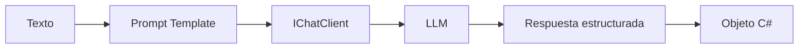

# Lab 05 - Structured Output

## Objetivo

Comprender cómo pasar de respuestas de texto libre a **objetos C# tipados**.

Hasta el Lab 04, nuestros métodos devolvían:

```csharp
Task<string>
```

En este laboratorio damos un paso importante:

```text
texto de entrada
      ↓
     LLM
      ↓
respuesta estructurada
      ↓
objeto C#
```

## El problema

Supongamos este texto:

```text
Mi nombre es Daniel y tengo 63 años.
```

Queremos obtener:

```csharp
Persona persona
```

y trabajar directamente con:

```csharp
persona.Nombre
persona.Edad
```

## Structured Output

`Microsoft.Extensions.AI` permite solicitar una respuesta que corresponda a un tipo C#:

```csharp
ChatResponse<Persona> response =
    await _chatClient.GetResponseAsync<Persona>(prompt);
```

El tipo genérico indica qué estructura esperamos recibir.

## Ejemplo 1 - Persona

```csharp
public sealed class Persona
{
    public string Nombre { get; init; } = string.Empty;
    public int Edad { get; init; }
}
```

Texto:

```text
Mi nombre es Daniel y tengo 63 años.
```

Resultado esperado:

```text
Nombre: Daniel
Edad: 63
```

## Ejemplo 2 - Varias personas

Para Structured Output utilizamos un objeto raíz:

```csharp
public sealed class Personas
{
    public List<Persona> PersonasEncontradas { get; init; } = [];
}
```

Esto evita depender de un array como raíz del esquema y mantiene un contrato extensible.

## Ejemplo 3 - Producto

```csharp
public sealed class Producto
{
    public string Nombre { get; init; } = string.Empty;
    public string Categoria { get; init; } = string.Empty;
}
```

Texto:

```text
Notebook Lenovo ThinkPad.
```

## IAssistant ahora devuelve objetos

```csharp
public interface IAssistant
{
    Task<Persona> ExtraerPersonaAsync(string texto);
    Task<Personas> ExtraerPersonasAsync(string texto);
    Task<Producto> ExtraerProductoAsync(string texto);
}
```

Antes:

```text
Assistant → string
```

Ahora:

```text
Assistant → Persona / Personas / Producto
```

## Validación del resultado

Usamos:

```csharp
response.TryGetResult(out T? result)
```

para comprobar que la respuesta pueda convertirse al tipo esperado antes de utilizarla.

## Flujo



## Estructura

```text
lab-05-structured-output/
├── AiClientFactory.cs
├── Assistant.cs
├── IAssistant.cs
├── Persona.cs
├── Personas.cs
├── Producto.cs
├── PromptTemplates.cs
├── Lab05.StructuredOutput.csproj
├── Program.cs
└── README.md
```

## Evolución desde Lab 04

### Lab 04

```text
Prompt Template → LLM → string
```

### Lab 05

```text
Prompt Template → LLM → Structured Output → objeto C#
```

## Configuración

Reutiliza el `.env` de la raíz del repositorio.

## Ejecutar

```powershell
cd labs\lab-05-structured-output
dotnet restore
dotnet build
dotnet run
```

## Salida esperada

```text
Proveedor: Gemini
Modelo: gemini-3.5-flash-lite

=== PERSONA ===
Nombre: Daniel
Edad: 63

=== PERSONAS ===
Daniel tiene 63 años
Roberto tiene 17 años
Juana tiene 30 años

=== PRODUCTO ===
Nombre: Notebook Lenovo ThinkPad
Categoría: ...
```

## Qué aprendemos

Al finalizar este laboratorio deberías poder explicar:

1. qué significa Structured Output;
2. qué representa `ChatResponse<T>`;
3. qué hace `GetResponseAsync<T>()`;
4. por qué utilizamos tipos C# para describir el resultado esperado;
5. por qué una colección puede envolverse en un objeto raíz;
6. para qué sirve `TryGetResult`;
7. por qué trabajar con objetos facilita la integración con el resto de una aplicación.

## Siguiente laboratorio

**Lab 06 - Memoria conversacional avanzada**

En Lab 02 vimos un historial simple mantenido durante la ejecución. El siguiente paso será controlar mejor ese contexto y explorar estrategias de memoria más avanzadas.
