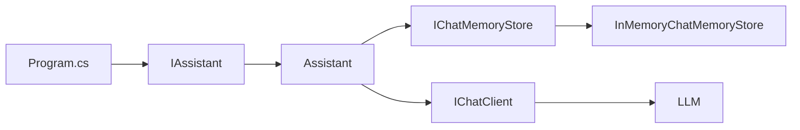
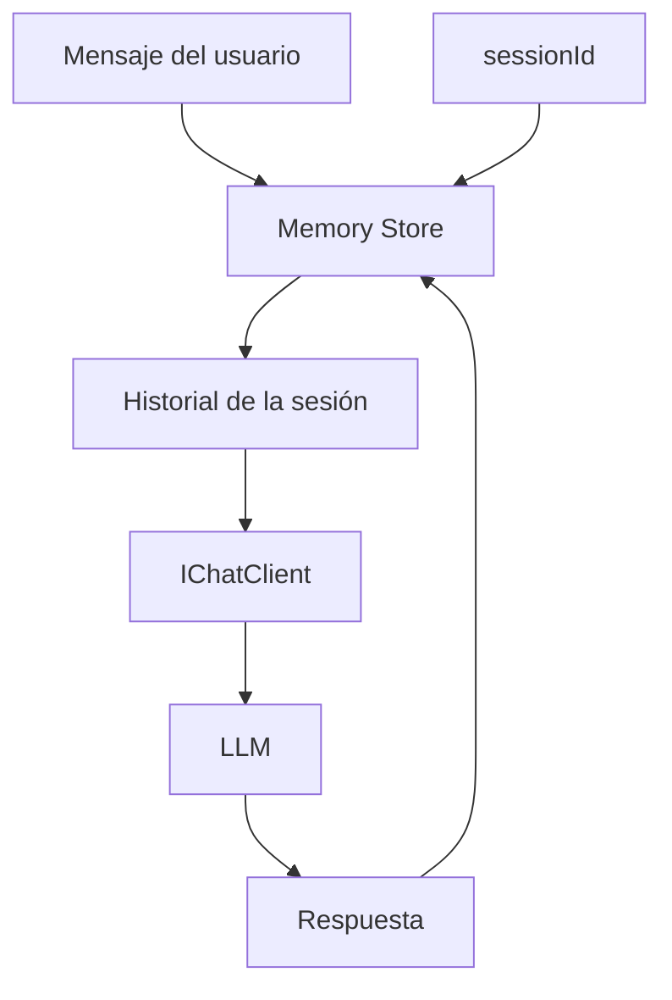

# Lab 06 - Chat Memory Advanced

## Objetivo

Extender el manejo de contexto conversacional para soportar **múltiples sesiones independientes** y separar la memoria de conversación en una capa reutilizable.

En el Lab 02 utilizamos una única lista:

```csharp
List<ChatMessage>
```

Ese enfoque sirve para comprender cómo funciona el historial, pero tiene una limitación evidente:

```text
una lista
=
una conversación
```

¿Qué ocurre cuando una aplicación atiende a varios usuarios o varias conversaciones al mismo tiempo?

---

## El problema

Supongamos dos sesiones:

```text
sesion-a → Daniel
sesion-b → Roberto
```

Ambas deberían poder preguntar:

```text
¿Cómo me llamo?
```

y recibir respuestas diferentes.

Si utilizáramos un único historial compartido:

```text
Daniel
Roberto
¿Cómo me llamo?
```

el contexto quedaría mezclado.

Necesitamos aislar la memoria mediante un identificador de sesión.

---

## La idea

La arquitectura será:

```text
sessionId
   ↓
IChatMemoryStore
   ↓
historial de la sesión
   ↓
IChatClient
   ↓
LLM
```

Cada sesión mantiene su propio conjunto de mensajes.

---

# 1. El contrato de memoria

Creamos:

```csharp
public interface IChatMemoryStore
```

con tres operaciones:

```csharp
IReadOnlyList<ChatMessage> GetMessages(
    string sessionId);

void AddMessage(
    string sessionId,
    ChatMessage message);

void AddMessages(
    string sessionId,
    IEnumerable<ChatMessage> messages);
```

La interfaz no dice dónde se almacenan los mensajes.

Solo define qué necesita la aplicación.

---

# 2. Implementación en memoria

Para este laboratorio usamos:

```csharp
InMemoryChatMemoryStore
```

internamente basado en:

```csharp
Dictionary<string, List<ChatMessage>>
```

Conceptualmente:

```text
Dictionary
│
├── sesion-a
│   ├── user: Mi nombre es Daniel
│   ├── assistant: Mucho gusto...
│   ├── user: ¿Cómo me llamo?
│   └── assistant: Daniel
│
└── sesion-b
    ├── user: Mi nombre es Roberto
    ├── assistant: Mucho gusto...
    ├── user: ¿Cómo me llamo?
    └── assistant: Roberto
```

La clave del diccionario es:

```text
sessionId
```

---

# 3. Ventana de mensajes

La memoria tiene:

```csharp
private const int MaxMessages = 20;
```

Después de agregar mensajes se ejecuta:

```csharp
TrimWindow(messages);
```

Si la cantidad supera el límite, se eliminan los mensajes más antiguos.

Conceptualmente:

```text
mensaje 1
mensaje 2
...
mensaje 20
```

Cuando llega el mensaje 21:

```text
mensaje 1   ← eliminado

mensaje 2
...
mensaje 21
```

Esto evita que el historial crezca indefinidamente.

---

# 4. Assistant recibe sessionId

Nuestro contrato ahora es:

```csharp
public interface IAssistant
{
    Task<string> ChatAsync(
        string sessionId,
        string message);
}
```

Ya no alcanza con saber:

```text
qué dijo el usuario
```

también necesitamos saber:

```text
a qué conversación pertenece
```

---

# 5. Flujo de una llamada

Cuando ejecutamos:

```csharp
await assistant.ChatAsync(
    "sesion-a",
    "¿Cómo me llamo?");
```

`Assistant` realiza cuatro pasos.

### Paso 1 — guardar el mensaje del usuario

```csharp
_memoryStore.AddMessage(
    sessionId,
    new ChatMessage(
        ChatRole.User,
        message));
```

### Paso 2 — recuperar el historial de esa sesión

```csharp
IReadOnlyList<ChatMessage> history =
    _memoryStore.GetMessages(sessionId);
```

### Paso 3 — enviar ese historial al modelo

```csharp
ChatResponse response =
    await _chatClient.GetResponseAsync(history);
```

### Paso 4 — guardar la respuesta

```csharp
_memoryStore.AddMessages(
    sessionId,
    response.Messages);
```

La memoria queda preparada para el próximo turno.

---

# 6. Prueba con dos sesiones

Primero:

```text
sesion-a
```

dice:

```text
Mi nombre es Daniel
```

y pregunta:

```text
¿Cómo me llamo?
```

Después:

```text
sesion-b
```

dice:

```text
Mi nombre es Roberto
```

y pregunta lo mismo.

Finalmente volvemos a:

```text
sesion-a
```

y preguntamos nuevamente:

```text
¿Cómo me llamo?
```

El resultado esperado es:

```text
sesion-a → Daniel
sesion-b → Roberto
sesion-a → Daniel
```

Esto demuestra que las conversaciones están aisladas.

---

# 7. Dependency Injection

Registramos el almacenamiento como:

```csharp
services.AddSingleton<
    IChatMemoryStore,
    InMemoryChatMemoryStore>();
```

Usamos `Singleton` porque queremos que todas las instancias de `Assistant` compartan el mismo almacenamiento durante la ejecución.

Luego:

```csharp
services.AddTransient<
    IAssistant,
    Assistant>();
```

`Assistant` recibe automáticamente:

```csharp
IChatClient
IChatMemoryStore
```

por constructor.

---

# 8. Grafo de dependencias



---

# 9. Flujo por sesión



---

# 10. Estructura

```text
lab-06-chat-memory-advanced/
├── AiClientFactory.cs
├── Assistant.cs
├── IAssistant.cs
├── IChatMemoryStore.cs
├── InMemoryChatMemoryStore.cs
├── Lab06.ChatMemoryAdvanced.csproj
├── Program.cs
└── README.md
```

---

# 11. Evolución desde Lab 02

## Lab 02

```text
List<ChatMessage>
        ↓
una conversación
```

## Lab 06

```text
sessionId
   ↓
IChatMemoryStore
   ↓
historial independiente
```

El mecanismo base sigue siendo el mismo:

```text
guardar mensajes
+
reenviar historial
```

pero ahora está encapsulado y preparado para manejar varias conversaciones.

---

# 12. Diferencia entre historial y almacenamiento

Conviene separar dos ideas.

## Historial

Son los mensajes:

```text
user
assistant
user
assistant
```

## Store

Es el componente responsable de decidir:

```text
dónde vive ese historial
```

En este laboratorio vive en memoria:

```text
Dictionary
```

Pero el contrato permitiría reemplazarlo posteriormente por:

```text
base de datos
Redis
archivo
cache distribuida
otro almacenamiento
```

sin cambiar `Assistant`.

---

# 13. Memoria reutilizable

El beneficio de introducir:

```csharp
IChatMemoryStore
```

es que `Assistant` deja de conocer el mecanismo concreto de almacenamiento.

Depende de:

```text
IChatMemoryStore
```

no de:

```text
Dictionary
```

Esto permite sustituir la implementación manteniendo el resto del código.

---

# 14. Configuración

El laboratorio reutiliza el `.env` común:

```text
dac-learning-ai-dotnet/
├── .env
├── .env.example
└── labs/
    ├── lab-01-hello-llm/
    ├── lab-02-chat-history/
    ├── lab-03-services-di/
    ├── lab-04-prompt-templates/
    ├── lab-05-structured-output/
    └── lab-06-chat-memory-advanced/
```

---

# 15. Ejecutar

Desde:

```powershell
cd labs\lab-06-chat-memory-advanced
```

ejecutar:

```powershell
dotnet restore
dotnet build
dotnet run
```

---

# 16. Salida esperada

Una ejecución típica será:

```text
Proveedor: Gemini
Modelo: gemini-3.5-flash-lite

=== SESIÓN A ===
[sesion-a] Usuario: Mi nombre es Daniel
[sesion-a] Asistente: Mucho gusto, Daniel.

[sesion-a] Usuario: ¿Cómo me llamo?
[sesion-a] Asistente: Te llamas Daniel.

=== SESIÓN B ===
[sesion-b] Usuario: Mi nombre es Roberto
[sesion-b] Asistente: Mucho gusto, Roberto.

[sesion-b] Usuario: ¿Cómo me llamo?
[sesion-b] Asistente: Te llamas Roberto.

=== SESIÓN A (AISLADA) ===
[sesion-a] Usuario: ¿Cómo me llamo?
[sesion-a] Asistente: Te llamas Daniel.
```

La redacción exacta dependerá del modelo.

Lo importante es:

```text
sesion-a → Daniel
sesion-b → Roberto
```

---

# 17. Una limitación deliberada

`InMemoryChatMemoryStore` existe únicamente mientras se ejecuta la aplicación.

Si cerramos el proceso:

```text
memoria perdida
```

Esto es intencional.

Todavía no queremos introducir una base de datos ni infraestructura externa.

El objetivo es comprender primero:

```text
sessionId
+
store
+
ventana
+
historial aislado
```

---

# 18. Qué aprendemos

Al finalizar este laboratorio deberías poder explicar:

1. por qué una única lista no alcanza para múltiples conversaciones;
2. qué función cumple `sessionId`;
3. qué responsabilidad tiene `IChatMemoryStore`;
4. por qué el store se registra como `Singleton`;
5. cómo se mantiene aislada cada conversación;
6. para qué sirve una ventana máxima de mensajes;
7. por qué `Assistant` no debería conocer el almacenamiento concreto;
8. cómo podría reemplazarse posteriormente la memoria en RAM por otro mecanismo.

---

# Qué NO hacemos todavía

No incorporamos:

- persistencia real;
- base de datos;
- Redis;
- memoria semántica;
- embeddings;
- resumen automático de conversaciones;
- Agent Framework.

`Microsoft.Extensions.AI` dispone también de reductores experimentales de historial para limitar o resumir conversaciones, pero en este laboratorio mantenemos la lógica explícita para comprender el mecanismo antes de incorporar esas abstracciones.

---

# Siguiente laboratorio

**Lab 07 - Embeddings**

Hasta ahora trabajamos con texto y conversaciones.

El siguiente paso será representar significado mediante vectores:

```text
texto
  ↓
embedding
  ↓
vector
  ↓
similitud semántica
```
