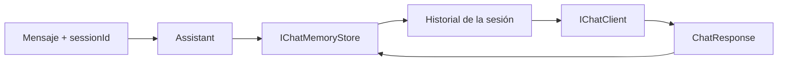

# Lab 06 - Chat Memory Advanced

## Objetivo

Extender el manejo de contexto conversacional para soportar **múltiples sesiones independientes** y separar el almacenamiento del historial en un componente reutilizable.

En el Lab 02 vimos el mecanismo básico:

```text
List<ChatMessage>
      ↓
una conversación
```

Ahora necesitamos algo más:

```text
sessionId
   ↓
historial propio
```

El concepto nuevo del Lab 06 es:

> una aplicación puede mantener varios historiales aislados y delegar su almacenamiento a un componente específico.

---

## Continuidad con los laboratorios anteriores

Conservamos la idea de servicio introducida en Lab 03:

```text
Program.cs
   ↓
IAssistant
   ↓
Assistant
```

Pero `Assistant` ahora necesita dos dependencias:

```text
IChatClient
IChatMemoryStore
```

La estructura queda:

```text
Program.cs
   ↓
IAssistant
   ↓
Assistant
   ├── IChatClient
   └── IChatMemoryStore
```

El servicio sigue siendo `Assistant`.

La memoria conversacional es una dependencia del servicio.

---

# 1. El problema

Con una sola lista:

```csharp
List<ChatMessage>
```

podemos representar una conversación.

Pero si tenemos:

```text
sesion-a → Daniel
sesion-b → Roberto
```

necesitamos que cada conversación conserve únicamente sus propios mensajes.

No queremos:

```text
Daniel
Roberto
¿Cómo me llamo?
```

mezclados en un mismo historial.

---

# 2. `sessionId`

El método del servicio ahora recibe:

```csharp
Task<string> ChatAsync(
    string sessionId,
    string message);
```

El `sessionId` identifica a qué conversación pertenece el mensaje.

Por ejemplo:

```text
sesion-a
sesion-b
```

No describe al usuario ni al modelo.

Describe:

```text
la conversación
```

---

# 3. `IChatMemoryStore`

Definimos un contrato:

```csharp
public interface IChatMemoryStore
{
    IReadOnlyList<ChatMessage> GetMessages(
        string sessionId);

    void AddMessage(
        string sessionId,
        ChatMessage message);

    void AddMessages(
        string sessionId,
        IEnumerable<ChatMessage> messages);
}
```

La interfaz expresa tres necesidades:

```text
leer historial
agregar un mensaje
agregar varios mensajes
```

No dice dónde se almacenan.

Ese detalle pertenece a la implementación.

---

# 4. `InMemoryChatMemoryStore`

La implementación actual utiliza:

```csharp
Dictionary<string, List<ChatMessage>>
```

Conceptualmente:

```text
sesion-a
   ↓
mensajes de Daniel

sesion-b
   ↓
mensajes de Roberto
```

Cada clave apunta a un historial diferente.

---

# 5. `Assistant` coordina la memoria

`Assistant` no conoce el `Dictionary`.

Depende de:

```csharp
IChatMemoryStore
```

El flujo de una llamada es:

```text
mensaje + sessionId
        ↓
guardar mensaje
        ↓
recuperar historial
        ↓
IChatClient
        ↓
respuesta
        ↓
guardar respuesta
```

El código central es:

```csharp
_memoryStore.AddMessage(
    sessionId,
    new ChatMessage(
        ChatRole.User,
        message));

IReadOnlyList<ChatMessage> history =
    _memoryStore.GetMessages(sessionId);

ChatResponse response =
    await _chatClient.GetResponseAsync(history);

_memoryStore.AddMessages(
    sessionId,
    response.Messages);
```

---

# 6. Flujo de ejecución



La idea central es:

```text
sessionId
   ↓
selecciona historial
   ↓
ese historial se envía al modelo
```

---

# 7. Aislamiento entre sesiones

El ejercicio utiliza:

```text
sesion-a → Daniel
sesion-b → Roberto
```

y luego pregunta en ambas:

```text
¿Cómo me llamo?
```

Esperamos:

```text
sesion-a → Daniel
sesion-b → Roberto
```

Finalmente volvemos a:

```text
sesion-a
```

y comprobamos que continúa recordando:

```text
Daniel
```

Eso demuestra que los historiales no se mezclan.

---

# 8. Ventana de mensajes

La implementación contiene:

```csharp
private const int MaxMessages = 20;
```

Cuando el historial supera ese límite:

```text
se eliminan los mensajes más antiguos
```

El store evita así crecer indefinidamente.

Conceptualmente:

```text
21 mensajes
    ↓
eliminar el más antiguo
    ↓
20 mensajes
```

La ventana pertenece al mecanismo de almacenamiento, no a `Assistant`.

---

# 9. ¿Por qué `IChatMemoryStore` es Singleton?

Registramos:

```csharp
services.AddSingleton<
    IChatMemoryStore,
    InMemoryChatMemoryStore>();
```

porque queremos que exista **un mismo almacén compartido** durante toda la ejecución.

Si cada resolución de `Assistant` recibiera un store nuevo:

```text
Assistant A → store A
Assistant B → store B
```

la memoria no sería compartida.

Con `Singleton`:

```text
Assistant A ─┐
             ├── mismo store
Assistant B ─┘
```

Eso permite que cualquier instancia del servicio consulte las mismas sesiones.

---

# 10. `Assistant` continúa como Transient

Seguimos registrando:

```csharp
services.AddTransient<
    IAssistant,
    Assistant>();
```

`Assistant` sigue siendo liviano y no guarda directamente la conversación.

El estado vive en:

```text
IChatMemoryStore
```

No convertimos `Assistant` en Singleton sólo porque ahora exista memoria.

La responsabilidad del estado fue separada deliberadamente.

---

# 11. ¿Por qué una interfaz para el store?

Porque `Assistant` necesita:

```text
guardar y recuperar mensajes
```

pero no necesita saber si eso ocurre en:

```text
Dictionary
base de datos
Redis
archivo
cache distribuida
```

Hoy:

```text
IChatMemoryStore
      ↓
InMemoryChatMemoryStore
```

Mañana podríamos reemplazar la implementación sin modificar el servicio.

---

# 12. Historial no es persistencia

En este laboratorio:

```text
memoria
```

significa que el historial se conserva mientras vive el proceso.

Si cerramos la aplicación:

```text
se pierde
```

No existe todavía:

- base de datos;
- Redis;
- archivo;
- almacenamiento distribuido.

Esto es intencional.

El foco es entender primero:

```text
sesión
+
store
+
aislamiento
+
ventana
```

---

# 13. Dependency Injection

La composición queda:

```csharp
services.AddSingleton<IChatClient>(
    _ => AiClientFactory.CreateFromEnvironment());

services.AddSingleton<
    IChatMemoryStore,
    InMemoryChatMemoryStore>();

services.AddTransient<
    IAssistant,
    Assistant>();
```

El contenedor puede construir `Assistant` porque conoce ambas dependencias:

```text
IChatClient
IChatMemoryStore
```

No necesitamos:

```csharp
new Assistant(...)
```

en `Program.cs`.

---

# 14. Configuración

Se utiliza la misma configuración común de los laboratorios anteriores:

```env
AI_PROVIDER=gemini
AI_MODEL=gemini-3.5-flash-lite
AI_API_KEY=tu-api-key
AI_URL=https://generativelanguage.googleapis.com/v1beta/openai/
```

Variables:

| Variable | Obligatoria | Objetivo |
|---|---:|---|
| `AI_PROVIDER` | Sí | Identifica el proveedor activo |
| `AI_MODEL` | Sí | Modelo utilizado |
| `AI_API_KEY` | Sí | Credencial |
| `AI_URL` | No | Endpoint alternativo |

`Program.cs` no carga `.env`.

La infraestructura sigue siendo:

```text
LabConfiguration
        ↓
AiClientFactory
        ↓
IChatClient
```

---

# 15. Estructura

```text
lab-06-chat-memory-advanced/
├── docs/
│   ├── 01-sessionid-y-memoria.md
│   ├── 02-ichatmemorystore.md
│   ├── 03-singleton-y-ciclo-de-vida.md
│   └── 04-configuracion-y-aiclientfactory.md
├── AiClientFactory.cs
├── Assistant.cs
├── IAssistant.cs
├── IChatMemoryStore.cs
├── InMemoryChatMemoryStore.cs
├── LabConfiguration.cs
├── Lab06.ChatMemoryAdvanced.csproj
├── Program.cs
└── README.md
```

---

# 16. Responsabilidad de cada pieza

### `IAssistant`

Define:

```text
chat por sesión
```

---

### `Assistant`

Coordina:

```text
mensaje
sessionId
memory store
IChatClient
respuesta
```

No almacena directamente los mensajes.

---

### `IChatMemoryStore`

Define el contrato de memoria conversacional.

---

### `InMemoryChatMemoryStore`

Implementa ese contrato en RAM mediante:

```text
Dictionary<string, List<ChatMessage>>
```

y aplica la ventana máxima.

---

### `IChatClient`

Envía el historial al modelo.

---

### `AiClientFactory`

Construye `IChatClient`.

Infraestructura reutilizada.

---

### `LabConfiguration`

Carga y valida la configuración.

---

# 17. Lecturas opcionales

Para profundizar:

- [`sessionId` y aislamiento de conversaciones](docs/01-sessionid-y-memoria.md)
- [`IChatMemoryStore` y `InMemoryChatMemoryStore`](docs/02-ichatmemorystore.md)
- [Por qué el store es Singleton y `Assistant` Transient](docs/03-singleton-y-ciclo-de-vida.md)
- [`LabConfiguration` y `AiClientFactory`](docs/04-configuracion-y-aiclientfactory.md)

La recomendación sigue siendo:

```text
primero ejecutar
      ↓
entender el flujo
      ↓
profundizar sólo donde haga falta
```

---

# 18. Ejecutar

```powershell
cd labs\lab-06-chat-memory-advanced
dotnet restore
dotnet run
```

Una salida aproximada:

```text
=== SESIÓN A ===
[sesion-a] Usuario: Mi nombre es Daniel
[sesion-a] Asistente: Mucho gusto, Daniel.
[sesion-a] Usuario: ¿Cómo me llamo?
[sesion-a] Asistente: Te llamas Daniel.

=== SESIÓN B ===
[sesion-b] Usuario: Mi nombre es Roberto
[sesion-b] Asistente: Mucho gusto, Roberto.
[sesion-b] Usuario: ¿Cómo me llamo?
[sesion-b] Asistente: Te llamas Roberto.

=== SESIÓN A (AISLADA) ===
[sesion-a] Usuario: ¿Cómo me llamo?
[sesion-a] Asistente: Te llamas Daniel.
```

La redacción exacta depende del modelo.

---

# 19. Evolución

### Lab 02

```text
List<ChatMessage>
      ↓
una conversación
```

### Lab 06

```text
sessionId
   ↓
IChatMemoryStore
   ↓
múltiples conversaciones
```

El mecanismo base sigue siendo:

```text
guardar mensajes
+
reenviar historial
```

pero ahora está encapsulado y preparado para más de una sesión.

---

# 20. Qué aprendemos

Al finalizar deberías poder explicar:

1. por qué una sola lista no alcanza para varias conversaciones;
2. qué representa `sessionId`;
3. para qué existe `IChatMemoryStore`;
4. qué responsabilidad tiene `InMemoryChatMemoryStore`;
5. por qué `Assistant` no conoce el `Dictionary`;
6. por qué el store se registra como Singleton;
7. por qué `Assistant` puede seguir siendo Transient;
8. cómo funciona la ventana de 20 mensajes;
9. por qué esta memoria desaparece al cerrar el proceso;
10. cómo podría reemplazarse el almacenamiento sin modificar `Assistant`.

---

# 21. Qué NO hacemos todavía

No incorporamos:

- persistencia real;
- concurrencia avanzada;
- base de datos;
- Redis;
- memoria semántica;
- embeddings;
- resumen automático de conversaciones;
- Agent Framework.

El objetivo es mantener visible el mecanismo antes de agregar más infraestructura.

---

## Siguiente laboratorio

**Lab 07 - Embeddings**

Hasta ahora trabajamos con:

```text
texto
+
contexto conversacional
```

El siguiente paso será representar significado mediante vectores.
