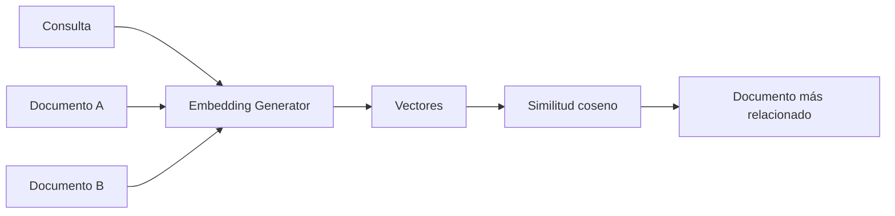

# Lab 07 - Embeddings

## Objetivo

Representar textos mediante vectores y comparar su cercanía semántica.

## Evolución conceptual

Hasta Lab 06 trabajábamos principalmente con texto, mensajes y objetos estructurados. Ahora incorporamos una nueva capacidad:

```text
texto
  ↓
embedding
  ↓
vector
```

Esta capacidad amplía los conceptos anteriores. Los modelos de chat siguen generando respuestas; los embeddings permiten comparar representaciones de textos.

Un modelo generativo produce texto y un modelo de embeddings produce vectores. Son capacidades distintas: no todos los modelos pueden generar embeddings, aunque pertenezcan al mismo proveedor.

Conservamos el patrón de configuración y factory. El ejercicio se realiza directamente en `Program.cs`, sin DI ni servicios adicionales, para concentrarnos en embeddings y similitud semántica.

---

## Qué es un embedding

Un embedding es una representación numérica de un texto. El modelo aprende a ubicar textos con significado relacionado en posiciones cercanas de un espacio vectorial.

“Notebook” y “laptop” pueden estar relacionadas aunque sean palabras distintas. La similitud semántica permite comparar significado sin exigir una coincidencia literal.

La cercanía es una señal aprendida por el modelo, no una garantía de equivalencia.

## Ejercicio

Generamos un embedding para cada texto:

| Texto | Contenido |
|---|---|
| Consulta | Quiero comprar una notebook para programar en Java |
| Documento A | Laptop para desarrollo de software con 32GB RAM |
| Documento B | Receta de pizza con salsa de tomate y mozzarella |

Calculamos la similitud de la consulta con cada documento y ordenamos los dos documentos de mayor a menor similitud.

Esperamos conceptualmente `similitud A > similitud B`, porque A habla de una computadora para desarrollo de software. Los scores y el resultado se calculan, sin valores hardcodeados. Si son iguales, mostramos un empate.

## Vector

El resultado es una secuencia de números `float`, accesible mediante `Embedding<float>.Vector`.

La dimensión indica cuántos números tiene el vector y depende del modelo. Mostramos la dimensión real recibida sin imprimir el vector completo. Los valores individuales no tienen una interpretación manual simple.

Para comparar textos debemos generar sus embeddings con el mismo modelo y configuración. La igualdad de dimensión por sí sola no asegura que sean comparables.

## Similitud coseno

Compara la dirección de dos vectores:

- cercano a 1 → mayor similitud;
- cercano a 0 → poca relación según esta medida;
- negativo → direcciones opuestas.

Su rango matemático es de -1 a 1. No es una probabilidad ni un porcentaje de coincidencia. La interpretación depende del modelo y de los textos.

`VectorSimilarity.cs` muestra el cálculo explícito sin bibliotecas matemáticas externas.

## Flujo



---

## Stack

- .NET 10 y C#;
- `DotNetEnv` 3.2.0;
- `Microsoft.Extensions.AI.OpenAI` 10.10.1.

El adaptador incluye transitivamente las abstracciones de `Microsoft.Extensions.AI` y el SDK oficial de OpenAI. No necesitamos agregar paquetes de DI, matemáticas o búsqueda vectorial.

## Estructura

```text
lab-07-embeddings/
├── docs/
│   ├── 01-que-es-un-embedding.md
│   ├── 02-iembeddinggenerator.md
│   ├── 03-similitud-coseno.md
│   └── 04-configuracion-y-embedding-generator-factory.md
├── EmbeddingGeneratorFactory.cs
├── LabConfiguration.cs
├── Lab07.Embeddings.csproj
├── Program.cs
├── VectorSimilarity.cs
└── README.md
```

| Pieza | Responsabilidad |
|---|---|
| `Program.cs` | Define textos, genera embeddings, compara y muestra resultados |
| `LabConfiguration` | Carga y valida la configuración común |
| `EmbeddingGeneratorFactory` | Construye el cliente concreto y devuelve `IEmbeddingGenerator<string, Embedding<float>>` |
| `VectorSimilarity` | Calcula similitud coseno y rechaza vectores inválidos |

## Configuración

Utilizamos el mismo `.env` en la raíz del repositorio:

**Nuevo parámetro desde Lab 07: `AI_EMBEDDING_MODEL`.** `AI_MODEL` conserva el modelo de chat; `AI_EMBEDDING_MODEL` define el modelo de embeddings. Así podemos mantener ambos configurados sin cambiar el modelo al pasar de un laboratorio a otro.

Hasta Lab 06 alcanzaba con `AI_MODEL` para las capacidades generativas/chat. Incorporamos esta distinción cuando aparece la necesidad de generar vectores, siguiendo el criterio KISS.

```text
AI_MODEL:           texto → respuesta generada
AI_EMBEDDING_MODEL: texto → vector
```

```env
AI_PROVIDER=openai
AI_MODEL=gpt-4o-mini
AI_EMBEDDING_MODEL=text-embedding-3-small
AI_API_KEY=tu-api-key
AI_URL=
```

| Variable | Obligatoria | Uso |
|---|---:|---|
| `AI_PROVIDER` | Sí | Identifica el proveedor activo |
| `AI_MODEL` | No en Lab 07 | Modelo de chat para los labs que lo utilizan |
| `AI_EMBEDDING_MODEL` | Sí | Modelo de embeddings activo |
| `AI_API_KEY` | Sí | Credencial |
| `AI_URL` | No | Endpoint alternativo absoluto |

Si usás Gemini, la configuración equivalente es:

```env
AI_PROVIDER=gemini
AI_MODEL=gemini-3.5-flash-lite
AI_EMBEDDING_MODEL=gemini-embedding-001
AI_API_KEY=tu-api-key
AI_URL=https://generativelanguage.googleapis.com/v1beta/openai/
```

Google documenta `gemini-embedding-001` para embeddings de texto mediante su [API compatible con OpenAI](https://ai.google.dev/gemini-api/docs/openai#embeddings).

Lab 07 requiere `AI_PROVIDER`, `AI_EMBEDDING_MODEL` y `AI_API_KEY`. No lee ni exige `AI_MODEL`, porque el ejercicio no usa chat. Los Labs 01-06 conservan su configuración actual. [Lab 09a](../lab-09-rag-basico/lab-09a-rag-explicito/README.md) y [Lab 09b](../lab-09-rag-basico/lab-09b-rag-service/README.md) ya utilizan ambos modelos para combinar recuperación semántica y generación.

`LabConfiguration` utiliza `Env.TraversePath().Load()` y expone el modelo como `EmbeddingModel`. `AI_URL` se valida con `Uri.TryCreate` y puede quedar vacía. No hay fallback a `AI_MODEL` ni un modelo de embeddings por defecto.

Ambos modelos comparten `AI_PROVIDER`, `AI_API_KEY` y `AI_URL`. Esta configuración permite usar chat y embeddings del mismo proveedor; cada modelo debe soportar su tarea.

El proveedor puede ser el mismo y los modelos distintos. No debemos asumir que el modelo configurado en `AI_MODEL` sirve también para embeddings.

La factory usa el cliente oficial de OpenAI. Sin `AI_URL`, utiliza el endpoint estándar del SDK. Con `AI_URL`, permite un endpoint OpenAI-compatible que implemente embeddings. `AI_PROVIDER` identifica el proveedor, pero no selecciona SDKs ni agrega defaults. Verificá que el proveedor y el modelo soporten esa API antes de configurar un endpoint alternativo; la compatibilidad con chat no lo garantiza.

## Ejecutar

Desde la raíz del repositorio:

```powershell
cd labs/lab-07-embeddings
dotnet restore
dotnet run
```

Se necesita una credencial válida y acceso al modelo de embeddings configurado.

## Salida esperada

Ejemplo conceptual; los marcadores entre `<...>` representan valores calculados durante la ejecución:

```text
=== EMBEDDINGS ===

Consulta:
Quiero comprar una notebook para programar en Java

Documento A:
Laptop para desarrollo de software con 32GB RAM

Documento B:
Receta de pizza con salsa de tomate y mozzarella

Dimensión del vector: <dimensión real>

Similitud consulta / documento A: <score A con cuatro decimales>
Similitud consulta / documento B: <score B con cuatro decimales>

Documentos ordenados por similitud:
Documento A: <score A>
Documento B: <score B>

Documento más relacionado: Documento A
```

Los scores y el orden real dependen de los embeddings recibidos. La expectativa pedagógica es que A tenga mayor similitud que B.

## Lecturas opcionales

El laboratorio puede realizarse sin leer estos documentos. Para profundizar:

- [Qué es un embedding](docs/01-que-es-un-embedding.md)
- [`IEmbeddingGenerator` y `Embedding<float>`](docs/02-iembeddinggenerator.md)
- [Similitud coseno](docs/03-similitud-coseno.md)
- [Configuración y `EmbeddingGeneratorFactory`](docs/04-configuracion-y-embedding-generator-factory.md)

## Qué aprendemos

Al finalizar deberías poder explicar:

1. qué es un embedding;
2. qué representa el vector;
3. para qué sirve `IEmbeddingGenerator`;
4. por qué dos textos relacionados deberían tener mayor similitud;
5. qué mide la similitud coseno;
6. por qué un modelo de embeddings es conceptualmente diferente de un modelo de chat;
7. por qué comparar representaciones semánticas será útil posteriormente para recuperar contenido relevante en RAG.

## Qué NO hacemos todavía

- documentos reales y carga de archivos;
- chunking;
- vector stores y bases vectoriales;
- RAG;
- persistencia;
- búsqueda aproximada y top-k avanzado;
- metadata y filtros;
- re-ranking;
- agentes, tools y memoria conversacional.

## Siguiente laboratorio

**Lab 08 - Document Loading**

El siguiente paso será dejar de trabajar con strings definidos en código y comenzar a incorporar documentos.
