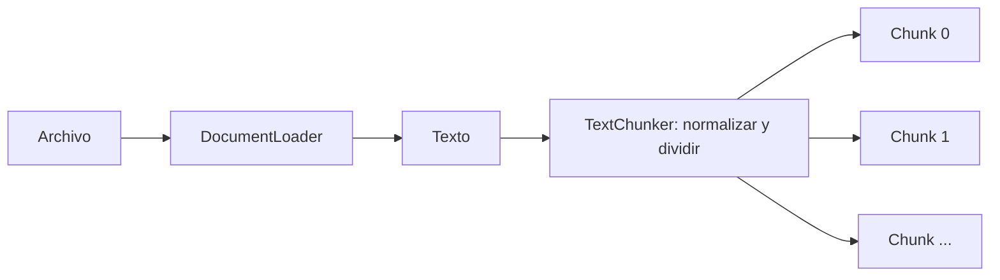

# Lab 08 - Document Loading

## Objetivo

Observar cómo un documento local se convierte en texto y luego en fragmentos que podrán procesarse posteriormente.

```text
archivo → cargar contenido → texto → normalizar → dividir en chunks
```

El concepto nuevo es **preparar documentos**, no construir RAG.

## Evolución conceptual

| Laboratorio | Flujo |
|---|---|
| [Lab 07](../lab-07-embeddings/README.md) | texto → embedding → vector → similitud |
| Lab 08 | archivo → texto → chunks |
| [Lab 09a](../lab-09-rag-basico/lab-09a-rag-explicito/README.md) | chunks → embeddings → recuperación → contexto → LLM |

En este lab dejamos de definir todo el contenido como strings en código. No reutilizamos configuración ni clientes de IA porque no los necesitamos.

---

## El problema

Un documento grande no suele manejarse como una única unidad cuando queremos recuperar fragmentos relevantes. Dividirlo permite trabajar con porciones más pequeñas y conservar su origen y secuencia.

Todavía no recuperamos resultados ni generamos respuestas: solo preparamos esas unidades.

## Document Loading

Aquí significa **archivo → string**. `DocumentLoader.LoadAsync` comprueba existencia y extensión y lee todo el contenido con `File.ReadAllTextAsync`.

El archivo es el recurso en disco; el string es su contenido en memoria. Los errores indican si falta el archivo o si su formato no está soportado. Otros errores de lectura, como permisos, se propagan desde .NET.

## Formatos soportados

Solo **.txt y .md**, sin distinguir mayúsculas en la extensión. Es una decisión deliberada de alcance: ambos se leen como texto plano mediante APIs estándar. No interpretamos ni renderizamos Markdown.

## Normalización

Dentro de `TextChunker.Split` convertimos los saltos de línea a `\n` y aplicamos `Trim()` al texto completo. Conservamos las líneas vacías interiores, las mayúsculas, los acentos y el Markdown.

No aplicamos Trim a cada chunk: eso alteraría el solapamiento exacto. El contador de caracteres leídos corresponde al archivo antes de normalizar; los límites de chunks corresponden al texto normalizado.

## Chunk

Un chunk es una porción de texto. Puede cortar una palabra o una oración: este algoritmo no intenta comprender el contenido ni preservar su estructura.

## DocumentChunk

| Propiedad | Qué representa |
|---|---|
| `Content` | Texto del fragmento |
| `Source` | Nombre del archivo de origen |
| `Index` | Posición del fragmento en la secuencia, comenzando en 0 |

`Index` no es un número de página ni un desplazamiento de caracteres. Usamos propiedades inicializadas, como los modelos sencillos de los labs anteriores.

## Chunk Size

`chunkSize = 500` es el máximo de unidades de string por fragmento. El último puede ser más corto. En C#, `Length` cuenta unidades UTF-16: no necesariamente letras visibles ni tokens de un modelo.

Elegimos caracteres porque el mecanismo es visible y fácil de observar.

## Overlap

`overlap = 100` hace que los siguientes fragmentos avancen **400** posiciones:

```text
Chunk 0: posiciones 0..499
Chunk 1: posiciones 400..899
Zona compartida: posiciones 400..499
```

Si un corte separa «el modelo genera una» de «respuesta a partir…», repetir parte del final anterior ayuda a conservar contexto. **No garantiza comprensión semántica**: solo reduce el efecto de límites arbitrarios.

El algoritmo exige `chunkSize > 0`, `overlap >= 0` y `overlap < chunkSize`. El texto vacío o compuesto solo por espacios devuelve cero chunks; no se agrega un fragmento de longitud cero ni una cola redundante al llegar al final.

## Flujo



## Estructura

```text
lab-08-document-loading/
├── docs/
│   ├── 01-document-loading.md
│   ├── 02-chunking.md
│   ├── 03-overlap.md
│   └── 04-document-chunk.md
├── documents/
│   └── introduccion-ia.md
├── DocumentChunk.cs
├── DocumentLoader.cs
├── Lab08.DocumentLoading.csproj
├── Program.cs
├── TextChunker.cs
└── README.md
```

`Program.cs` permite seguir cargar → dividir → observar. No hay DI, interfaces, factories ni servicios de aplicación.

## Ejecutar

Desde la raíz del repositorio, con el SDK de .NET 10:

```powershell
cd labs/lab-08-document-loading
dotnet restore
dotnet build
dotnet run
```

El proyecto copia `documents/` al output y resuelve el archivo con `AppContext.BaseDirectory`. No depende del directorio actual de la terminal.

## Salida esperada

Salida conceptual: los marcadores representan valores calculados, no constantes.

```text
=== DOCUMENT LOADING ===

Archivo: introduccion-ia.md
Caracteres leídos: <cantidad real>

=== CHUNKING ===

Tamaño máximo: 500
Overlap: 100
Chunks generados: <cantidad real>

--- Chunk 0 ---
Source: introduccion-ia.md

<contenido>

--- Chunk 1 ---
Source: introduccion-ia.md

<contenido que repite los últimos 100 caracteres del anterior>
```

Se imprimen todos los chunks para comparar sus extremos. Probá cambiar overlap a 0 y luego restaurarlo a 100. Compará también tamaños 300 y 500; no son valores universales recomendados.

## Sin configuración de IA

**Lab 08 trabaja exclusivamente con documentos locales. No utiliza ningún modelo ni servicio externo.**

No necesita `.env`, claves ni configuración de IA. Funciona offline con el SDK instalado y no agrega paquetes NuGet. No incorporamos infraestructura que el ejercicio no necesita.

## Lecturas opcionales

Primero ejecutar, luego seguir el código y profundizar solo donde haga falta:

- [Document Loading](docs/01-document-loading.md)
- [Chunking](docs/02-chunking.md)
- [Overlap](docs/03-overlap.md)
- [DocumentChunk](docs/04-document-chunk.md)

## Qué aprendemos

Al finalizar deberías poder explicar:

1. qué significa cargar un documento;
2. por qué convertimos el archivo a texto;
3. qué es un chunk;
4. qué representa `chunkSize`;
5. qué representa `overlap`;
6. para qué sirve `Source`;
7. para qué sirve `Index`;
8. por qué todavía no estamos haciendo RAG;
9. cómo estos chunks podrán utilizarse posteriormente.

## Qué NO hacemos todavía

- embeddings sobre chunks;
- búsqueda semántica o similitud coseno;
- vector stores;
- RAG o llamadas a modelos;
- PDF, Word u OCR;
- persistencia de chunks;
- metadata avanzada;
- tokenización;
- chunking semántico;
- tools, agentes, memoria o re-ranking.

## Siguiente laboratorio

**[Lab 09 - RAG básico](../lab-09-rag-basico/README.md)** está implementado mediante Lab 09a - RAG explícito y Lab 09b - RAG con RagService. Primero observamos el pipeline y después encapsulamos su coordinación.

El siguiente paso es chunks → embeddings → recuperación de fragmentos relevantes → contexto para una respuesta. Lab 08 deja preparados los fragmentos; Lab 09a agrega recuperación y generación.
