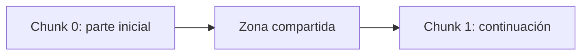

# Lectura opcional - Overlap

## Una zona compartida

El Chunk 0 contiene parte inicial + zona compartida. El Chunk 1 contiene zona compartida + continuación. Esa zona se copia literalmente, no se resume.

Con tamaño 500 y overlap 100, el primero cubre 0..499 y el segundo 400..899. Las posiciones 400..499 pertenecen a ambos. Estos números ilustran el ejemplo; no son una regla universal.

## Para qué sirve

Si el corte separa «el modelo genera una» de «respuesta a partir…», compartir texto puede reducir la pérdida de contexto entre fragmentos. No garantiza que una idea quede completa ni aporta comprensión semántica.

Más solapamiento implica mayor redundancia y normalmente más chunks para un texto suficientemente largo. No existe un valor perfecto para todos los documentos.

Con overlap 0 no hay repetición. Si overlap alcanza el tamaño, el avance sería cero: por eso el algoritmo rechaza ese valor y los mayores. También rechaza valores negativos.

El último chunk termina el recorrido; no generamos otro que repita únicamente su cola.

[Volver al laboratorio](../README.md).
