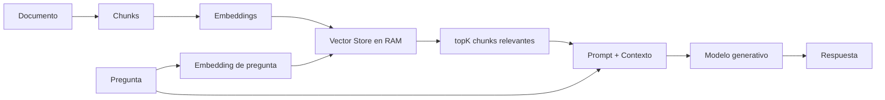

# Lab 09a - RAG explícito

## Objetivo

Construir manualmente un RAG mínimo y observar cada paso. `Program.cs` muestra el pipeline completo, sin ocultarlo detrás de un servicio de alto nivel.

## Evolución

| Laboratorio | Capacidad |
|---|---|
| [Lab 07](../../lab-07-embeddings/README.md) | texto → embedding → vector → similitud |
| [Lab 08](../../lab-08-document-loading/README.md) | archivo → texto → chunks |
| Lab 09a | chunks → embeddings → recuperación → contexto → generación |
| [Lab 09b](../lab-09b-rag-service/README.md) | mismo pipeline → encapsulado en RagService |

Lab 09a pertenece a [Lab 09 - RAG básico](../README.md). Lab 09b es la segunda evolución, implementada dentro del mismo laboratorio. Aquí conservamos el pipeline explícito para comprender el mecanismo.

## Qué significa RAG

**Retrieval-Augmented Generation** combina:

```text
recuperar información + agregar contexto + generar una respuesta
```

La aplicación selecciona contenido del documento y lo envía junto con la pregunta. RAG no entrena el modelo ni le da acceso automático a los archivos.

## Indexación vs consulta

Son dos momentos distintos, aunque el ejemplo ejecute ambos en un mismo proceso.

**Indexación:** cargar `guia-dotnet-ai.md`, normalizar, dividir, generar embeddings de los chunks y asociarlos en un índice en memoria.

```text
documento → chunks → embeddings → índice
```

**Consulta:** generar el embedding de la pregunta, recuperar fragmentos, construir el contexto y el prompt, y llamar al modelo generativo.

```text
pregunta → embedding → búsqueda semántica → topK → contexto → prompt → modelo generativo → respuesta
```

La pregunta fija es: **¿Qué función cumple IChatClient en Microsoft.Extensions.AI?** Su respuesta está en el documento, especialmente en la sección `IChatClient`.

## Vector Store

`InMemoryVectorStore` mantiene una lista de `IndexedChunk`, que asocia un `DocumentChunk` con su vector. `Search` compara el vector de la pregunta con **todos** los vectores mediante similitud coseno, ordena de mayor a menor y devuelve resultados con chunk y similitud.

Es una búsqueda lineal en RAM para observar el mecanismo. No es una base vectorial de producción y pierde sus datos al cerrar el proceso. Se vuelve a indexar en cada ejecución.

Si el store está vacío, `Search` devuelve una colección vacía. `topK <= 0` produce un error claro. La comparación rechaza vectores vacíos, dimensiones diferentes, números no finitos y magnitud cero.

## topK

`topK = 3` significa **cantidad máxima de chunks recuperados**. Si hay menos disponibles, devuelve los que existan. No significa que todos sean relevantes: en este lab no hay score mínimo, filtros ni re-ranking.

Los valores de similitud y el ranking se calculan, sin resultados hardcodeados.

## Prompt con contexto

`Program.cs` une los fragmentos recuperados con encabezados de este tipo:

```text
[Fuente: guia-dotnet-ai.md - Chunk <índice>]
<contenido>
```

`Source` e `Index` permiten observar de dónde salió cada fragmento. No son citaciones formales de la respuesta.

`PromptTemplates.Rag(context, question)` pide responder solo con el contexto e indicar cuando falta información. Es un grounding básico: reduce el riesgo de usar información externa, pero no garantiza ausencia de errores o alucinaciones.

## AI_MODEL vs AI_EMBEDDING_MODEL

```text
AI_EMBEDDING_MODEL: texto → vector
AI_MODEL:           pregunta + contexto → respuesta generada
```

Son capacidades distintas y no todos los modelos soportan ambas. En Lab 09a necesitamos las dos simultáneamente. Los chunks y la pregunta usan el mismo modelo de embeddings y configuración; el modelo generativo puede ser diferente aunque pertenezca al mismo proveedor.

## Flujo



## Estructura

Dentro de `lab-09-rag-basico/` conviven `lab-09a-rag-explicito/` y `lab-09b-rag-service/`. La estructura de este sublaboratorio es:

```text
lab-09a-rag-explicito/
├── documents/
│   └── guia-dotnet-ai.md
├── docs/
│   ├── 01-que-es-rag.md
│   ├── 02-indexacion.md
│   ├── 03-recuperacion-semantica.md
│   ├── 04-contexto-y-prompt.md
│   └── 05-limitaciones-rag-basico.md
├── ChatClientFactory.cs
├── DocumentChunk.cs
├── DocumentLoader.cs
├── EmbeddingGeneratorFactory.cs
├── IndexedChunk.cs
├── InMemoryVectorStore.cs
├── LabConfiguration.cs
├── Lab09a.RagExplicito.csproj
├── Program.cs
├── PromptTemplates.cs
├── SearchResult.cs
├── TextChunker.cs
├── VectorSimilarity.cs
└── README.md
```

| Pieza | Responsabilidad |
|---|---|
| `Program.cs` | Hace visibles las dos etapas y muestra sus resultados |
| `LabConfiguration` | Carga y valida las cinco variables comunes |
| `ChatClientFactory` | Construye `IChatClient` con `Model` |
| `EmbeddingGeneratorFactory` | Construye `IEmbeddingGenerator<string, Embedding<float>>` con `EmbeddingModel` |
| `DocumentLoader`, `TextChunker`, `DocumentChunk` | Conservan el enfoque de preparación documental de Lab 08 |
| `IndexedChunk` | Asocia un chunk con su vector |
| `InMemoryVectorStore` | Almacena y busca linealmente |
| `SearchResult` | Asocia un chunk recuperado con su similitud |
| `VectorSimilarity` | Calcula coseno explícitamente, como en Lab 07 |
| `PromptTemplates` | Construye el único template RAG |

`IndexedChunk` y `SearchResult` son records pequeños con dos valores. `DocumentChunk` conserva únicamente contenido, origen e índice; no mezcla contenido con vectores o scores.

## Configuración

Utilizamos el `.env` de la raíz, encontrado mediante `Env.TraversePath().Load()`:

```env
AI_PROVIDER=openai
AI_MODEL=gpt-4o-mini
AI_EMBEDDING_MODEL=text-embedding-3-small
AI_API_KEY=tu-api-key
AI_URL=
```

| Variable | Obligatoria | Uso |
|---|---:|---|
| `AI_PROVIDER` | Sí | Identifica el proveedor activo |
| `AI_MODEL` | Sí | Modelo generativo/chat |
| `AI_EMBEDDING_MODEL` | Sí | Modelo de embeddings |
| `AI_API_KEY` | Sí | Credencial del proveedor |
| `AI_URL` | No | Endpoint alternativo absoluto |

No hay modelos por defecto ni selección de SDK por nombre de proveedor. Ambas factories utilizan el SDK de OpenAI y permiten un endpoint compatible explícito mediante `AI_URL`. Sin esa variable utilizan el endpoint estándar del SDK. La compatibilidad con chat no implica soporte de embeddings: verificá ambas capacidades y los modelos configurados.

Las factories solo construyen clientes. No cargan documentos, buscan ni construyen prompts. Lab 09a usa construcción directa; no necesitamos DI para observar este flujo.

## Ejecutar

Con .NET 10, desde la raíz:

```powershell
cd labs/lab-09-rag-basico/lab-09a-rag-explicito
dotnet restore
dotnet build
dotnet run
```

El proyecto copia `documents/` al output y resuelve la ruta con `AppContext.BaseDirectory`. La lectura y el chunking son locales; embeddings y generación requieren credenciales válidas y acceso a los dos modelos.

Paquetes directos: `DotNetEnv` 3.2.0 y `Microsoft.Extensions.AI.OpenAI` 10.10.1. El adaptador aporta transitivamente las abstracciones de `Microsoft.Extensions.AI` y el SDK de OpenAI. No agregamos paquetes de DI, matemáticas o RAG.

## Salida esperada

Ejemplo conceptual. Los marcadores representan resultados de ejecución; los índices, scores y respuesta dependen del contenido y los modelos.

```text
=== RAG BÁSICO - LAB 09a ===

=== DOCUMENTO ===
Archivo: guia-dotnet-ai.md
Caracteres: <cantidad real>
Chunks: <cantidad real>
Tamaño máximo: 500
Overlap: 100

=== INDEXACIÓN ===
Modelo de embeddings: <AI_EMBEDDING_MODEL>
Chunks indexados: <cantidad real>

=== CONSULTA ===
¿Qué función cumple IChatClient en Microsoft.Extensions.AI?

=== RECUPERACIÓN ===
Top K: 3
Chunk <índice> - similitud: <score con cuatro decimales>
Chunk <índice> - similitud: <score con cuatro decimales>
Chunk <índice> - similitud: <score con cuatro decimales>

=== CONTEXTO RECUPERADO ===
[Fuente: guia-dotnet-ai.md - Chunk <índice>]
<contenido recuperado>
...

=== GENERACIÓN ===
Modelo: <AI_MODEL>

=== RESPUESTA ===
<respuesta generada a partir del contexto>
```

## Lecturas opcionales

- [Qué es RAG](docs/01-que-es-rag.md)
- [Indexación](docs/02-indexacion.md)
- [Recuperación semántica](docs/03-recuperacion-semantica.md)
- [Contexto y prompt](docs/04-contexto-y-prompt.md)
- [Limitaciones del RAG básico](docs/05-limitaciones-rag-basico.md)

## Qué aprendemos

Al finalizar deberías poder explicar:

1. qué significa RAG;
2. la diferencia entre indexación y consulta;
3. por qué generamos embeddings de los chunks;
4. por qué generamos un embedding de la pregunta;
5. qué hace el vector store;
6. qué significa topK;
7. cómo construimos el contexto;
8. por qué el modelo recibe contexto recuperado;
9. la diferencia entre `AI_MODEL` y `AI_EMBEDDING_MODEL`;
10. por qué primero observamos el pipeline sin encapsularlo en un servicio.

## Qué NO hacemos todavía

- `RagService` ni `IRagService`;
- DI;
- vector database externa ni persistencia;
- score mínimo, filtros ni re-ranking;
- chunking avanzado;
- citaciones formales;
- evaluación automática;
- hybrid search ni query rewriting;
- agentes RAG.

## Siguiente paso dentro de Lab 09

**[Lab 09b - RAG con RagService](../lab-09b-rag-service/README.md)**, implementado.

El siguiente paso encapsula este mismo pipeline en `IRagService` y `RagService`, revisa la responsabilidad del servicio y reduce el flujo principal. Reutiliza DI para componer las dependencias. Lab 09a conserva su código explícito como referencia del mecanismo.
