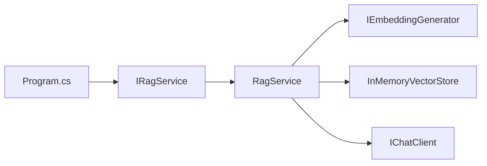

# Lab 09b - RAG con RagService

## Objetivo

Encapsular el pipeline RAG aprendido en [Lab 09a](../lab-09a-rag-explicito/README.md) dentro de un servicio reutilizable. El algoritmo conserva el mismo documento, chunking, embeddings, búsqueda, prompt y topK. Cambia quién coordina esas etapas.

## Punto de partida

Lab 09a hacía visible el mecanismo en `Program.cs`:

```text
cargar → chunkear → embeddings → indexar → recuperar → contexto → prompt → generar
```

Ese recorrido permitió comprender indexación y consulta antes de introducir un servicio de aplicación.

## El problema

El pipeline funciona, pero `Program.cs` conoce cada paso de la coordinación. Si queremos volver a indexar o realizar otra consulta desde un consumidor diferente, necesitamos una capacidad de aplicación que reúna esas operaciones.

Ahora que entendemos el mecanismo, podemos identificar esa responsabilidad y encapsularla.

## El servicio

```text
Program.cs → IRagService → RagService → mismo pipeline
```

`RagService` coordina indexación y consulta. `IRagService` expresa esas dos capacidades para el consumidor.

La interfaz retoma conscientemente contrato + implementación de Lab 03. Está justificada por una responsabilidad concreta: indexar y consultar conocimiento. No es una regla que obligue a crear interfaces para todas las clases; `InMemoryVectorStore` sigue siendo una dependencia concreta.

## Contrato

```csharp
public interface IRagService
{
    Task IndexDocumentAsync(string documentPath);

    Task<RagResponse> AskAsync(string question, int topK = 3);
}
```

`IndexDocumentAsync` carga el documento, normaliza, divide, genera embeddings en batch y agrega los chunks con sus vectores al store. Comprueba que la cantidad de embeddings coincida con la de chunks.

`AskAsync` genera un embedding de la pregunta, recupera como máximo topK chunks, construye contexto y prompt, llama al cliente de chat y devuelve respuesta y fuentes.

Como en 09a, el índice vive en RAM y la búsqueda es lineal por similitud coseno. `topK <= 0` produce un error claro y un store vacío devuelve cero resultados de búsqueda. El ejemplo indexa un documento una vez; llamadas posteriores a indexación agregan fragmentos al mismo store.

## Responsabilidades

| Pieza | Responsabilidad |
|---|---|
| `Program.cs` | Composición, ejecución del ejemplo y presentación |
| `IRagService` | Contrato para indexar y preguntar |
| `RagService` | Coordinación de las dos etapas del pipeline |
| `LabConfiguration` y factories | Configuración validada y construcción de clientes |
| `DocumentLoader`, `TextChunker` | Lectura y preparación del texto |
| `InMemoryVectorStore`, `VectorSimilarity` | Almacenamiento, ranking y cálculo coseno |
| `PromptTemplates` | Construcción de la instrucción con contexto |

El servicio recibe sus colaboradores. No lee `.env`, crea clientes ni escribe en consola. Las etapas internas siguen siendo visibles al abrir `RagService.cs`.

## Dependencias

El constructor recibe:

```text
RagService
  ├── IChatClient
  ├── IEmbeddingGenerator<string, Embedding<float>>
  └── InMemoryVectorStore
```

Los clientes representan capacidades de IA. El store conserva el índice. `RagService` utiliza esos objetos y las funciones de carga, chunking y prompt para coordinar el trabajo.

`ChunkSize = 500` y `Overlap = 100` son constantes privadas del servicio. El ejemplo mantiene `topK = 3` visible en `Program.cs`, además del valor opcional del contrato. No agregamos configuración específica de RAG.

## RagResponse

```csharp
public sealed record RagResponse(
    string Answer,
    IReadOnlyList<SearchResult> Sources);
```

Conservar `Answer` y `Sources` permite presentar la respuesta y observar qué fragmentos se recuperaron, con su índice, origen y similitud. El resultado sigue siendo pequeño y no expone detalles de composición del prompt ni diagnóstico adicional.

`Sources` representa los resultados de retrieval; no garantiza que cada fragmento haya sido utilizado por el modelo y no constituye citaciones formales.

## Program.cs antes/después

Lab 09a:

```text
Program.cs
  → cargar, dividir, generar embeddings, indexar
  → generar embedding de pregunta, buscar, construir contexto y prompt, llamar al modelo
  → mostrar
```

Lab 09b, después de componer las dependencias:

```csharp
await ragService.IndexDocumentAsync(documentPath);
RagResponse response = await ragService.AskAsync(question, topK);
```

`Program.cs` presenta `response.Sources` y `response.Answer`. Lab 09a conserva su propósito de mostrar el mecanismo; Lab 09b permite practicar su encapsulación después de comprenderlo.

## DI

Usamos el contenedor de .NET, ya estudiado en Lab 03. **El objetivo sigue siendo servicio y encapsulación; DI es el mecanismo de composición.**

| Registro | Ciclo de vida | Motivo en este ejemplo |
|---|---|---|
| `IChatClient` | Singleton | Reutilizar el cliente durante la ejecución |
| `IEmbeddingGenerator<string, Embedding<float>>` | Singleton | Reutilizar el generador durante la ejecución |
| `InMemoryVectorStore` | Singleton | Conservar el índice entre indexación y consultas |
| `IRagService` → `RagService` | Transient | Coordinar con dependencias compartidas, sin guardar el índice en el servicio |

Una nueva resolución del servicio utiliza el mismo store dentro del mismo `ServiceProvider`. Singleton describe este ejemplo; no es una regla universal para cualquier aplicación RAG. El proveedor de servicios se libera con `using` al terminar y dispone los clientes que construyó.

## Flujo



## Estructura

```text
lab-09b-rag-service/
├── documents/
│   └── guia-dotnet-ai.md
├── docs/
│   ├── 01-por-que-rag-service.md
│   ├── 02-responsabilidades.md
│   ├── 03-dependencias-del-servicio.md
│   └── 04-de-09a-a-09b.md
├── ChatClientFactory.cs
├── DocumentChunk.cs
├── DocumentLoader.cs
├── EmbeddingGeneratorFactory.cs
├── IndexedChunk.cs
├── InMemoryVectorStore.cs
├── IRagService.cs
├── LabConfiguration.cs
├── Lab09b.RagService.csproj
├── Program.cs
├── PromptTemplates.cs
├── RagResponse.cs
├── RagService.cs
├── SearchResult.cs
├── TextChunker.cs
├── VectorSimilarity.cs
└── README.md
```

El sublab incluye sus propios componentes y documento, sin dependencia runtime de 09a. El `.csproj` copia `documents/` al output; la ruta se resuelve con `AppContext.BaseDirectory`.

## Configuración

La misma que 09a, en el `.env` de la raíz:

```env
AI_PROVIDER=openai
AI_MODEL=gpt-4o-mini
AI_EMBEDDING_MODEL=text-embedding-3-small
AI_API_KEY=tu-api-key
AI_URL=
```

| Variable | Obligatoria | Uso |
|---|---:|---|
| `AI_PROVIDER` | Sí | Proveedor activo |
| `AI_MODEL` | Sí | Modelo generativo/chat |
| `AI_EMBEDDING_MODEL` | Sí | Modelo de embeddings |
| `AI_API_KEY` | Sí | Credencial del proveedor |
| `AI_URL` | No | Endpoint alternativo absoluto |

Generación y embeddings son capacidades distintas: texto → respuesta y texto → vector. No todos los modelos soportan ambas. Chunks y pregunta utilizan el mismo modelo de embeddings; ambos clientes comparten proveedor, credencial y endpoint.

`LabConfiguration` conserva `Env.TraversePath().Load()`, variables obligatorias sin defaults y validación de `AI_URL` con `Uri.TryCreate`. Las factories utilizan el SDK de OpenAI y aceptan un endpoint compatible explícito. La compatibilidad con chat no garantiza soporte de embeddings.

## Ejecutar

Con .NET 10, desde la raíz:

```powershell
cd labs/lab-09-rag-basico/lab-09b-rag-service
dotnet restore
dotnet build
dotnet run
```

Se necesitan credenciales válidas y acceso a los modelos configurados. Paquetes directos: `DotNetEnv` 3.2.0, `Microsoft.Extensions.AI.OpenAI` 10.10.1 y `Microsoft.Extensions.DependencyInjection` 10.0.0. Las abstracciones de IA y el SDK OpenAI llegan transitivamente mediante el adaptador.

## Salida esperada

Ejemplo conceptual. Los índices, scores y respuesta se calculan durante la ejecución:

```text
=== RAG BÁSICO - LAB 09b ===

Documento: guia-dotnet-ai.md
Indexando documento...
Documento indexado.

=== CONSULTA ===
¿Qué función cumple IChatClient en Microsoft.Extensions.AI?

=== CHUNKS RECUPERADOS ===
Top K: 3
Chunk <índice> (guia-dotnet-ai.md) - similitud: <score>
Chunk <índice> (guia-dotnet-ai.md) - similitud: <score>
Chunk <índice> (guia-dotnet-ai.md) - similitud: <score>

=== RESPUESTA ===
<respuesta generada con el contexto recuperado>
```

## Lecturas opcionales

- [Por qué RagService](docs/01-por-que-rag-service.md)
- [Responsabilidades](docs/02-responsabilidades.md)
- [Dependencias del servicio](docs/03-dependencias-del-servicio.md)
- [De 09a a 09b](docs/04-de-09a-a-09b.md)

## Qué aprendemos

Al finalizar deberías poder explicar:

1. qué responsabilidad encapsula `RagService`;
2. por qué aparece `IRagService`;
3. la diferencia entre mecanismo RAG y servicio RAG;
4. por qué el servicio recibe sus dependencias;
5. por qué no crea `IChatClient`;
6. por qué no crea `IEmbeddingGenerator`;
7. por qué `InMemoryVectorStore` conserva el índice;
8. para qué sirve `RagResponse`;
9. por qué `Program.cs` queda más simple;
10. por qué 09a sigue siendo importante aunque 09b reduzca la orquestación del programa.

## Qué NO hacemos todavía

- RAG avanzado ni nuevas capacidades de recuperación;
- vector database externa ni persistencia;
- threshold, filtros ni re-ranking;
- chunking avanzado ni tokenización;
- query rewriting, multi-query ni hybrid search;
- evaluación ni citaciones formales;
- metadata avanzada, agentes ni tools.

## Siguiente laboratorio

**Lab 10 - RAG avanzado**, pendiente.

Después de comprender y encapsular el pipeline básico podremos estudiar mejoras de recuperación. No las incorporamos en esta refactorización pedagógica.
