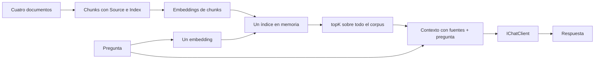

# Lab 10a - Múltiples documentos

## Objetivo

Responder una pregunta: **¿qué cambia cuando el conocimiento deja de estar en un único documento y pasa a formar un corpus de varios documentos?**

```text
varios documentos → corpus → chunks con Source → embeddings
                                                   ↓
                                            un único índice
                                                   ↓
                                      búsqueda sobre todo el corpus
                                                   ↓
                                     resultados de distintas fuentes
```

## Evolución desde Lab 09

| Lab 09 | Lab 10a |
|---|---|
| Un documento | Varios documentos descubiertos en una carpeta |
| Chunks de una fuente | Chunks que conservan su archivo de origen |
| Un índice en memoria | Un índice en memoria con todo el corpus |
| Retrieval sobre ese documento | Retrieval sobre todos los chunks del corpus |

Reutilizamos las piezas conocidas de [09a](../../lab-09-rag-basico/lab-09a-rag-explicito/README.md) y [09b](../../lab-09-rag-basico/lab-09b-rag-service/README.md). Embeddings, similitud coseno, chunking y el prompt RAG mantienen su función. El cambio central es ampliar el conocimiento disponible y hacer visible la procedencia de cada resultado.

`Program.cs` conserva el pipeline explícito para observar ese cambio. No agregamos un servicio de corpus ni una nueva abstracción de retrieval. Primero entendemos y experimentamos; abstraemos cuando aparece una necesidad concreta.

## El problema y el corpus

Un documento puede explicar embeddings y otro describir RAG. Para responder una pregunta que relaciona ambos temas necesitamos buscar en el conjunto, conservando de dónde viene cada fragmento.

Un **corpus** es ese conjunto de documentos que indexamos como conocimiento disponible. Este ejemplo incluye cuatro archivos Markdown:

| Archivo | Tema principal |
|---|---|
| `microsoft-extensions-ai.md` | Abstracciones comunes e `IChatClient` |
| `embeddings.md` | Representación vectorial y búsqueda semántica |
| `rag.md` | Retrieval, contexto externo y generación |
| `dependency-injection.md` | Composición de dependencias en .NET |

Los textos de embeddings y RAG comparten conceptos de manera deliberada. La consulta fija es:

> ¿Cómo se relacionan los embeddings con un sistema RAG?

## Indexación de varios documentos

El programa descubre los archivos `*.md` de `documents/` y ordena sus rutas con `StringComparer.Ordinal`. El descubrimiento y la indexación tienen así un orden estable.

El `InMemoryVectorStore` se crea **una sola vez, antes del `foreach`**. Para cada archivo:

1. `DocumentLoader` carga su texto.
2. `TextChunker` crea chunks con `Path.GetFileName(documentPath)` como `Source`.
3. El generador produce embeddings de esos chunks.
4. Se comprueba que la cantidad de chunks y embeddings coincida.
5. Cada asociación `chunks[i]` / `chunkEmbeddings[i]` se agrega al mismo índice.

Se mantienen `chunkSize = 500` y `overlap = 100`, como en Lab 09. La consola muestra caracteres y chunks por documento, y después el total indexado. No hay un vector store por archivo.

## Source y posición local

`DocumentChunk.Source` conserva el nombre del archivo de origen. `DocumentChunk.Index` indica la posición dentro de ese archivo y comienza nuevamente en cero al dividir el siguiente documento:

```text
embeddings.md - Chunk 0
embeddings.md - Chunk 1
rag.md - Chunk 0
rag.md - Chunk 1
```

Esa repetición es correcta. Para este corpus pequeño, **`Source + Index`** permite reconocer el fragmento. No necesitamos GUID ni identificadores globales.

## Retrieval sobre todo el corpus

```text
N chunks → N embeddings para indexar
1 pregunta → 1 embedding para consultar
```

La consulta utiliza el mismo modelo de embeddings que los documentos. El código conserva una variable singular `questionEmbedding` y busca con `topK = 3` sobre el único índice.

El retrieval compara contra todos los chunks del corpus; no selecciona primero un documento completo. Los candidatos mejor posicionados pueden proceder de distintos archivos. La consola muestra **Source, Chunk y Similarity** para cada resultado.

El ranking depende de los textos y del modelo. No se fuerza diversidad de fuentes: también podrían recuperarse varios fragmentos de un mismo archivo. Ordenar las rutas hace estable el recorrido de archivos, no garantiza resultados idénticos entre modelos o llamadas.

## Contexto y respuesta

Cada resultado aporta su contenido con un encabezado:

```text
[Fuente: embeddings.md - Chunk <índice>]
<contenido del fragmento>

[Fuente: rag.md - Chunk <índice>]
<contenido del fragmento>
```

`PromptTemplates.Rag(context, question)` combina ese contexto con la pregunta. `IChatClient` genera la respuesta. Las fuentes permiten observar qué material llegó al prompt; no implementamos citaciones formales ni verificamos cada afirmación generada.

## Flujo



## Estructura

```text
lab-10a-multiples-documentos/
├── documents/
│   ├── microsoft-extensions-ai.md
│   ├── embeddings.md
│   ├── rag.md
│   └── dependency-injection.md
├── docs/
│   ├── 01-corpus-de-documentos.md
│   ├── 02-source-y-procedencia.md
│   └── 03-retrieval-multifuente.md
├── ChatClientFactory.cs
├── DocumentChunk.cs
├── DocumentLoader.cs
├── EmbeddingGeneratorFactory.cs
├── IndexedChunk.cs
├── InMemoryVectorStore.cs
├── LabConfiguration.cs
├── Lab10a.MultiplesDocumentos.csproj
├── Program.cs
├── PromptTemplates.cs
├── SearchResult.cs
├── TextChunker.cs
├── VectorSimilarity.cs
└── README.md
```

Las piezas conocidas tienen copias locales para que el sublab sea autocontenido. No hay dependencia de ejecución hacia Lab 09. `VectorSimilarity` conserva la versión actual de 09a como infraestructura ya aprendida.

El `.csproj` copia `documents/` al output y el programa resuelve la carpeta con `AppContext.BaseDirectory`.

## Configuración

Se utiliza el `.env` de la raíz, con la convención vigente:

```env
AI_PROVIDER=openai
AI_MODEL=gpt-4o-mini
AI_EMBEDDING_MODEL=text-embedding-3-small
AI_API_KEY=...
AI_URL=
```

| Variable | Uso |
|---|---|
| `AI_PROVIDER` | Proveedor activo |
| `AI_MODEL` | Modelo generativo/chat para la respuesta |
| `AI_EMBEDDING_MODEL` | Modelo de embeddings para chunks y pregunta |
| `AI_API_KEY` | Credencial del proveedor |
| `AI_URL` | Endpoint alternativo opcional |

Se requieren las primeras cuatro variables; `AI_URL` es opcional y se valida como URI absoluta. Chat y embeddings son capacidades distintas, aunque compartan proveedor, credencial y endpoint. La compatibilidad con chat no demuestra soporte de embeddings. Se conserva el comportamiento de las factories de Lab 09 para endpoints compatibles explícitos.

## Ejecutar

Con .NET 10, desde la raíz:

```powershell
cd labs/lab-10-retrieval-calidad/lab-10a-multiples-documentos
dotnet restore
dotnet build
dotnet run
```

Se necesitan acceso a los modelos y una credencial válida. Las dependencias son las mismas de 09a: `DotNetEnv` 3.2.0 y `Microsoft.Extensions.AI.OpenAI` 10.10.1. No se agrega un paquete de DI ni una biblioteca de búsqueda.

## Salida esperada

Ejemplo conceptual; cantidades, índices, similitudes y respuesta se calculan durante la ejecución:

```text
=== RETRIEVAL - MÚLTIPLES DOCUMENTOS ===
=== CORPUS ===
Documentos encontrados: 4

dependency-injection.md
  Caracteres: <cantidad leída>
  Chunks: <cantidad generada>
...
=== INDEXACIÓN ===
Chunks totales indexados: <suma de los cuatro documentos>

=== CONSULTA ===
¿Cómo se relacionan los embeddings con un sistema RAG?

=== RECUPERACIÓN ===
Top K: 3
rag.md - Chunk <índice> - similitud: <valor calculado>
embeddings.md - Chunk <índice> - similitud: <valor calculado>
embeddings.md - Chunk <índice> - similitud: <valor calculado>

=== CONTEXTO RECUPERADO ===
[Fuente: rag.md - Chunk <índice>]
<contenido>
...
=== GENERACIÓN ===
Modelo: <AI_MODEL>
=== RESPUESTA ===
<respuesta basada en el contexto>
```

## Lecturas opcionales

- [Corpus de documentos](docs/01-corpus-de-documentos.md)
- [Source y procedencia](docs/02-source-y-procedencia.md)
- [Retrieval multifuente](docs/03-retrieval-multifuente.md)

## Qué aprendemos

1. Qué cambia al pasar de un documento a un corpus.
2. Cómo indexar varios archivos sin separar el store por fuente.
3. Por qué un chunk conserva `Source` e `Index`, aunque se repitan posiciones entre archivos.
4. Por qué la consulta genera un solo embedding y busca sobre todo el índice.
5. Cómo varios documentos pueden aportar contexto a una respuesta.
6. Por qué `topK` no garantiza relevancia ni diversidad de fuentes.

## Limitaciones y qué no hacemos todavía

El índice vive en RAM y la búsqueda es lineal. Se reconstruye todo el corpus en cada ejecución. El chunking por caracteres puede cortar palabras y el overlap agrega redundancia. Los nombres de archivo identifican suficientemente este corpus plano; el ejemplo no administra colecciones de carpetas ni identidades persistentes.

No incorporamos threshold, score mínimo, filtros por metadata, re-ranking, BM25, hybrid search, query rewriting, multi-query, HyDE, vector database externa, evaluación automática, chunking semántico, agentes ni MCP. El modelo todavía puede cometer errores aun con contexto útil.

## Siguiente sublaboratorio

`topK` devuelve los mejores resultados disponibles. **¿Qué pasa si ninguno es realmente relevante?**

Ese será el problema de **Lab 10b - Relevancia, threshold y fuentes**, previsto en `lab-10b-relevancia-threshold-fuentes/` y todavía pendiente. Este sublab no lo resuelve.

[Volver a Lab 10](../README.md).
