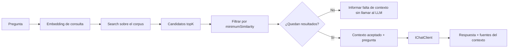

# Lab 10b - Relevancia, threshold y fuentes

## Objetivo

Responder una pregunta: **si `topK` devuelve los resultados más parecidos disponibles, ¿cómo sabemos si son suficientemente relevantes para responder?**

```text
topK ≠ relevancia
```

Este sublab introduce una primera decisión explícita de calidad: aceptar únicamente candidatos cuya similitud alcance un mínimo experimental. Si ninguno lo alcanza, la aplicación informa que falta contexto y no llama al modelo generativo.

## Punto de partida

Reutilizamos el corpus y las piezas de [Lab 10a](../lab-10a-multiples-documentos/README.md): cuatro archivos Markdown, un único índice en memoria, `chunkSize = 500`, `overlap = 100` y `topK = 3`. Embeddings, chunking, similitud coseno y el pipeline RAG conservan su función.

| Lab 10a | Lab 10b |
|---|---|
| Pregunta → embedding → búsqueda → topK → contexto → LLM | Pregunta → embedding → búsqueda → topK → evaluar similitud |
| Todos los candidatos recuperados pasan al contexto | Solo los aceptados pasan al contexto |
| Se observa el origen de los chunks | Se muestran las fuentes del contexto que efectivamente se envió al modelo |

El mecanismo permanece visible en `Program.cs`. No agregamos un servicio de relevancia, una policy ni DI para resolver un filtrado local.

## El problema de topK

La búsqueda ordena los chunks por similitud y devuelve hasta K candidatos. Si la pregunta no tiene relación con el corpus, todavía puede haber tres mejores resultados disponibles. Ser los mejores dentro de ese conjunto no demuestra que sirvan para responder.

```text
topK:      ¿cuáles son los mejores candidatos disponibles?
threshold: ¿alguno alcanza el mínimo que decidimos aceptar?
```

## Ranking y filtering

El ranking ya existía en `InMemoryVectorStore.Search`. El threshold agrega una decisión posterior y mantiene el orden de los candidatos aceptados:

```csharp
IReadOnlyList<SearchResult> candidates = vectorStore.Search(
    questionEmbedding.Vector,
    topK);

IReadOnlyList<SearchResult> relevantResults = candidates
    .Where(result => result.Similarity >= minimumSimilarity)
    .ToArray();
```

Primero mostramos todos los candidatos. Después mostramos cuántos alcanzan el mínimo. `Search` permanece igual que en 10a: no escondemos el filtrado dentro del store ni recuperamos candidatos adicionales para reemplazar los descartados.

## Similarity y minimumSimilarity

`Similarity` es la medida de cercanía calculada entre los embeddings de la consulta y del chunk. Permite comparar y ordenar candidatos. **Un score de `0.70` no significa “70 % de relevancia” ni “70 % de probabilidad de que la respuesta sea correcta”.**

`minimumSimilarity` es el límite con el que la aplicación decide qué candidatos acepta como contexto en este experimento:

```csharp
const double minimumSimilarity = 0.70;
```

El valor es didáctico y experimental. Se comprobó con este corpus y las dos preguntas usando `gemini-embedding-001`: los tres candidatos de la consulta relacionada quedaron entre aproximadamente 0.8456 y 0.8509; los de fotosíntesis, entre 0.5260 y 0.5317. `0.70` permitió observar ambos caminos. Es un registro de esta prueba, no una recomendación general ni un resultado hardcodeado.

## Por qué el threshold no es universal

La distribución y la interpretación práctica de los scores dependen de:

- modelo de embeddings;
- corpus;
- redacción de las preguntas;
- chunking;
- distribución de similitudes observada;
- dominio del contenido.

Cambiar cualquiera de esos factores puede modificar los resultados aceptados. Un mínimo alto puede descartar contenido útil; uno bajo puede admitir contenido ajeno. El alumno puede modificar la constante y repetir el experimento. No agregamos variables al `.env` ni calibración automática.

## Las dos consultas

**Relacionada:** “¿Cómo se relacionan los embeddings con un sistema RAG?”

**No relacionada:** “¿Cuáles son las principales características de la fotosíntesis en las plantas?”

```text
Relacionada:    topK → candidatos → threshold → contexto aceptado → LLM → respuesta + fuentes
No relacionada: topK → candidatos → threshold → sin contexto suficiente → no llamar al LLM
```

Los títulos describen la intención de las preguntas. La decisión de generar depende de los scores calculados, no del título ni de una respuesta predefinida. Con otro modelo o mínimo podría cambiar qué camino toma cada consulta.

## Sin contexto suficiente

Cuando `relevantResults.Count == 0`, el programa informa el problema y utiliza `continue` antes de construir el contexto y antes de `GetResponseAsync`. No envía los candidatos rechazados al modelo ni le pide fabricar una respuesta RAG sin evidencia aceptada.

La consulta todavía necesita un embedding para comparar contra el corpus. Lo que se omite es la llamada generativa. Crear el cliente de chat al inicio no implica realizar una solicitud de generación.

## Contexto y fuentes utilizadas

El contexto se construye únicamente con `relevantResults`, conservando el formato conocido:

```text
[Fuente: embeddings.md - Chunk <índice>]
<contenido aceptado>
```

`PromptTemplates.Rag` sigue pidiendo responder únicamente con ese contexto e indicar cuando falta información suficiente. Un score aceptado no garantiza que el texto contenga la respuesta completa, por lo que esa instrucción de grounding sigue siendo necesaria.

Al terminar la generación, la aplicación recorre los mismos resultados aceptados y muestra fuente, posición y similitud. **Fuentes recuperadas ≠ citas generadas por el LLM.** No delegamos en el modelo la lista ni pedimos referencias bibliográficas o marcadores `[1]`, `[2]`.

“Fuentes utilizadas” identifica los chunks enviados como evidencia al prompt. No demuestra que cada afirmación generada esté respaldada ni que el modelo haya utilizado todos los fragmentos.

## Flujo



## Estructura

```text
lab-10b-relevancia-threshold-fuentes/
├── documents/
│   ├── microsoft-extensions-ai.md
│   ├── embeddings.md
│   ├── rag.md
│   └── dependency-injection.md
├── docs/
│   ├── 01-topk-y-relevancia.md
│   ├── 02-threshold-experimental.md
│   └── 03-fuentes-y-grounding.md
├── ChatClientFactory.cs
├── DocumentChunk.cs
├── DocumentLoader.cs
├── EmbeddingGeneratorFactory.cs
├── IndexedChunk.cs
├── InMemoryVectorStore.cs
├── LabConfiguration.cs
├── Lab10b.RelevanciaThresholdFuentes.csproj
├── Program.cs
├── PromptTemplates.cs
├── SearchResult.cs
├── TextChunker.cs
├── VectorSimilarity.cs
└── README.md
```

El corpus y los once componentes conocidos son copias de la versión actual de 10a. El sublab es autocontenido; `VectorSimilarity` y el store conservan su implementación. El `.csproj` copia `documents/` al output y el programa resuelve la ruta con `AppContext.BaseDirectory`.

## Configuración y ejecución

Se conserva el `.env` de la raíz:

```env
AI_PROVIDER=openai
AI_MODEL=gpt-4o-mini
AI_EMBEDDING_MODEL=text-embedding-3-small
AI_API_KEY=...
AI_URL=
```

`AI_MODEL` configura generación/chat y `AI_EMBEDDING_MODEL` los embeddings de chunks y preguntas. Se requieren esas variables junto con proveedor y credencial; `AI_URL` es opcional. Los modelos deben soportar sus respectivas capacidades y el endpoint configurado. No se agrega configuración para el threshold.

Con .NET 10, desde la raíz:

```powershell
cd labs/lab-10-retrieval-calidad/lab-10b-relevancia-threshold-fuentes
dotnet restore
dotnet build
dotnet run
```

Se mantienen `DotNetEnv` 3.2.0 y `Microsoft.Extensions.AI.OpenAI` 10.10.1. No se agregan paquetes ni frameworks.

## Salida esperada

Ejemplo conceptual. Los scores, las cantidades aceptadas y la respuesta se calculan en cada ejecución:

```text
=== RETRIEVAL - RELEVANCIA Y THRESHOLD ===
Documentos encontrados: 4
Chunks totales indexados: <total>
Top K: 3
Threshold mínimo experimental: 0.7000

=== CONSULTA - RELACIONADA ===
¿Cómo se relacionan los embeddings con un sistema RAG?
=== CANDIDATOS TOP K ===
<fuente> - Chunk <índice> - similitud: <score>
...
=== RESULTADOS RELEVANTES ===
<aceptados> de <candidatos> candidatos alcanzan el threshold.
=== CONTEXTO ACEPTADO ===
<solo fragmentos aceptados>
=== RESPUESTA ===
<respuesta generada>
=== FUENTES UTILIZADAS ===
- <fuente aceptada> - Chunk <índice> - similitud: <score>

=== CONSULTA - NO RELACIONADA ===
¿Cuáles son las principales características de la fotosíntesis en las plantas?
=== CANDIDATOS TOP K ===
<candidatos disponibles aunque la pregunta sea ajena al corpus>
=== RESULTADOS RELEVANTES ===
0 de 3 candidatos alcanzan el threshold.
No se encontró contexto suficientemente relevante para responder la pregunta.
No se realizará una llamada al modelo generativo.
```

## Lecturas opcionales

- [TopK y relevancia](docs/01-topk-y-relevancia.md)
- [Threshold experimental](docs/02-threshold-experimental.md)
- [Fuentes y grounding](docs/03-fuentes-y-grounding.md)

## Limitaciones

El threshold es una primera regla simple, no un detector perfecto de relevancia. Puede aceptar falsos positivos o rechazar contenido útil. Tampoco verifica veracidad, cobertura de la pregunta ni fidelidad de la respuesta. Conservamos el índice en RAM, búsqueda lineal, chunking por caracteres y reconstrucción del corpus en cada ejecución.

No incorporamos vector databases, BM25, hybrid search, re-ranking, query rewriting, multi-query, HyDE, chunking semántico, filtros complejos, evaluación automática, RAGAS, GraphRAG, agentes, tools ni MCP. Las técnicas avanzadas quedan como [posibles extensiones](../../../ROADMAP.md#posibles-extensiones-futuras).

## Cierre del bloque introductorio de RAG

| Laboratorio | Capacidad recorrida |
|---|---|
| 07 | Embeddings y similitud |
| 08 | Documentos y chunks |
| 09 | Pipeline RAG explícito y encapsulación |
| 10a | Corpus y múltiples fuentes |
| 10b | Calidad mínima de retrieval y evidencia aceptada |

Podemos observar qué recuperó el sistema, decidir qué contexto aceptamos y evitar la generación cuando no hay evidencia suficiente según el mínimo elegido. Esta base permite estudiar otras técnicas posteriormente con un problema conocido.

El siguiente laboratorio del recorrido es [Lab 11 - Tools](../../lab-11-tools/README.md), implementado mediante 11a, con el ciclo explícito, y 11b, con invocación automática. Ambos preservan la representación nativa del SDK utilizado sin condiciones por proveedor; el caso observado con Gemini se explica en sus README.

[Volver a Lab 10](../README.md).
