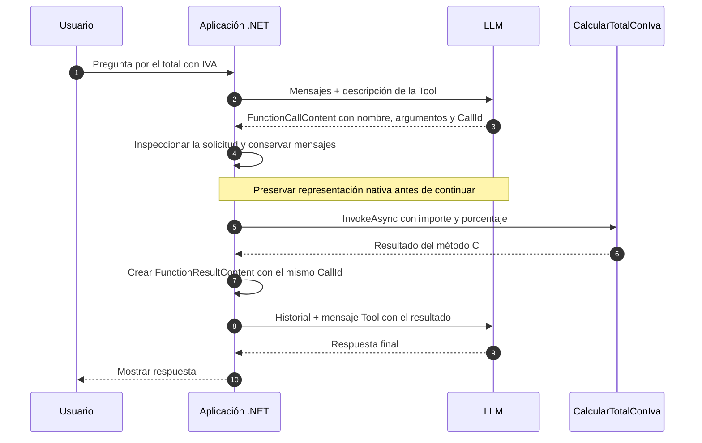

# Lab 11a - Primer Tool explícito

## Objetivo

Comprender cómo un LLM puede solicitar la ejecución de una función de nuestra aplicación. El concepto central es **Tool / Function Calling**, con el ciclo explícito en `Program.cs`:

```text
Tool → Function Call → ejecución .NET → Function Result → respuesta final
```

**El modelo solicita. La aplicación ejecuta.** El LLM no ejecuta código C#.

## Estado

✅ Implementado con .NET 10. Compilación y protocolo verificados, incluyendo una prueba local controlada del ciclo completo.

La prueba real con el Gemini configurado completó el ciclo y obtuvo una respuesta final. La preservación de la representación nativa se explica en [Validación y compatibilidad](#validación-y-compatibilidad).

## Evolución conceptual

Hasta Lab 10 utilizamos el modelo para responder, también con contexto recuperado de documentos. Ahora incorporamos otra capacidad: permitir que solicite una operación de nuestra aplicación.

```text
Usuario
   ↓
LLM
   ↓
Function Call
   ↓
Aplicación .NET
   ↓
Tool / método C#
   ↓
Function Result
   ↓
LLM
   ↓
Respuesta final
```

Primero entender, después abstraer y finalmente integrar. Por eso mostramos cada etapa sin automatizar el ciclo. Este sublab conserva la implementación explícita original de Lab 11. En [11b](../lab-11b-tool-invocation/README.md) resolveremos el mismo ejercicio con `FunctionInvokingChatClient`.

## El problema

Queremos que una operación de la aplicación produzca el resultado de un cálculo. La pregunta fija es:

> ¿Cuánto debo pagar por una compra de $1000 si corresponde aplicar un IVA del 21%?

La cuenta es deliberadamente trivial. Estudiamos cómo llega la solicitud, cómo ejecutamos código y cómo devolvemos el resultado.

## Qué es una Tool

Una **Tool** es una capacidad que ponemos a disposición del modelo. Su nombre, descripción y parámetros informan qué operación puede solicitar.

La capacidad del ejercicio es calcular el total con IVA. Su implementación concreta es una función C# local:

```csharp
static decimal CalcularTotalConIva(decimal importe, decimal porcentaje)
{
    return importe + importe * porcentaje / 100m;
}
```

Con `importe = 1000` y `porcentaje = 21`, devuelve `1210`. La función no llama a servicios externos, no lee archivos y no utiliza un modelo.

## Tool, función C# y Function Calling

| Pieza | Responsabilidad |
|---|---|
| LLM | Solicita una operación con argumentos y después redacta la respuesta |
| Tool | Describe la capacidad disponible para el modelo |
| Función C# | Implementa el cálculo y se ejecuta dentro de la aplicación |
| Function Calling | Mecanismo conversacional para solicitar la función y devolver su resultado |

```text
Tool ≠ función ejecutada dentro del LLM
Tool ≠ Agent
```

El modelo puede solicitar la Tool según su nombre, descripción, parámetros y la pregunta. La aplicación conserva el control: comprueba qué función se solicitó y ejecuta la única función disponible.

## Las piezas de Microsoft.Extensions.AI

| API | Uso en el laboratorio |
|---|---|
| `IChatClient` | Envía los mensajes y recibe las respuestas del modelo |
| `AIFunctionFactory.Create` | Crea una `AIFunction` a partir del método C# y su descripción |
| `AIFunction` | Describe la función y permite invocarla desde .NET |
| `ChatOptions.Tools` | Informa al modelo qué Tool está disponible |
| `FunctionCallContent` | Contiene la solicitud: `Name`, `Arguments` y `CallId` |
| `AIFunctionArguments` | Transporta los argumentos recibidos hacia la invocación |
| `AIFunction.InvokeAsync` | Ejecuta en la aplicación el método asociado |
| `FunctionResultContent` | Representa el resultado y lo vincula a la solicitud mediante `CallId` |

```csharp
AIFunction tool = AIFunctionFactory.Create(
    CalcularTotalConIva,
    name: nameof(CalcularTotalConIva),
    description:
        "Calcula el total de una compra sumando el IVA al importe sin impuesto. " +
        "Recibe importe y porcentaje de IVA (por ejemplo, 21 para el 21%).");

ChatOptions options = new()
{
    Tools = [tool]
};
```

El modelo recibe una descripción de la función y sus parámetros, no el código C#. Ofrecerla mediante `Tools` no la ejecuta.

## Recorrido del ejemplo

1. Crear `IChatClient` con la configuración común.
2. Crear la única `AIFunction` y ofrecerla mediante `ChatOptions.Tools`.
3. Enviar la pregunta y una instrucción que pide usar la Tool para el cálculo.
4. Conservar `response.Messages` e inspeccionar sus contenidos buscando `FunctionCallContent`.
5. Mostrar el nombre, el identificador y los argumentos recibidos.
6. Verificar que haya una única solicitud y que corresponda a la Tool disponible.
7. Ejecutar `tool.InvokeAsync(new AIFunctionArguments(functionCall.Arguments))`.
8. Crear `FunctionResultContent` con el mismo `CallId` y agregarlo como un mensaje de rol `Tool`.
9. Reenviar el historial al modelo para obtener la respuesta final.

La segunda llamada no ofrece nuevas Tools. El alcance es una solicitud, una ejecución y una respuesta final; no implementamos un bucle genérico de herramientas.

`InvokeAsync` adapta los argumentos y ejecuta el método C#. **No automatiza la conversación**: detectar la solicitud, guardar mensajes, crear el resultado y volver a llamar al modelo siguen siendo pasos explícitos de `Program.cs`.

Si el modelo no solicita la Tool, solicita más de una llamada o pide otro nombre, el programa informa el problema y termina con código de salida `1`.

## Historial necesario

Reutilizamos el concepto del Lab 02: la aplicación mantiene y reenvía el contexto.

```text
System: instrucciones del ejercicio
User: pregunta
Assistant: solicitud de función recibida del modelo
Tool: resultado de la aplicación con el mismo CallId
   ↓
segunda llamada al modelo
```

Conservamos el mensaje que solicitó la función. El `CallId` relaciona esa solicitud con su resultado. No agregamos sesiones, stores ni memoria persistente.

## ChatResponse y la representación nativa

`Microsoft.Extensions.AI` ofrece un modelo común para trabajar con distintos proveedores. `ChatResponse` representa una respuesta y contiene mensajes `ChatMessage`. Cada mensaje tiene una colección `Contents` de elementos `AIContent`; `FunctionCallContent` y `FunctionResultContent` representan una solicitud de función y su resultado.

```text
Proveedor / SDK
        ↓
respuesta nativa
        ↓
adaptador
        ↓
Microsoft.Extensions.AI
        ↓
ChatResponse
        ↓
ChatMessage
        ↓
AIContent
```

La respuesta nativa puede contener texto, rol, tool calls, identificadores, uso y metadata específica. El modelo común expone los conceptos compartidos de su contrato, incluyendo identificadores y uso; no necesita representar cada extensión particular de cada proveedor. Es una consecuencia normal de abstraer integraciones diferentes.

`RawRepresentation` permite acceder a la representación subyacente que proporciona el adaptador y conservarla cuando necesitamos continuar el protocolo:

```text
ChatMessage
├── Role
├── Contents
└── RawRepresentation
        ↓
        objeto específico del SDK
```

**`RawRepresentation` no es necesariamente JSON HTTP crudo.** En esta integración es inicialmente un objeto `OpenAI.Chat.ChatCompletion` del SDK OpenAI. Con la versión utilizada, el adaptador lo coloca tanto en `ChatResponse.RawRepresentation` como en `ChatMessage.RawRepresentation`.

El problema aparece si reconstruimos el mensaje utilizando solamente el contrato común:

```text
Respuesta nativa original
├── Function Call
├── argumentos
└── metadata específica
        ↓
modelo común: FunctionCallContent
├── CallId
├── nombre
└── argumentos
        ↓
reconstrucción sólo desde estos datos
        ↓
puede faltar metadata específica
```

El caso real que hizo visible esta necesidad fue Gemini: algunos modelos requieren devolver la `thought_signature` recibida junto con la solicitud de función. Reconstruir esa solicitud sólo desde su nombre, argumentos e identificador puede dejar afuera la firma. Esto no significa que la abstracción borre la respuesta original: el objeto nativo sigue accesible mediante `RawRepresentation`.

En el flujo no streaming de este lab, preservamos una representación reutilizable de cada mensaje:

```csharp
foreach (ChatMessage message in response.Messages)
{
    if (message.RawRepresentation is OpenAI.Chat.ChatCompletion completion)
    {
        message.RawRepresentation =
            new OpenAI.Chat.AssistantChatMessage(completion);
    }
}
```

`new OpenAI.Chat.AssistantChatMessage(completion)` construye el mensaje nativo del assistant directamente desde la respuesta original del SDK:

```text
ChatCompletion original
        ↓
AssistantChatMessage nativo
        ↓
ChatMessage.RawRepresentation
        ↓
continuación del historial
```

El [adaptador de la versión utilizada](https://github.com/dotnet/extensions/blob/v10.10.1/src/Libraries/Microsoft.Extensions.AI.OpenAI/OpenAIChatClient.cs) consulta `ChatMessage.RawRepresentation` al enviar el historial. Si encuentra un mensaje nativo del SDK, lo reutiliza en lugar de reconstruirlo únicamente desde los contenidos comunes. Por eso trabajamos sobre cada mensaje, sin depender de la posición `0`.

La decisión depende del tipo recibido, **no de `AI_PROVIDER`**. Conservamos información que ya llegó: no interpretamos `thought_signature`, no generamos firmas ni completamos campos de Gemini manualmente.

Esta implementación pertenece al adaptador basado en el SDK OpenAI, también cuando se usa con endpoints OpenAI-compatible. Otro SDK puede exponer una representación diferente y requerir su tratamiento en la capa correspondiente. Preservar el mensaje no garantiza compatibilidad con cualquier proveedor futuro ni con todas sus extensiones.

En 11a hacemos visible esta responsabilidad junto con el ciclo explícito. En [11b](../lab-11b-tool-invocation/README.md), la preservación queda en el cliente base y `FunctionInvokingChatClient` coordina la invocación.

## Diagrama de secuencia

Este diagrama es conceptual. La aplicación controla el envío de mensajes y la ejecución.



## Estructura

```text
lab-11a-tool-explicita/
├── docs/
│   ├── 01-que-es-una-tool.md
│   └── 02-ciclo-function-calling.md
├── ChatClientFactory.cs
├── LabConfiguration.cs
├── Lab11a.ToolExplicita.csproj
├── Program.cs
└── README.md
```

`Program.cs` muestra el mecanismo y contiene la función local. `LabConfiguration` carga y valida el `.env` raíz; `ChatClientFactory` construye el cliente y devuelve `IChatClient`, como en los laboratorios anteriores.

## Configuración

Sólo necesitamos el modelo de chat y la configuración común:

```env
AI_PROVIDER=gemini
AI_MODEL=gemini-3.5-flash-lite
AI_API_KEY=tu-api-key
AI_URL=https://generativelanguage.googleapis.com/v1beta/openai/
```

Este bloque refleja la configuración con la que se verificó el ciclo completo, incluyendo la preservación del mensaje nativo explicada más abajo.

| Variable | Obligatoria | Uso |
|---|---:|---|
| `AI_PROVIDER` | Sí | Identifica el proveedor activo |
| `AI_MODEL` | Sí | Modelo de chat que debe soportar Tool Calling |
| `AI_API_KEY` | Sí | Credencial del proveedor |
| `AI_URL` | No | Endpoint alternativo compatible con el cliente utilizado |

El `.env` permanece en la raíz y se carga con `Env.TraversePath().Load()`. No hay modelos predeterminados por proveedor. `AI_EMBEDDING_MODEL` puede seguir configurado para otros labs; Lab 11 no lo lee ni genera embeddings.

La Tool es completamente local. Las llamadas de chat sí requieren acceso al proveedor. La compatibilidad con chat de texto no garantiza que todo el protocolo de Tool Calling funcione con una combinación concreta de SDK, endpoint y modelo.

## Ejecutar

```powershell
cd labs/lab-11-tools/lab-11a-tool-explicita
dotnet restore
dotnet build
dotnet run
```

Paquetes directos: `DotNetEnv` 3.2.0 y `Microsoft.Extensions.AI.OpenAI` 10.10.1. Este último incorpora `Microsoft.Extensions.AI.Abstractions` 10.10.1 y el SDK `OpenAI` 2.14.0 como dependencias transitivas. No agregamos paquetes para automatizar la ejecución.

## Salida esperada

Ejemplo conceptual de una ejecución completa con un proveedor compatible. El `CallId`, el orden de los argumentos y la redacción final pueden variar:

```text
=== LAB 11a - PRIMER TOOL EXPLÍCITO ===
Proveedor: <proveedor configurado>
Modelo: <modelo configurado>

Usuario:
¿Cuánto debo pagar por una compra de $1000 si corresponde aplicar un IVA del 21%?

=== RESPUESTA DEL MODELO ===
El modelo solicitó ejecutar una Tool.
Tool: CalcularTotalConIva
CallId: <identificador recibido>
Argumentos:
importe: 1000
porcentaje: 21

=== EJECUCIÓN .NET ===
La aplicación ejecuta CalcularTotalConIva(...) mediante InvokeAsync.
Resultado:
1210

=== RESULTADO DEVUELTO AL MODELO ===
CallId: <mismo identificador>
1210

=== RESPUESTA FINAL ===
El total a pagar es $1210.
```

El cálculo viene del método C#. La respuesta natural se toma de `finalResponse.Text`; no está hardcodeada.

## Validación y compatibilidad

`dotnet restore` y `dotnet build` completaron correctamente con .NET 10. Una prueba local controlada con respuestas HTTP simuladas verificó el historial, la ejecución real del método, la correspondencia de `CallId`, el resultado enviado y la presentación del texto final. Esa prueba verifica el protocolo del código; no demuestra las capacidades de un modelo real.

En la prueba real con `gemini-3.5-flash-lite` y el endpoint OpenAI-compatible de Gemini:

- el modelo solicitó `CalcularTotalConIva` con `importe=1000` y `porcentaje=21`;
- la aplicación ejecutó el método y obtuvo `1210`;
- se creó el mensaje `Tool` con `FunctionResultContent` y se reenvió el historial conservando la firma original;
- la segunda llamada completó correctamente y el modelo respondió: “El total a pagar es $1210.”;
- el programa terminó con código de salida `0`.

Ciertos modelos Gemini requieren conservar la firma de la solicitud de función al continuar. La [documentación oficial de thought signatures](https://ai.google.dev/gemini-api/docs/generate-content/thought-signatures) explica ese requisito de Google, también para el endpoint compatible con OpenAI. Gemini sí soporta Function Calling: la dificultad aparece al perder metadata específica cuando reconstruimos la conversación mediante representaciones comunes.

El problema se observó con Gemini porque algunos modelos requieren `thought_signature`. La solución actual no pregunta qué proveedor está configurado: conserva cada `ChatCompletion` recibido como un `AssistantChatMessage` reutilizable en `ChatMessage.RawRepresentation`, antes de agregar los mensajes al historial.

La sección [ChatResponse y la representación nativa](#chatresponse-y-la-representación-nativa) explica por qué reconstruir sólo desde el contrato común puede omitir información adicional y cómo evitamos esa pérdida con el SDK utilizado.

La prueba local verificó que la metadata se conserva exactamente tanto con `AI_PROVIDER=gemini` como con `AI_PROVIDER=openai`, sin condiciones por proveedor. También se ejecutó el ciclo real con Gemini. No se realizó una llamada real a OpenAI.

## Lecturas opcionales

- [Qué describe una Tool y qué ejecuta C#](docs/01-que-es-una-tool.md): parámetros, descripción e invocación.
- [El ciclo conversacional de Function Calling](docs/02-ciclo-function-calling.md): mensajes, resultados y correlación mediante `CallId`.

## Qué aprendemos

Al finalizar deberías poder explicar:

1. qué capacidad expone una Tool y cómo se relaciona con una función C#;
2. qué recibe el modelo mediante `ChatOptions.Tools`;
3. qué representan `FunctionCallContent` y sus argumentos;
4. por qué el modelo solicita y la aplicación ejecuta;
5. qué hace `AIFunction.InvokeAsync`;
6. para qué sirven `FunctionResultContent`, el rol `Tool` y `CallId`;
7. por qué reenviamos la solicitud junto con el resultado;
8. cómo el modelo utiliza ese resultado para redactar la respuesta final;
9. por qué una Tool no convierte este ejercicio en un agente;
10. qué diferencia hay entre el modelo común y `RawRepresentation`, y por qué preservamos el mensaje nativo al continuar.

## Limitaciones

El ejemplo tiene una sola Tool y admite una única solicitud. La instrucción orienta al modelo, pero no garantiza que cualquier modelo la solicite correctamente. El proveedor debe soportar también la continuación con el resultado.

La función hace una cuenta simple sin reglas fiscales, validaciones de negocio ni redondeo monetario. Tampoco garantizamos la exactitud de la redacción final. Los errores de argumentos o de red no tienen una política de recuperación; el rechazo de la segunda llamada se muestra para distinguirlo de la ejecución local.

## Qué NO hacemos todavía

- Múltiples Tools ni selección entre distintas operaciones.
- Tools que llaman a APIs externas, bases de datos o archivos.
- Gestión compleja de errores, reintentos o ciclos de varias ejecuciones.
- Ejecución automática mediante `FunctionInvokingChatClient` o `UseFunctionInvocation()`.
- Embeddings, retrieval o RAG.
- Agent, Workflow ni MCP.

## Siguiente sublaboratorio

[Lab 11b - Invocación automática de Tools](../lab-11b-tool-invocation/README.md) mantiene la misma función y pregunta. Después de comprender el ciclo, utilizaremos `UseFunctionInvocation()` para encapsular esa responsabilidad.

Ahora que vimos cada intercambio, ¿qué partes de nuestra aplicación desaparecen al delegar la coordinación del protocolo?

[Lab 12](../../lab-12-function-calling/README.md) está implementado mediante 12a, 12b y 12c: múltiples Tools, decisión y errores y una capacidad HTTP externa. La automatización de una única Tool se estudia primero en 11b.

[Guía de Lab 11](../README.md) · [Roadmap](../../../ROADMAP.md) · [Fundamento pedagógico](../../../docs/04-enfoque-pedagogico-y-evolucion-del-roadmap.md).
