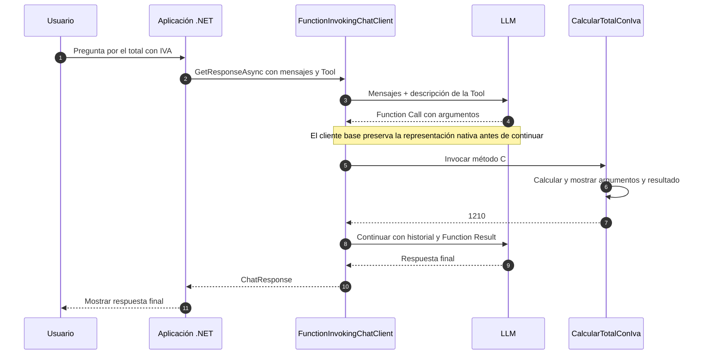

# Lab 11b - Invocación automática de Tools

## Objetivo

Resolver el mismo ejercicio de 11a utilizando `FunctionInvokingChatClient`, la abstracción de `Microsoft.Extensions.AI` que coordina automáticamente la invocación de Tools.

```text
11a: comprender el ciclo explícito
    ↓
11b: encapsular esa responsabilidad
```

**El modelo solicita. La aplicación ejecuta.** La abstracción coordina el intercambio, pero el método C# continúa ejecutándose dentro de nuestro proceso.

## Estado

✅ Implementado con .NET 10. El ciclo completo se verificó con el Gemini configurado, con la conservación de metadata nativa en el cliente base explicada más abajo.

## El mismo ejercicio

Utilizamos una única Tool, `CalcularTotalConIva(decimal importe, decimal porcentaje)`, y la misma pregunta:

> ¿Cuánto debo pagar por una compra de $1000 si corresponde aplicar un IVA del 21%?

El cálculo sigue siendo `importe + importe * porcentaje / 100m`. No agregamos más Tools ni una API externa. Cambiamos la coordinación del protocolo para comparar directamente ambas implementaciones.

## La abstracción

```csharp
using IChatClient chatClient = new ChatClientBuilder(
    ChatClientFactory.Create(configuration))
    .UseFunctionInvocation()
    .Build();
```

`UseFunctionInvocation()` agrega un `FunctionInvokingChatClient` alrededor del cliente base. El código ofrece la función mediante `AIFunctionFactory.Create` y `ChatOptions.Tools`, igual que en 11a.

Después realiza una sola llamada desde el flujo principal:

```csharp
response = await chatClient.GetResponseAsync(messages, options);
```

Una llamada de nuestra aplicación puede producir varias llamadas al proveedor. La abstracción recibe la solicitud, invoca la función disponible, construye el resultado y continúa hasta obtener la respuesta final o alcanzar sus límites.

## Qué desaparece de Program.cs

Ya no buscamos `FunctionCallContent`, interpretamos su nombre ni construimos `FunctionResultContent`. Tampoco agregamos manualmente los mensajes intermedios ni escribimos una segunda llamada de chat.

La aplicación sigue definiendo la Tool, su descripción y la pregunta. La función sigue implementando el cálculo. El modelo sigue decidiendo solicitar una operación y redactando la respuesta final.

La [comparación del README padre](../README.md#qué-responsabilidad-cambia) resume quién realiza cada tarea en ambos sublabs. Esta abstracción resulta adecuada para código de aplicación habitual porque encapsula una responsabilidad repetitiva y reduce la coordinación manual de mensajes, argumentos y resultados. No es un agente.

## Observar la ejecución

El método local imprime los argumentos y el resultado:

```text
=== TOOL EJECUTADA POR .NET ===
importe: 1000
porcentaje: 21
resultado: 1210
```

Esa salida ocurre cuando `FunctionInvokingChatClient` invoca el método C#. El resultado numérico se calcula en la aplicación; la respuesta final se toma de `response.Text`.

## Diagrama de secuencia



El cliente base incluye el ajuste de metadata de la factory. El ciclo de Tool Calling sigue coordinado por `FunctionInvokingChatClient`.

## Estructura

```text
lab-11b-tool-invocation/
├── docs/
│   ├── 01-function-invoking-chat-client.md
│   └── 02-metadata-y-compatibilidad.md
├── ChatClientFactory.cs
├── LabConfiguration.cs
├── Lab11b.ToolInvocation.csproj
├── Program.cs
└── README.md
```

`Program.cs` define el ejercicio y utiliza la invocación automática. `LabConfiguration` reutiliza el patrón común. `ChatClientFactory` crea el cliente base y conserva la representación nativa de las respuestas del SDK.

## Configuración

Usamos el mismo `.env` raíz que en 11a:

```env
AI_PROVIDER=
AI_MODEL=
AI_API_KEY=
AI_URL=
```

Proveedor, modelo y credencial son obligatorios. `AI_URL` es opcional y permite un endpoint alternativo compatible. `AI_MODEL` debe soportar Tool Calling. No hay valores predeterminados por proveedor ni variables nuevas. `AI_EMBEDDING_MODEL` puede permanecer configurado para otros labs y no se utiliza aquí.

La Tool es local. Las llamadas al modelo sí requieren acceso al proveedor configurado.

## Ejecutar

```powershell
cd labs/lab-11-tools/lab-11b-tool-invocation
dotnet restore
dotnet build
dotnet run
```

Paquetes directos: `DotNetEnv` 3.2.0, `Microsoft.Extensions.AI` 10.10.0 y `Microsoft.Extensions.AI.OpenAI` 10.10.1. El paquete `Microsoft.Extensions.AI` aporta `ChatClientBuilder` y `FunctionInvokingChatClient`; la versión ya se utiliza en labs anteriores. No actualizamos paquetes ni agregamos un contenedor de DI.

## Salida esperada

Ejemplo conceptual. El orden de los argumentos y la redacción final pueden variar:

```text
=== LAB 11b - INVOCACIÓN AUTOMÁTICA DE TOOLS ===
Proveedor: <proveedor configurado>
Modelo: <modelo configurado>

Usuario:
¿Cuánto debo pagar por una compra de $1000 si corresponde aplicar un IVA del 21%?

=== TOOL EJECUTADA POR .NET ===
importe: 1000
porcentaje: 21
resultado: 1210

=== RESPUESTA FINAL ===
Debés pagar un total de $1210.
```

## Validación y compatibilidad

Restore y build completaron correctamente. La ejecución real con `gemini-3.5-flash-lite` produjo `1210`, obtuvo “Debés pagar un total de $1210.” y terminó con código `0`.

### Prueba inicial sin ajuste

La primera prueba utilizó `ChatClientBuilder.UseFunctionInvocation()` sin copiar el ajuste de 11a. Con `gemini-3.5-flash-lite`, el modelo solicitó la Tool y .NET ejecutó el cálculo con `importe=1000`, `porcentaje=21` y resultado `1210`. La continuación recibió HTTP 400: `Function call is missing a thought_signature`.

La invocación automática coordina las llamadas, pero utiliza el mismo adaptador basado en el SDK OpenAI. En esa prueba, reconstruir el mensaje únicamente desde la representación común no recuperaba la firma presente en la respuesta nativa. Gemini hizo visible esa necesidad; no define una condición por proveedor en la solución.

### Ajuste comprobado en el cliente base

`ChatClientFactory` utiliza el hook `ChatClientBuilder.Use(getResponseFunc: ..., getStreamingResponseFunc: null)` para conservar cada `ChatCompletion` como `AssistantChatMessage` en `RawRepresentation`. La abstracción de invocación recibe así un mensaje cuya representación nativa se puede reenviar sin perder la firma.

La preservación actúa según el tipo de representación nativa del SDK, sin comprobar el proveedor. `RawRepresentation` contiene aquí objetos del SDK, no necesariamente JSON HTTP crudo. En 11a la aplicación conserva explícitamente cada mensaje; en 11b esa responsabilidad queda encapsulada en la configuración del `IChatClient`. `Program.cs` no manipula Function Call ni Function Result. La [lectura de compatibilidad](docs/02-metadata-y-compatibilidad.md) explica esta separación y la [sección conceptual de 11a](../lab-11a-tool-explicita/README.md#chatresponse-y-la-representación-nativa) presenta el modelo común.

Por tanto, con estas versiones **11b también necesitó conservar metadata nativa**, aunque esa responsabilidad quedó en el cliente base. La implementación utiliza `OpenAI.Chat.ChatCompletion` y `OpenAI.Chat.AssistantChatMessage`: sirve para esa integración, incluidos endpoints OpenAI-compatible que atraviesen el mismo SDK. Otro SDK puede necesitar un tratamiento diferente. Delegar el ciclo reduce la gestión manual del protocolo, pero no garantiza compatibilidad absoluta entre cualquier SDK, proveedor y modelo. Los requisitos de firmas están en la [documentación oficial de Google](https://ai.google.dev/gemini-api/docs/generate-content/thought-signatures).

## Lecturas opcionales

- [Qué coordina FunctionInvokingChatClient](docs/01-function-invoking-chat-client.md).
- [Metadata nativa y compatibilidad del adaptador](docs/02-metadata-y-compatibilidad.md).

## Qué aprendemos

1. Qué responsabilidad de 11a encapsula `FunctionInvokingChatClient`.
2. Qué agregan `ChatClientBuilder` y `UseFunctionInvocation()`.
3. Por qué una sola llamada de aplicación puede implicar varios intercambios con el modelo.
4. Por qué la Tool continúa ejecutándose en .NET.
5. Qué sigue decidiendo y generando el modelo.
6. Por qué abstraer el ciclo no garantiza compatibilidad absoluta del adaptador.

## Limitaciones y fuera de alcance

El ejemplo ofrece una sola Tool. La instrucción orienta al modelo a solicitarla; si responde directamente, no aparecerá la salida de ejecución de la Tool. El framework coordina y limita las iteraciones, pero no valida las reglas de negocio del cálculo ni garantiza la exactitud de la redacción.

No abordamos múltiples Tools, APIs externas, recuperación avanzada de errores, agentes, workflows ni MCP. Tampoco streaming: el hook del cliente base se define para la API no streaming que usa este ejercicio.

## Siguiente laboratorio

[Lab 12 - Function Calling](../../lab-12-function-calling/README.md) continúa pendiente. Ya comprendemos y abstraemos una invocación; el siguiente paso será trabajar con múltiples Tools, selección, argumentos, errores, preguntas sin Tool y una capacidad externa.

[Lab 11a](../lab-11a-tool-explicita/README.md) · [Guía de Lab 11](../README.md) · [Roadmap](../../../ROADMAP.md).
