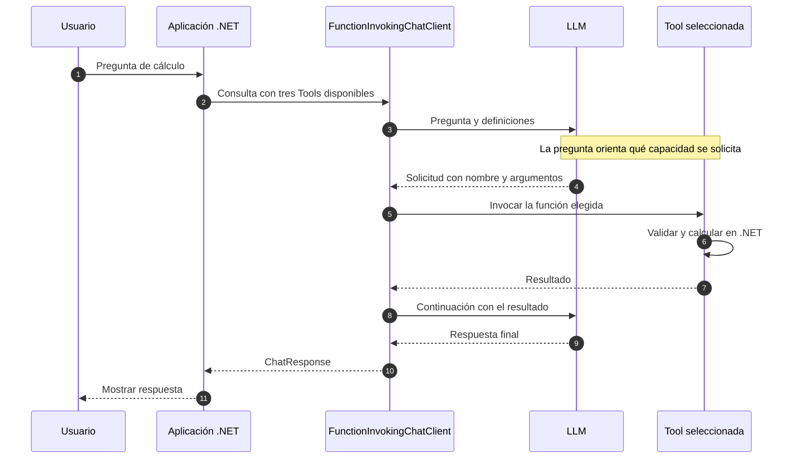

# Lab 12a - Múltiples Tools

## Objetivo

Observar cómo decide el modelo qué Tool solicitar cuando dispone de varias capacidades.

Continuamos desde [11b](../../lab-11-tools/lab-11b-tool-invocation/README.md): conservamos la invocación automática y cambiamos una Tool por tres. No repetimos el protocolo explícito.

## Estado

✅ Implementado y ejecutado con .NET 10 y `gemini-3.5-flash-lite`.

## Capacidades disponibles

| Tool | Argumentos | Resultado |
|---|---|---|
| `CalcularTotalConIva` | `importe`, `porcentaje` | Importe con IVA |
| `CalcularDescuento` | `importe`, `porcentaje` | Importe final después del descuento |
| `ConvertirCelsiusAFahrenheit` | `celsius` | Temperatura en Fahrenheit |

Las operaciones son triviales para que la selección resulte visible. `LocalTools.cs` contiene sus implementaciones y muestra nombre, argumentos y resultado en consola. Los importes no pueden ser negativos; el descuento debe estar entre 0 y 100.

Creamos tres `AIFunction` mediante `AIFunctionFactory.Create` y las registramos simultáneamente en `ChatOptions.Tools`. Cada consulta ofrece las mismas tres capacidades.

## La decisión del modelo

```text
Pregunta
    ↓
LLM observa nombres, descripciones y parámetros
    ↓
selecciona capacidad
    ↓
genera argumentos
    ↓
solicita invocación
```

No hay un `if (pregunta.Contains("IVA"))` ni un switch de preguntas en nuestra aplicación. La selección viene del modelo. `FunctionInvokingChatClient` coordina la invocación de la función disponible.

**El modelo solicita; el código C# se ejecuta dentro de la aplicación.**

## Consultas independientes

`Program.cs` realiza tres consultas secuenciales, cada una con mensajes iniciales nuevos:

| Pregunta | Tool observada | Resultado calculado |
|---|---|---|
| Compra de $1000 con 21% de IVA | `CalcularTotalConIva` | `1210` |
| Producto de $2500 con 15% de descuento | `CalcularDescuento` | `2125` |
| Conversión de 30 °C | `ConvertirCelsiusAFahrenheit` | `86` |

No se reenvía el historial de una pregunta a la siguiente. La continuación dentro de cada consulta sigue a cargo del framework.

La definición orienta la decisión, pero no garantiza que todos los modelos soliciten siempre la misma Tool. No forzamos una Tool concreta según el texto ni hardcodeamos las respuestas del modelo.

## Diagrama de secuencia



El diagrama muestra el camino observado. Si el modelo responde directamente, no hay invocación; ese caso se estudia en 12b.

## Estructura

```text
lab-12a-multiples-tools/
├── ChatClientFactory.cs
├── LabConfiguration.cs
├── Lab12a.MultiplesTools.csproj
├── LocalTools.cs
├── Program.cs
└── README.md
```

La factory conserva sin cambios la representación nativa del SDK, como en 11b. `Program.cs` ofrece las funciones y realiza las consultas; no manipula Function Call ni Function Result.

## Configuración y ejecución

Se utiliza el `.env` raíz con `AI_PROVIDER`, `AI_MODEL`, `AI_API_KEY` y `AI_URL` opcional. El modelo y el endpoint deben soportar Tool Calling. No se generan embeddings.

```powershell
cd labs/lab-12-function-calling/lab-12a-multiples-tools
dotnet restore
dotnet build
dotnet run
```

Paquetes: `DotNetEnv` 3.2.0, `Microsoft.Extensions.AI` 10.10.0 y `Microsoft.Extensions.AI.OpenAI` 10.10.1. Son las versiones de 11b; no agregamos paquetes para las Tools.

## Salida esperada

Fragmento conceptual; la redacción final puede variar:

```text
Usuario:
¿Cuánto pago por un producto de $2500 con un descuento del 15%?
=== TOOL EJECUTADA ===
Tool: CalcularDescuento
importe: 2500
porcentaje: 15
resultado: 2125
=== RESPUESTA FINAL ===
<respuesta generada a partir del resultado>
```

## Validación

Restore y build completaron sin errores ni advertencias. Con Gemini se observaron las tres selecciones de la tabla, sus argumentos, los cálculos locales y las respuestas finales; el programa terminó con código 0.

Una prueba HTTP local controlada verificó el registro simultáneo, las consultas independientes, la correlación del resultado y la preservación de metadata nativa. Esa prueba controla el protocolo, no impone una decisión universal a los modelos reales.

## Qué aprendemos

1. Cómo registrar tres Tools al mismo tiempo.
2. Qué papel tienen nombre, descripción y parámetros en la selección.
3. Por qué la aplicación ofrece capacidades y el modelo solicita cuál utilizar.
4. Cómo observar argumentos y ejecución sin instrumentación adicional.
5. Por qué cada consulta puede ser independiente aunque reutilice el cliente.
6. Por qué una decisión observada no es una garantía para todos los modelos.

## Qué NO hacemos todavía

Agentes, MCP, routing manual, APIs externas, memoria entre consultas ni un framework propio de Tools. Tampoco abordamos reglas fiscales, redondeo monetario o validaciones de negocio completas.

## Siguiente sublaboratorio

[Lab 12b - Decisión y errores](../lab-12b-decision-y-errores/README.md): tener Tools disponibles no obliga a usarlas y una solicitud puede fallar.

[Guía de Lab 12](../README.md) · [Roadmap](../../../ROADMAP.md).
