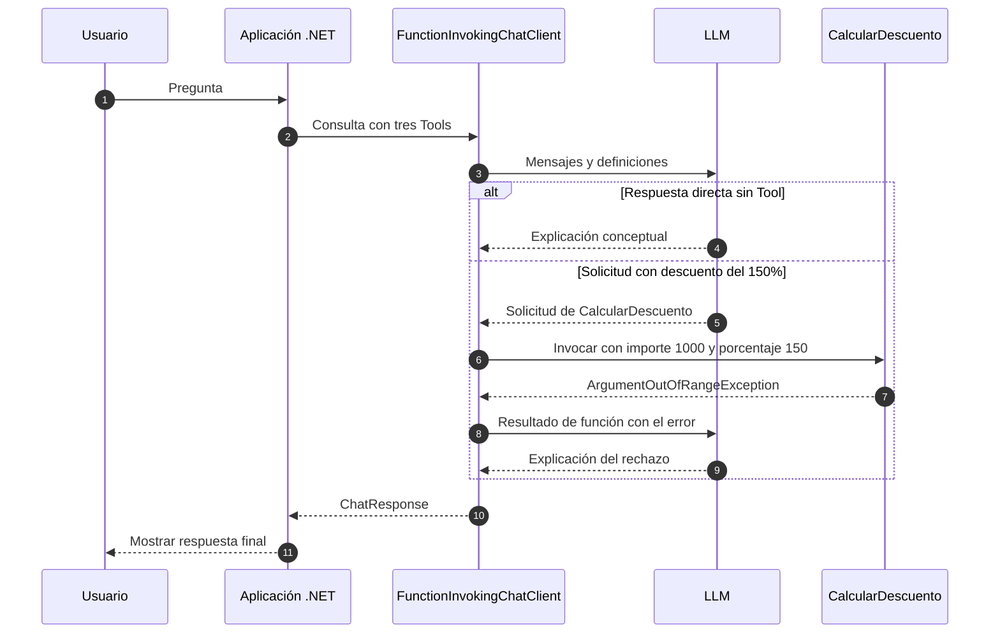

# Lab 12b - Decisión y errores

## Objetivo

Distinguir dos situaciones: una pregunta que no necesita ninguna Tool y una solicitud cuya ejecución falla.

Conservamos las tres funciones de [12a](../lab-12a-multiples-tools/README.md) y la invocación automática. El foco es la decisión y la validación, no construir mecanismos de resiliencia.

## Estado

✅ Implementado y ejecutado con .NET 10 y `gemini-3.5-flash-lite`.

## Caso 1: no usar Tool

La primera consulta es:

> Explicá en una oración qué significa aplicar un descuento.

Las tres Tools siguen disponibles. La instrucción permite responder directamente a una explicación conceptual:

```text
Tools disponibles ≠ Tool obligatoria
```

En la ejecución observada, el modelo respondió sin invocar ninguna función: no apareció el bloque `=== TOOL EJECUTADA ===`. Otro modelo puede tomar una decisión diferente; la explicación no depende de un test que exija la misma conducta a todos.

## Caso 2: error dentro de la Tool

La segunda consulta solicita calcular un descuento de `150%` sobre `1000`, conservando esos valores. `CalcularDescuento` defiende su invariante:

```csharp
if (porcentaje < 0 || porcentaje > 100)
{
    Console.WriteLine("ERROR: El porcentaje de descuento debe estar entre 0 y 100.");
    throw new ArgumentOutOfRangeException(
        nameof(porcentaje),
        "El porcentaje de descuento debe estar entre 0 y 100.");
}
```

La función muestra nombre y argumentos, pero no calcula un importe cuando el porcentaje es inválido. La validación sigue siendo responsabilidad del código, aunque el modelo genere los argumentos.

## Qué hace la API utilizada con esa excepción

Configuramos la opción oficial:

```csharp
using IChatClient chatClient = new ChatClientBuilder(
    ChatClientFactory.Create(configuration))
    .UseFunctionInvocation(configure: client => client.IncludeDetailedErrors = true)
    .Build();
```

Con `Microsoft.Extensions.AI` 10.10.0, el cliente captura este fallo, crea un resultado de función con el error y continúa la conversación. No construimos ese resultado en `Program.cs`.

Una prueba HTTP controlada comprobó que el modelo recibe:

```text
Error: Function failed. Exception: El porcentaje de descuento debe estar entre 0 y 100. (Parameter 'porcentaje')
```

En esta ejecución la excepción no se propagó al flujo principal. Gemini recibió el error y explicó que el 150% había sido rechazado, sin inventar un resultado ni cambiar los argumentos.

`IncludeDetailedErrors` vale `false` por defecto: en ese caso se envía `Error: Function failed.`. También lo comprobamos con una prueba local. En este ejemplo activamos el detalle para que el modelo pueda explicar nuestra validación conocida. En una aplicación real habría que decidir qué información de errores puede compartirse con el proveedor.

La API también permite que las excepciones se propaguen al agotar sus límites. Se verificó que `MaximumConsecutiveErrorsPerRequest = 0` propaga la primera excepción; **el laboratorio no cambia ese límite** ni implementa reintentos. El `catch (ArgumentException)` del flujo principal informa una excepción de argumentos si llega a propagarse.

La [implementación oficial de la versión utilizada](https://github.com/dotnet/extensions/blob/v10.10.0/src/Libraries/Microsoft.Extensions.AI/ChatCompletion/FunctionInvokingChatClient.cs) permite contrastar estas responsabilidades. No debemos asumir que todas las excepciones se absorben indefinidamente.

## Distinguir los errores

| Situación | Ejemplo | Alcance aquí |
|---|---|---|
| Error en la solicitud de Tool | Nombre desconocido o argumentos que no se pueden enlazar | Posibilidad distinta del caso estudiado |
| Error dentro de Tool | Descuento fuera de 0–100 | Validación visible y continuación comprobada |
| Error HTTP externo | API de países no disponible | Se estudia de forma mínima en 12c |
| Error del proveedor LLM | Rechazo de la solicitud de chat | Se informa el estado HTTP; no hay recuperación |

Una función puede rechazar valores incluso cuando la solicitud de Function Calling es válida. No se debe confundir ese error local con una falla del proveedor de modelos.

## Diagrama de secuencia



Los caminos reflejan la prueba realizada. La selección y la explicación final dependen del modelo.

## Estructura

```text
lab-12b-decision-y-errores/
├── ChatClientFactory.cs
├── LabConfiguration.cs
├── Lab12b.DecisionYErrores.csproj
├── LocalTools.cs
├── Program.cs
└── README.md
```

`LocalTools.cs` es la misma implementación de 12a. La factory conserva la representación nativa como en 11b, sin condiciones por proveedor. Cada consulta empieza con mensajes nuevos.

## Configuración y ejecución

Se utiliza el `.env` raíz con `AI_PROVIDER`, `AI_MODEL`, `AI_API_KEY` y `AI_URL` opcional. El modelo y el endpoint deben soportar Function Calling. No se usa `AI_EMBEDDING_MODEL`.

```powershell
cd labs/lab-12-function-calling/lab-12b-decision-y-errores
dotnet restore
dotnet build
dotnet run
```

Paquetes: `DotNetEnv` 3.2.0, `Microsoft.Extensions.AI` 10.10.0 y `Microsoft.Extensions.AI.OpenAI` 10.10.1.

## Salida esperada

Fragmentos conceptuales:

```text
Usuario:
Explicá en una oración qué significa aplicar un descuento.
=== RESPUESTA FINAL ===
<explicación sin bloque de ejecución de Tool>

Usuario:
<solicitud de descuento del 150% sobre 1000>
=== TOOL EJECUTADA ===
Tool: CalcularDescuento
importe: 1000
porcentaje: 150
ERROR: El porcentaje de descuento debe estar entre 0 y 100.
=== RESPUESTA FINAL ===
<explicación del error recibido>
```

## Validación

Restore y build pasaron sin errores ni advertencias. La ejecución real observó ambos caminos y terminó con código 0: el error esperado fue tratado como parte del ejercicio.

Las pruebas controladas verificaron el mensaje enviado al modelo, el comportamiento con detalles activados y desactivados y la propagación cuando el límite de errores se fija en cero. No se agregó un proyecto de pruebas ni paquetes al laboratorio.

## Qué aprendemos

1. Por qué disponer de Tools no obliga a utilizarlas.
2. Cómo distinguir una respuesta directa de una ejecución.
3. Por qué una Tool debe validar sus invariantes.
4. Qué sucede con una excepción de Tool en la versión utilizada.
5. Qué cambia al activar `IncludeDetailedErrors`.
6. Por qué un error local no equivale a un error HTTP del proveedor LLM.
7. Por qué la decisión del modelo y su explicación pueden variar.

## Qué NO hacemos todavía

Políticas de reintento, circuit breakers, Polly, compensaciones, observabilidad avanzada, agentes ni MCP. Tampoco reinterpretamos automáticamente argumentos inválidos para aparentar un cálculo exitoso.

## Siguiente sublaboratorio

[Lab 12c - Tool externa](../lab-12c-tool-externa/README.md): la implementación de una Tool puede consultar una API HTTP.

[Guía de Lab 12](../README.md) · [Roadmap](../../../ROADMAP.md).
