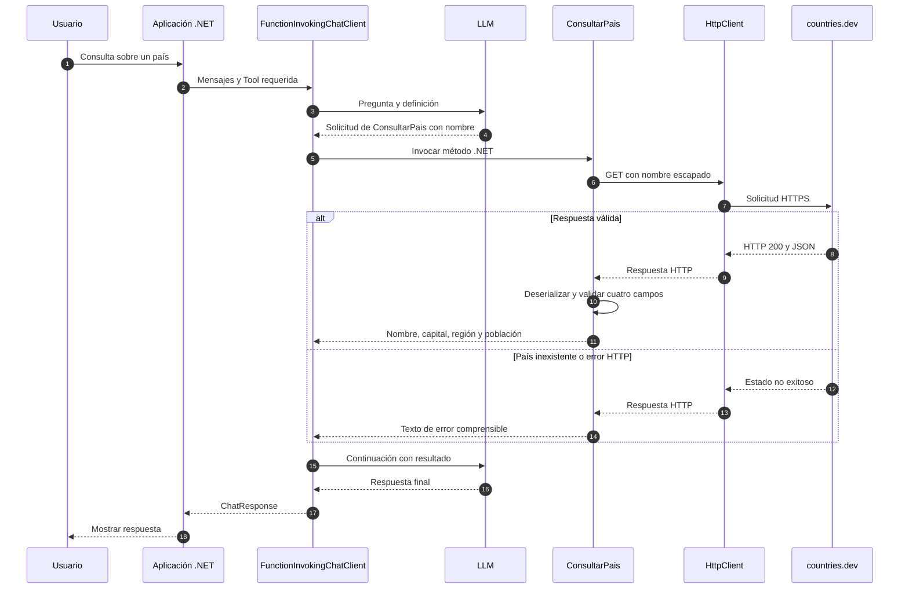

# Lab 12c - Tool externa

## Objetivo

Observar cómo una Tool puede encapsular una consulta HTTP y devolver información al modelo.

Una Tool representa una capacidad. Su implementación puede calcular localmente, consultar un archivo, una base de datos o un servicio externo. Aquí elegimos una API pública de países.

## Estado

✅ Implementado y ejecutado con .NET 10, `gemini-3.5-flash-lite` y llamadas HTTP reales.

## API elegida y contrato comprobado

Usamos [countries.dev](https://countries.dev/docs), sin API key ni alta de cuenta. El endpoint es:

```text
GET https://countries.dev/name/{nombre}?fullText=true
```

La [documentación por nombre](https://countries.dev/docs/api/name) y la ejecución real permiten comprobar su contrato: devuelve un array de países. Consumimos solamente `name`, `capital`, `region` y `population` mediante `CountryInfo`.

`name` es un string del catálogo, no un objeto `name.official`. No inventamos un campo de nombre oficial que este contrato no ofrece. El nombre se busca completo en inglés; no implementamos traducción ni búsqueda ambigua.

Se evaluó primero REST Countries. Su endpoint `/v3.1/name/...` devolvió un mensaje de versión retirada, y su [documentación actual de versiones](https://restcountries.com/docs/countries/api-versions) requiere autenticación para v5. Por eso usamos una alternativa comprobada sin credenciales nuevas.

La URL queda explícita en el ejemplo. El argumento del modelo se escapa como un segmento con `Uri.EscapeDataString`; no puede elegir otra URL de servicio.

## Tool y API

```text
Tool ConsultarPais
        ↓
implementación .NET
        ↓
HttpClient
        ↓
countries.dev
```

**API REST ≠ Tool.** La API es el servicio externo. La Tool es la capacidad que ofrecemos al modelo y puede cambiar su implementación HTTP sin cambiar necesariamente su significado.

**Tool externa ≠ MCP.** Esta función llama directamente a HTTP; no utiliza un servidor ni un SDK MCP. Tampoco es un agente.

## Flujo principal

`Program.cs` crea un `HttpClient` reutilizable y ofrece `ConsultarPais` como `AIFunction`. La función:

1. recibe un nombre;
2. realiza la consulta HTTP;
3. deserializa los cuatro campos;
4. valida la respuesta;
5. devuelve un texto simple al modelo.

La respuesta final viene de `ChatResponse.Text`, no de un texto hardcodeado. La representación nativa del chat sigue preservada en `ChatClientFactory`, exactamente como en 11b.

## Consultar la API, no sólo recordar datos

La descripción y la instrucción piden obtener los datos desde el servicio. Además, este ejercicio configura:

```csharp
ChatOptions options = new()
{
    Tools = [tool],
    ToolMode = ChatToolMode.RequireAny
};
```

En 12a y 12b dejamos disponible la decisión de responder sin Tool. En 12c requerimos una solicitud inicial para demostrar la integración HTTP. `FunctionInvokingChatClient` permite luego la respuesta final sin seguir exigiendo una Tool en cada continuación.

El proveedor debe soportar ese modo de Function Calling. No garantizamos que cualquier modelo o endpoint lo implemente.

## Consultas

Cada consulta es independiente:

- Capital y población de Argentina.
- Capital y población de Uruguay.
- El nombre literal `pais-inexistente-lab12` para observar el error.

La Tool no hardcodea países ni cifras. **La población es el valor publicado por la API, no un conteo actual en tiempo real.** Una consulta reciente puede devolver un dato de un período anterior; este catálogo no informa aquí una fecha estadística.

## Errores mínimos

`CountryTools` reconoce país inexistente, otros estados HTTP no exitosos, respuesta vacía o incompleta, JSON inválido y problemas de transporte o timeout. La consulta tiene un límite de 20 segundos.

En esos casos devuelve un texto que empieza por `Error:`. Ese texto viaja como resultado de Tool y el modelo lo explica. A diferencia de 12b, aquí los errores HTTP previstos se traducen en un resultado comprensible dentro de la función; no se exponen detalles de excepciones de transporte al modelo.

Un país inexistente devuelve HTTP 404. No se inventan datos ni se implementan reintentos. Un error esperado en esta consulta no hace fallar todo el programa.

## Diagrama de secuencia



El modelo solicita una capacidad; la consulta HTTP ocurre en nuestra aplicación.

## Estructura

```text
lab-12c-tool-externa/
├── ChatClientFactory.cs
├── CountryTools.cs
├── LabConfiguration.cs
├── Lab12c.ToolExterna.csproj
├── Program.cs
└── README.md
```

`CountryTools.cs` también contiene `CountryInfo`, un record con únicamente los cuatro campos consumidos. No hay gateways, repositorios, servicios genéricos ni una capa de integración adicional.

## Configuración y ejecución

Se utiliza el `.env` raíz:

```env
AI_PROVIDER=
AI_MODEL=
AI_API_KEY=
AI_URL=
```

`AI_URL` es opcional. No usamos `AI_EMBEDDING_MODEL` ni credenciales adicionales para países.

```powershell
cd labs/lab-12-function-calling/lab-12c-tool-externa
dotnet restore
dotnet build
dotnet run
```

Paquetes: `DotNetEnv` 3.2.0, `Microsoft.Extensions.AI` 10.10.0 y `Microsoft.Extensions.AI.OpenAI` 10.10.1. HTTP y JSON utilizan el framework .NET: `HttpClient` y `System.Net.Http.Json`.

## Salida esperada

Ejemplo conceptual; la población y la redacción dependen del servicio y del modelo:

```text
=== TOOL EJECUTADA ===
Tool: ConsultarPais
nombre: Argentina
HTTP: 200
Nombre: Argentina
Capital: Buenos Aires
Región: Americas
Población publicada por la API: <valor devuelto>
=== RESPUESTA FINAL ===
<respuesta generada con esos datos>
```

Para el nombre inexistente se observa HTTP 404, el texto de error de la Tool y la explicación final.

## Validación

Restore y build pasaron sin errores ni advertencias. La ejecución real con Gemini solicitó la Tool en las tres consultas: Argentina y Uruguay devolvieron HTTP 200, y el nombre inexistente HTTP 404. Se deserializaron los datos y las tres continuaciones produjeron respuestas finales; el proceso terminó con código 0.

Las pruebas locales controladas verificaron deserialización, datos incompletos, arrays vacíos o ambiguos, JSON inválido, HTTP no exitoso, transporte, timeout, nombre vacío y escape del argumento. No se agregaron dependencias de testing al repositorio.

## Qué aprendemos

1. Por qué una Tool representa una capacidad y puede encapsular una API.
2. Qué diferencia hay entre la API externa y la Tool ofrecida al modelo.
3. Cómo usar `HttpClient` y deserializar sólo los campos necesarios.
4. Cómo convertir errores HTTP previstos en resultados comprensibles.
5. Por qué consultar un servicio no garantiza que sus datos sean de hoy.
6. Por qué una Tool puede llamar directamente a HTTP sin MCP.
7. Por qué todo este código sigue ejecutándose en la aplicación, no dentro del LLM.

## Qué NO hacemos todavía

APIs con autenticación adicional, reintentos, resiliencia avanzada, múltiples proveedores de datos, MCP, agentes ni arquitectura de gateways. No garantizamos disponibilidad del servicio público ni actualidad de sus cifras.

## Siguiente laboratorio

[Lab 13 - Primer agente](../../lab-13-primer-agente/README.md) ya está implementado. Ya podemos ofrecer capacidades locales y externas; en Lab 13 coordinamos decisiones hacia un objetivo de diagnóstico con estado, observaciones y límites.

[Guía de Lab 12](../README.md) · [Roadmap](../../../ROADMAP.md).
