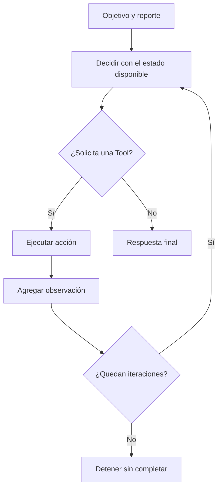
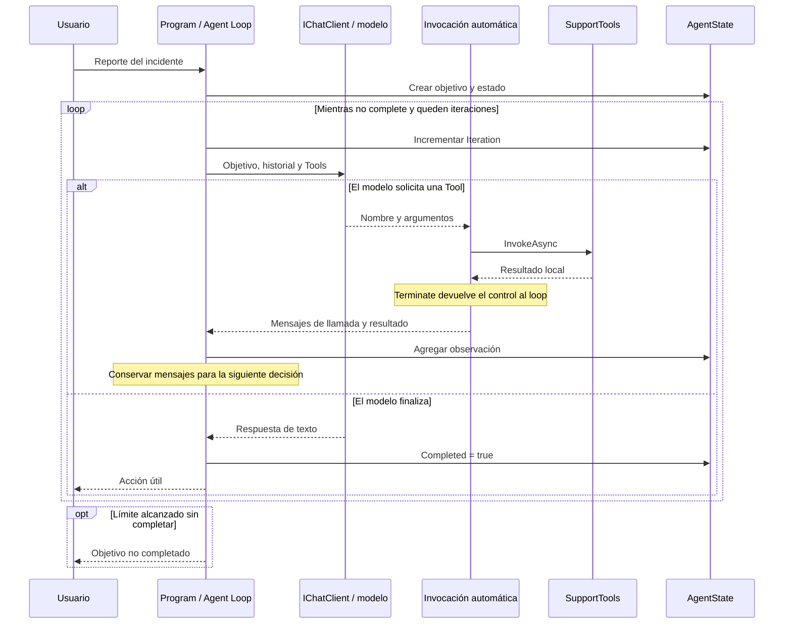

# Lab 13 - Primer agente

## Objetivo

Comprender qué diferencia hay entre un modelo que puede usar Tools y un agente: **perseguir un objetivo mediante decisiones, acciones y observaciones iterativas**.

Lab 11 introduce Tools. Lab 12 ofrece varias capacidades, errores y una Tool HTTP. Lab 13 conserva Function Calling abstraído y hace visible el Agent Loop.

## Estado

✅ Implementado con .NET 10. Se completaron restore, build y los tres escenarios con `gemini-3.5-flash-lite`. M7 contiene sólo Lab 13 y queda implementado. Labs 14 y 15 siguen pendientes.

## El problema

Un reporte como “Pagos devuelve error X91” no indica de antemano cuántas acciones hacen falta. Podemos encontrar un incidente conocido, una recomendación local o ninguna explicación.

El objetivo es **diagnosticar el incidente y proporcionar una acción útil al usuario**. No significa reparar el servicio: consultar datos, orientar o registrar un caso para seguimiento puede completar este ejercicio.

Los servicios, estados y recomendaciones son datos ficticios y controlados; no diagnosticamos una infraestructura real.

## Tools, Function Calling y Agent

```text
Tool
    = capacidad ejecutada por la aplicación

Function Calling
    = mecanismo para solicitar una capacidad con argumentos

Agent
    = sistema que persigue un objetivo mediante decisiones
      y acciones iterativas

LLM + Tools ≠ automáticamente Agent
```

La diferencia que observamos aquí es el ciclo orientado a objetivo y su estado de ejecución. Un ciclo automático de invocación, como el de Lab 12, resuelve el intercambio de funciones; disponer de él no demuestra por sí solo que diseñamos un agente.

## Objetivo, estado, observación e iteración

- **Objetivo:** qué intentamos conseguir, sin enumerar obligatoriamente las acciones.
- **Estado:** información de esta ejecución. `AgentState` contiene `Objective`, `Observations`, `Iteration` y `Completed`.
- **Observación:** resultado real de una Tool. Se agrega a la colección ordenada de observaciones y al historial enviado al modelo.
- **Iteración:** una decisión del modelo, que puede solicitar una acción o finalizar con texto.

`Observations` permite inspeccionar lo sucedido. El historial `messages` conserva esos mismos resultados, junto con las solicitudes y sus identificadores, para que el modelo decida a partir de ellos. No reenviamos un resumen separado ni sustituimos mensajes nativos.

Cada reporte comienza con estado, historial e incidentes locales nuevos. Este estado temporal no es memoria persistente ni memoria entre usuarios.

## Agent Loop

El núcleo está en `Program.cs`:

```csharp
const int maxIterations = 5;

// Dentro de cada escenario:
while (!state.Completed && state.Iteration < maxIterations)
{
    // Decidir → ejecutar si solicita una Tool → observar → continuar.
    // Si devuelve texto final sin una solicitud pendiente, finalizar.
}
```

`maxIterations` evita iterar indefinidamente. Cuenta decisiones, incluida la respuesta final: tres acciones y una respuesta final son cuatro iteraciones. Al alcanzar cinco sin finalizar, se informa **objetivo no completado**, con código de salida 1. No se hace una llamada adicional para aparentar éxito.

`Completed` significa que el modelo decidió finalizar con texto sin una Tool pendiente. No es una comprobación independiente de que el diagnóstico sea correcto o el servicio se haya recuperado.



## Function Calling abstraído, Agent Loop explícito

Reutilizamos `IChatClient`, `ChatOptions.Tools`, `AIFunctionFactory.Create` y `UseFunctionInvocation()`.

Por defecto, la invocación automática continúa consultando al modelo hasta obtener una respuesta final. Para devolver el control al `while` después de una acción, la versión utilizada ofrece:

```csharp
client.FunctionInvoker = async (context, cancellationToken) =>
{
    context.Terminate = true;
    return await context.Function.InvokeAsync(context.Arguments, cancellationToken);
};
```

La aplicación ejecuta la función mediante ese punto de extensión. `FunctionInvokingChatClient` sigue construyendo los resultados y conservando la relación entre llamada y resultado. El `while` recibe `response.Messages`, incorpora el resultado a `AgentState` y decide si pide otra iteración.

`Terminate` corta esa solicitud de invocación automática; **no marca el objetivo como completado**. No usamos `MaximumIterationsPerRequest = 1`: en esta versión esa última vuelta retira las Tools antes de consultar al modelo. El límite pedagógico pertenece al `while`.

`AllowMultipleToolCalls = false` solicita una acción por decisión; es una indicación al proveedor, no una validación universal de sus respuestas. Si devuelve varias, comprobamos `context.FunctionCount` y detenemos el escenario antes de ejecutar acciones. Así evitamos dejar llamadas sin resultado al cortar la invocación automática. No implementamos acciones paralelas.

`MaximumConsecutiveErrorsPerRequest = 0` hace que una excepción de invocación se propague inmediatamente. En este lab un argumento inválido o un lote rechazado termina el diagnóstico con un error; no hay un ciclo interno de recuperación oculto.

Una Tool desconocida detiene la ejecución con un error claro. La factory conserva la representación nativa igual que Lab 12, sin condiciones por proveedor ni manipulación de firmas en el loop.

Referencia de la API utilizada: [FunctionInvokingChatClient, versión 10.10.0](https://github.com/dotnet/extensions/blob/v10.10.0/src/Libraries/Microsoft.Extensions.AI/ChatCompletion/FunctionInvokingChatClient.cs).

## Dominio y Tools disponibles

| Tool | Entrada | Resultado local |
|---|---|---|
| `ConsultarEstadoServicio` | `servicio` | Estado del servicio y su incidente conocido, si existe |
| `BuscarSolucion` | `concepto` | Recomendación por clave exacta o ausencia de resultados |
| `RegistrarIncidente` | `servicio`, `descripcion` | Registro en memoria y número `INC-1001`, `INC-1002`, etc. |

Los datos se leen desde `data/service-status.json` y `data/knowledge-base.json`. Las claves ignoran mayúsculas y espacios exteriores. La búsqueda es una consulta de diccionario, sin embeddings ni búsqueda semántica.

Los registros sólo viven en una lista dentro de `SupportTools`; no se escriben a disco ni se envían a un sistema de tickets. Los números se reinician en cada escenario y no son identificadores globales.

La instrucción pide consultar el estado, evitar duplicar incidentes conocidos y finalizar cuando haya información suficiente. No contiene una secuencia obligatoria de tres Tools ni decisiones por reporte en C#.

## Tres escenarios

| Escenario | Reporte | Datos disponibles | Camino esperado |
|---|---|---|---|
| A — Incidente conocido | No puedo usar transferencias. | Degradado, con demoras conocidas | Consultar estado → informar y finalizar |
| B — Error conocido | Pagos devuelve error 503. | Operativo, con recomendación para 503 | Consultar estado → buscar solución → finalizar |
| C — Error desconocido | Pagos devuelve error X91. | Operativo, sin recomendación para X91 | Consultar estado → buscar solución → registrar → finalizar |

Son caminos esperados, no una tabla de routing implementada. El modelo recibe siempre las mismas tres capacidades y decide según los resultados.

## Secuencia



## Estructura

```text
lab-13-primer-agente/
├── Program.cs
├── AgentState.cs
├── SupportTools.cs
├── LabConfiguration.cs
├── ChatClientFactory.cs
├── Lab13.PrimerAgente.csproj
├── README.md
└── data/
    ├── service-status.json
    └── knowledge-base.json
```

El `.csproj` copia `data/` al output y se resuelve con `AppContext.BaseDirectory`. Las Tools funcionan con archivos locales; las decisiones requieren conexión al proveedor LLM. No se consulta ninguna API externa desde las Tools.

## Configuración

Usamos el `.env` de la raíz, con el patrón de Lab 12:

```env
AI_PROVIDER=
AI_MODEL=
AI_API_KEY=
AI_URL=
```

Proveedor, modelo y credencial son obligatorios; `AI_URL` es opcional para un endpoint compatible. `AI_MODEL` debe soportar Function Calling en el endpoint configurado. No utilizamos `AI_EMBEDDING_MODEL` ni agregamos variables.

Paquetes existentes: DotNetEnv **3.2.0**, Microsoft.Extensions.AI **10.10.0** y Microsoft.Extensions.AI.OpenAI **10.10.1**. No hay paquetes de agentes.

## Ejecutar

```bash
cd labs/lab-13-primer-agente
dotnet restore
dotnet build
dotnet run
```

Se ejecutan los tres reportes de forma independiente. La consola muestra cada decisión solicitada, argumentos, resultado, observación, respuesta final y los contadores.

## Salida esperada

Ejemplo abreviado del escenario C; las decisiones y la redacción pueden variar:

```text
=== LAB 13 - PRIMER AGENTE ===
OBJETIVO: Diagnosticar el incidente y proporcionar una acción útil al usuario.
REPORTE: Pagos devuelve error X91.

--- ITERACIÓN 1 / 5 ---
Decisión del modelo / Tool:
ConsultarEstadoServicio
Resultado / observación agregada:
El servicio pagos está operativo. No hay un incidente conocido.

--- ITERACIÓN 2 / 5 ---
Decisión del modelo / Tool:
BuscarSolucion
Resultado / observación agregada:
No existe una solución conocida para X91.

--- ITERACIÓN 3 / 5 ---
Decisión del modelo / Tool:
RegistrarIncidente
Resultado / observación agregada:
Se registró el incidente INC-1001 para pagos: ...

--- ITERACIÓN 4 / 5 ---
Decisión del modelo: finalizar.
=== OBJETIVO COMPLETADO SEGÚN EL MODELO ===
...se registró INC-1001 para seguimiento...

Iteraciones: 4
Observaciones: 3
Completado: True
```

## Validación y límites

Restore y build pasaron sin errores ni advertencias. En la ejecución real con Gemini se observaron:

| Escenario | Tools ejecutadas | Iteraciones | Observaciones |
|---|---|---:|---:|
| A | Estado | 2 | 1 |
| B | Estado, solución | 3 | 2 |
| C | Estado, solución, registro | 4 | 3 |

A informó el incidente conocido. B recomendó esperar y reintentar, contactando a soporte si persistía. C informó `INC-1001` y sugirió seguimiento; también añadió una recomendación general de reintento que no provenía de una solución conocida para X91. Esto muestra que una instrucción no garantiza que toda recomendación esté respaldada por las Tools.

Una primera ejecución buscó una solución y registró innecesariamente el incidente conocido. Aclarar la política en la instrucción produjo el camino corto de A. No convertimos esa observación en un resultado garantizado para todos los modelos.

Se verifican además las Tools y sus argumentos, los resultados convertidos en observaciones, finalización y el corte por cinco iteraciones con respuestas simuladas repetitivas. Las pruebas controladas verifican invariantes; no exigen una redacción exacta del LLM.

El límite acota decisiones, no tiempo total, tokens ni costo. Un error HTTP del proveedor no equivale a haber completado el objetivo. El agente puede elegir mal, repetir acciones o finalizar antes de investigar lo suficiente. Este ejemplo no incorpora una evaluación independiente del diagnóstico.

## Qué aprendemos

Al finalizar deberías poder explicar:

1. qué diferencia hay entre Tool y Agent;
2. qué diferencia hay entre Function Calling y Agent;
3. qué es un objetivo;
4. qué contiene el estado de ejecución;
5. qué representa una observación;
6. qué cuenta como una iteración;
7. cómo funciona el Agent Loop;
8. por qué el agente puede tomar caminos distintos;
9. por qué necesita un límite de iteraciones;
10. por qué un agente no es simplemente un conjunto de Tools.

## Qué NO hacemos todavía

Frameworks de agentes, planners, multi-agent, workflows, MCP, RAG, vector stores, APIs externas desde las Tools, bases de datos ni memoria persistente. No implementamos un sistema de soporte de producción.

## Siguiente laboratorio

[Lab 14 - Workflow](../lab-14-multi-agent/README.md) continúa ⏳ Pendiente.

¿Todas las decisiones del proceso deberían quedar en manos del agente? Un agente decide dinámicamente qué hacer; un workflow define pasos y transiciones más predecibles. El dominio de incidentes puede ayudarnos a explorar esa diferencia, sin implementarla aquí.

En Lab 13 dejamos que el agente decida el siguiente paso.

En Lab 14 veremos qué ocurre cuando parte del proceso debe seguir un flujo explícito y predecible.

[Lab 12 - Function Calling](../lab-12-function-calling/README.md) · [Roadmap](../../ROADMAP.md) · [Qué aprendemos](../../docs/05-que-aprendemos.md).
