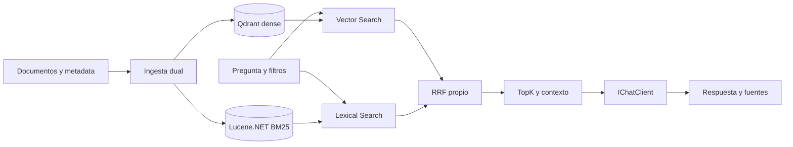

# RAG Hybrid Search + BM25

## Objetivo

Combinar similitud semántica y relevancia lexical dentro de RAG usando **Qdrant dense + Lucene.NET BM25 + RRF propio**. Evoluciona [rag-vector-store](../rag-vector-store/README.md); no crea otro reference ni altera los labs.

## Problema y conocimientos previos

Una paráfrasis puede necesitar embeddings; códigos, siglas e identificadores necesitan conservar términos exactos. Los scores vectoriales y BM25 no comparten escala. RRF combina posiciones y conserva identidad, metadata y fuentes.

Base conceptual: [Lab 07](../../labs/lab-07-embeddings/README.md), [Lab 08](../../labs/lab-08-document-loading/README.md), [Lab 09](../../labs/lab-09-rag-basico/README.md), [Lab 10](../../labs/lab-10-retrieval-calidad/README.md) y [RAG con Vector Store](../rag-vector-store/README.md).

## Arquitectura



Una consola con composición por constructor, logging y cancelación. Qdrant administra vectores; Lucene, índice invertido y BM25; RRF compone retrieval. Ambos motores filtran antes del topK. No se reimplementa coseno ni se mantienen dos motores BM25.

## ¿Por qué no implementamos BM25 nosotros?

En los Labs priorizamos comprender mecanismos. En Reference integramos componentes maduros y buenas prácticas para una aplicación realista. BM25 está disponible en Lucene.NET: documentamos TF, IDF y longitud, y delegamos implementación, análisis e índice al motor.

RRF sí corresponde a la aplicación: es una estrategia pequeña y testeable para componer rankings. El corpus pequeño facilita ejecutar y comparar; **no justifica sustituir infraestructura especializada por un recorrido artesanal**.

## Tecnologías

| Paquete | Versión | Responsabilidad |
|---|---|---|
| [Lucene.Net](https://www.nuget.org/packages/Lucene.Net/4.8.0-beta00018) | 4.8.0-beta00018 | Índice invertido persistente, consulta y BM25 |
| [Lucene.Net.Analysis.Common](https://www.nuget.org/packages/Lucene.Net.Analysis.Common/4.8.0-beta00018) | 4.8.0-beta00018 | PatternTokenizer y LowerCaseFilter para conservar códigos |
| Microsoft.Extensions.AI.OpenAI | 10.10.1 | Adaptadores a IEmbeddingGenerator e IChatClient |
| Microsoft.Extensions.VectorData.Abstractions | 10.10.0 | Colección, esquema y búsqueda vectorial |
| CommunityToolkit.VectorData.Qdrant | 1.0.0 | Traduce operaciones y filtros a Qdrant |
| Qdrant.Client | 1.19.0 | Conexión gRPC |
| DotNetEnv | 3.2.0 | Configuración raíz |
| Microsoft.Extensions.Logging.Console | 10.0.12 | Diagnóstico de etapas/errores |
| xunit.v3 | 4.0.2 | Tests propios e integración |

**Los dos paquetes Lucene son prerelease**, no estables. Se fijó la línea vigente 4.8 y se verificó con .NET 10; la última release sin beta listada, 3.0.3, pertenece a otra línea antigua. [Decisión, APIs oficiales y compromisos](docs/02-lucene-bm25.md). Las demás versiones se conservan de la referencia anterior.

## Entorno y configuración

.NET SDK 10, Docker Desktop con contenedores Linux y modelos compatibles con chat/embeddings. Lucene es local, sin servidor adicional. Qdrant comparte instancia/volumen con rag-vector-store y utiliza otra colección.

El .env sigue en la raíz:

```env
AI_PROVIDER=openai
AI_MODEL=gpt-4o-mini
AI_EMBEDDING_MODEL=text-embedding-3-small
AI_API_KEY=tu-api-key
AI_URL=
QDRANT_ENDPOINT=http://localhost:6334
```

No hay variables nuevas. AI_MODEL genera texto; AI_EMBEDDING_MODEL genera vectores. AI_URL es endpoint compatible opcional; QDRANT_ENDPOINT usa gRPC. [Preparación, configuración y limpieza completas](docs/08-entorno-y-ejecucion.md).

## Ejecutar

```powershell
cd reference/rag-hybrid-search
docker compose up -d
docker compose ps
curl.exe http://localhost:6333/healthz
dotnet restore
dotnet build
dotnet test
dotnet run --project src/RagHybridSearch -- ingest
```

Ejecutá todos los comandos desde esta carpeta. La misma pregunta admite tres modos:

```powershell
dotnet run --project src/RagHybridSearch -- query "ART-93821 annual time off: which form and how many days?" --mode vector
dotnet run --project src/RagHybridSearch -- query "ART-93821 annual time off: which form and how many days?" --mode bm25
dotnet run --project src/RagHybridSearch -- query "ART-93821 annual time off: which form and how many days?" --mode hybrid
```

Hybrid es el default. Sin --search-only, todos completan RAG. BM25 con --search-only funciona offline después de ingesta, aunque se valida la configuración común.

Filtros exactos, opcionales y combinados mediante AND:

```powershell
dotnet run --project src/RagHybridSearch -- query "ART-93821 annual time off: which form and how many days?" --mode hybrid --department RRHH --type policy --year 2026
```

La consola muestra rank, score, fuente, chunk y metadata; Hybrid agrega ranks de origen. No imprime vectores.

## Ingesta, identidad y persistencia

Se conserva el corpus anterior: cuatro documentos técnicos y cuatro textos ficticios para observar códigos, ambigüedad y año. metadata.json describe cada archivo.

Una carga/chunking produce los mismos DocumentRecord para ambos motores. Guid estable deriva de Source y ChunkIndex. Qdrant hace upsert en dac_hybrid_documents; Lucene usa UpdateDocument por ID dentro de una reconstrucción confirmada del corpus. La ingesta retira IDs conocidos que desaparecieron. Dos ejecuciones no acumulan duplicados.

Lucene persiste en **artifacts/lucene-index/**, ignorada por Git. El commit guarda modelo, dimensión, esquema y generación; Qdrant guarda la misma generación en payload. Las consultas abren el índice existente, sin cargar/reconstruir todo el corpus. [Detalles y fallas parciales](docs/05-ingesta-dual.md).

La versión anterior de BM25 y el snapshot se retiraron del código. Ejecutá build e ingest para migrar; artifacts/hybrid-index.json queda sin uso. Si se perdió historial o se retiraron archivos antes de migrar, reiniciá ambos índices deliberadamente según la guía.

## Analyzer y parámetros

CodePreservingAnalyzer usa componentes Lucene: conserva ART-93823 como término entero y normaliza casing, sin stemming, stop words o eliminación de acentos. El mismo análisis se usa al escribir y consultar.

Chunks: 500 unidades UTF-16, overlap 100. topKVector/topKBm25/topKFinal: 6/6/2. BM25Similarity se configura explícitamente en writer y searcher con k1=1.2 y b=0.75. RRF usa 60.

Cosine >= 0.60 es aceptación experimental vectorial; BM25 > 0 indica coincidencia lexical. Ningún umbral se traslada a RRF ni representa confianza universal.

## Comparación reproducible

[queries.json](examples/queries.json) define A–D. Ejecutá ./examples/Compare-Queries.ps1 para guardar doce búsquedas en artifacts/, sin generar doce respuestas.

Resultados observados con gemini-embedding-001 y Lucene.NET, no garantías para otros modelos:

| Caso | Vector, dos finales | BM25, dos finales | Hybrid, dos finales |
|---|---|---|---|
| A: paráfrasis inglesa | Política vigente e histórica | Sin coincidencias | Ambas políticas por señal vectorial |
| B: ART-93823 | Catálogo y software distractor | Sólo catálogo exacto | Catálogo primero y software distractor |
| C: código + descanso anual | Política y software | Catálogo y política | Política y catálogo |
| D: C filtrado RRHH/policy/2026 | Sólo política vigente | Sólo política vigente | Sólo política vigente |

En C los candidatos lexicales empatan y se desempatan por fuente. **BM25 ahora también recupera ambas evidencias**; Hybrid prioriza la política por acuerdo con la señal semántica. No se conserva la afirmación anterior de que sólo Hybrid recuperaba ambas ni se fuerza una mejora universal. B muestra que RRF puede mantener distractores.

## RAG y fuentes

RagContext construye prompt desde el ranking final. IChatClient genera respuesta; fuentes se deduplican desde los chunks enviados, sin pedir al modelo que invente documentos. Sin evidencia no se llama a chat. Citas numéricas no son verificación automática.

## Tests y validación

dotnet test ejecuta 44 pruebas sin servicios externos: 38 unitarias y seis de integración local Lucene. No se prueba la fórmula interna del motor.

```powershell
dotnet test --project tests/RagHybridSearch.IntegrationTests
```

La integración separada comprueba Qdrant y Lucene reales, filtros, reconexión, RRF y generaciones, con embeddings controlados y sin LLM. [Guía](docs/07-testing.md).

Se verificaron restore/build sin warnings ni errores, las 44 pruebas de la solución y la prueba separada Qdrant/Hybrid. Dos ingestas conservaron 68 documentos Lucene y 68 puntos Qdrant, de dimensión 3072 en el entorno Gemini configurado; la colección anterior conserva 64 puntos. También se probaron doce búsquedas, RAG real en tres modos y con filtros, y ausencia de evidencia sin llamada a chat. Los seis Mermaid se renderizaron y se comprobaron 511 enlaces locales del repositorio sin errores.

## Documentación técnica

1. [Arquitectura y artefactos](docs/00-arquitectura.md).
2. [Qdrant vector search](docs/01-qdrant-vector-search.md).
3. [Lucene.NET y BM25](docs/02-lucene-bm25.md).
4. [Hybrid Search y RRF](docs/03-hybrid-search-rrf.md).
5. [Metadata filtering](docs/04-metadata-filtering.md).
6. [Ingesta dual](docs/05-ingesta-dual.md).
7. [Flujo RAG y secuencia](docs/06-flujo-rag.md).
8. [Testing](docs/07-testing.md).
9. [Entorno y ejecución](docs/08-entorno-y-ejecucion.md).

Incluyen Mermaid, fuentes oficiales y decisiones de cada componente. Los comentarios del código explican Analyzer, mapeo, publicación, filtros y fusión.

## Limitaciones

Lucene 4.8 sigue en prerelease. La ingesta reconstruye el corpus lexical y genera todos los embeddings; no hay sincronización incremental industrial, transacción entre motores o ingestas concurrentes. La generación detecta inconsistencias en hits, no igualdad exhaustiva. Perder Lucene pierde historial de IDs retirados.

El Analyzer no traduce ni expande sinónimos; caracteres pueden cortar palabras. RRF no garantiza diversidad o mejora. El corpus y las preguntas son demostración, no evaluación independiente. Prompt y delimitadores no garantizan grounding o resistencia completa a instrucciones maliciosas. Qdrant local está limitado a loopback sin autenticación.

## Próximo reference

reference/rag-semantic-chunking/ sigue planificado: **¿qué ocurre cuando mejoramos no el motor de búsqueda, sino la forma en que construimos los chunks?** No se implementa aquí.

Query rewriting, multi-query, reranking, evaluación completa, MAF y MCP quedan fuera. Agent Framework conserva su planificación.

[Índice de reference](../README.md) · [Roadmap](../../ROADMAP.md#implementaciones-de-referencia).

