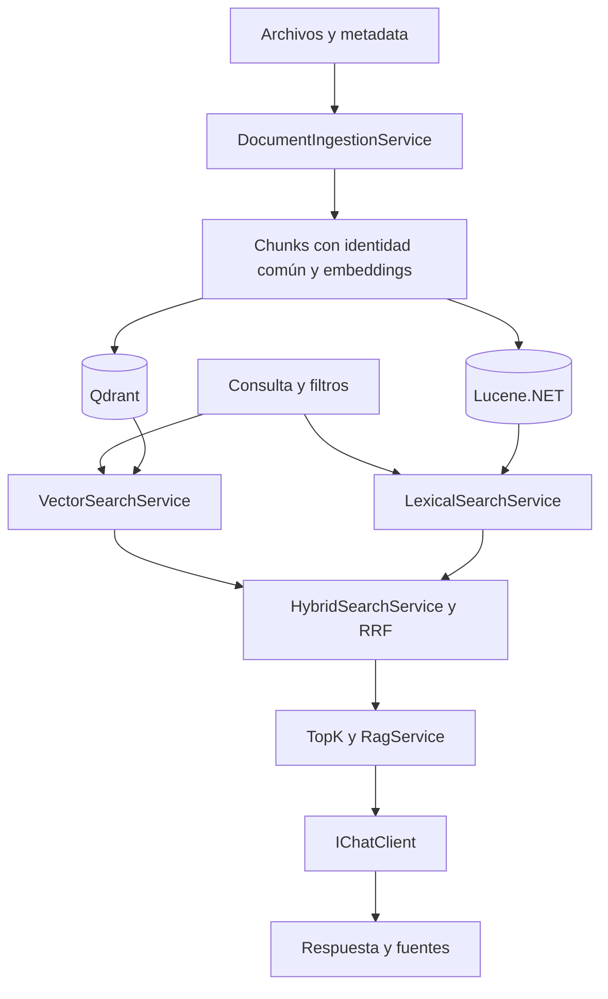

# Arquitectura y artefactos

Qdrant recupera por significado. Lucene.NET recupera por términos mediante BM25. La aplicación fusiona sus rankings con RRF y genera una respuesta con Microsoft.Extensions.AI. Continúa [rag-vector-store](../../rag-vector-store/README.md), conservando los labs.

## Responsabilidades

Delegamos búsqueda vectorial a Qdrant y BM25 a Lucene.NET. RRF queda en la aplicación: compone señales y es una función pequeña, determinista y testeable. Reference integra infraestructura madura sin reimplementarla innecesariamente. El corpus reducido facilita experimentar; no justifica sustituir motores por implementaciones artesanales.

| Archivo de src/RagHybridSearch | Entrada → salida y responsabilidad |
|---|---|
| [Program.cs](../src/RagHybridSearch/Program.cs) | Argumentos → composición por constructor → comando → presentación, recursos y errores |
| [CommandLine.cs](../src/RagHybridSearch/CommandLine.cs) | Valida pregunta, modo, filtros y search-only |
| [AppConfiguration.cs](../src/RagHybridSearch/AppConfiguration.cs) | .env raíz/entorno → modelos y endpoints validados |
| [SearchSettings.cs](../src/RagHybridSearch/SearchSettings.cs) | Parámetros de chunking, BM25, aceptación y topK |
| [DocumentText.cs](../src/RagHybridSearch/DocumentText.cs) | Archivo → texto normalizado → DocumentChunk |
| [DocumentRecord.cs](../src/RagHybridSearch/DocumentRecord.cs) | Chunk + metadata + vector → Guid estable, payload y Generation |
| [EmbeddingGeneration.cs](../src/RagHybridSearch/EmbeddingGeneration.cs) | Textos → embeddings MEAI validados |
| [DocumentIngestionService.cs](../src/RagHybridSearch/DocumentIngestionService.cs) | Un corpus → mismos records en ambos motores |
| [CodePreservingAnalyzer.cs](../src/RagHybridSearch/CodePreservingAnalyzer.cs) | Configura análisis Lucene que conserva códigos |
| [LuceneIndex.cs](../src/RagHybridSearch/LuceneIndex.cs) | Records → campos, índice persistido, commit y rollback |
| [IndexMetadata.cs](../src/RagHybridSearch/IndexMetadata.cs) | Modelo, dimensión, generación y esquema ↔ metadata validada del commit |
| [LexicalSearchService.cs](../src/RagHybridSearch/LexicalSearchService.cs) | Reader persistido + consulta/filtro → SearchHit mediante BM25 |
| [MetadataFilter.cs](../src/RagHybridSearch/MetadataFilter.cs) | Una intención → expresión Qdrant y Filter Lucene |
| [VectorSearchService.cs](../src/RagHybridSearch/VectorSearchService.cs) | Pregunta → embedding → Qdrant filtrado → ranking validado |
| [HybridSearchService.cs](../src/RagHybridSearch/HybridSearchService.cs) | Coordina modos y aceptación; conserva ramas y resultado |
| [ReciprocalRankFusion.cs](../src/RagHybridSearch/ReciprocalRankFusion.cs) | Rankings → FusedHit únicos con score RRF y ranks |
| [RagService.cs](../src/RagHybridSearch/RagService.cs) | Ranking → RagContext, prompt, RagAnswer y fuentes |

Las dependencias se reciben por constructor, sin interfaces propias ni contenedor DI. using libera clientes, reader y analyzer. ILogger registra etapas sin credenciales.

## Soporte

La [solución](../RagHybridSearch.slnx) agrupa consola y pruebas sin servicios externos; el proyecto Qdrant se ejecuta aparte. El [csproj](../src/RagHybridSearch/RagHybridSearch.csproj) fija paquetes, net10.0, nullable y warnings como errores; copia data/ al output. [global.json](../global.json) selecciona Microsoft Testing Platform.

[docker-compose.yml](../docker-compose.yml) comparte Qdrant/volumen con la referencia anterior, usando otra colección. [.env.example](../.env.example) remite al .env raíz. data/metadata.json describe el corpus; examples/ contiene preguntas y comparación. artifacts/lucene-index/ es infraestructura generada, ignorada por Git. docs/ no se ingesta.

[README](../README.md) · [Qdrant](01-qdrant-vector-search.md) · [Lucene](02-lucene-bm25.md).

