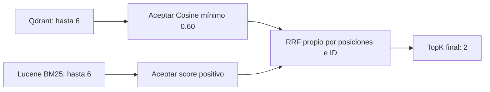

# Hybrid Search y RRF

Los scores Qdrant y BM25 no comparten escala. La aplicación combina posiciones:

```text
RRF(chunk) = suma de 1 / (60 + posiciónEnRanking)
```

Posiciones desde uno; un chunk presente en ambas ramas recibe dos aportes. El Guid compartido permite deduplicar sin confundir fragmentos distintos de una misma fuente. [Paper original](https://research.google/pubs/reciprocal-rank-fusion-outperforms-condorcet-and-individual-rank-learning-methods/).



HybridSearchService ejecuta sólo las ramas del modo solicitado. Vector conserva scores Qdrant; bm25, scores Lucene; hybrid combina ambas secuencialmente. RetrievalResult mantiene ramas para presentar resultados.

Select acepta por señal antes de RRF. Fuse evita votos repetidos dentro de una rama, suma aportes y ordena; los empates finales usan Source ordinal y ChunkIndex. FusedHit conserva VectorRank/Bm25Rank sobre rankings aceptados.

Seis candidatos por rama dan margen; dos finales acotan contexto. La constante 60 es una elección clásica explícita, no una garantía de optimalidad.

## Límite arquitectónico correcto

BM25 se delega a Lucene y vector search a Qdrant. RRF queda en la aplicación porque compone retrieval: lógica pequeña, específica y testeable. Reference permite algoritmos propios cuando pertenecen a la solución; evita sustituir infraestructura madura sin motivo.

RRF no recupera evidencia ausente, no asegura diversidad o veracidad y puede reforzar distractores. En el caso C verificado prioriza política y conserva catálogo. BM25 también recupera ambos, con otro orden; no se afirma una victoria universal ni se fuerza el ranking.

[Lucene](02-lucene-bm25.md) · [Filtros](04-metadata-filtering.md).

