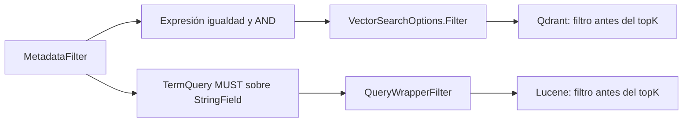

# Metadata filtering

MetadataFilter expresa Department, DocumentType y Year opcionales combinados por AND. El manifest data/metadata.json asigna valores explícitos a cada documento; la ingesta exige correspondencia exacta con el corpus.

```powershell
dotnet run --project src/RagHybridSearch -- query "ART-93821 annual time off: which form and how many days?" --mode hybrid --department RRHH --type policy --year 2026
```



ToExpression construye comparaciones con constantes para el provider Qdrant. Year es entero en el payload.

ToLuceneFilter combina TermQuery MUST y QueryWrapperFilter. Las etiquetas son StringField sin analizar; Year se representa en decimal con cultura invariante. El Filter va separado de la consulta textual en IndexSearcher.Search, sin sumar puntos al score.

La igualdad distingue casing: RRHH no coincide con rrhh. Sin opciones no se restringe; sin coincidencias se devuelve vacío, sin relajar filtros. Las estadísticas BM25 pertenecen al índice completo.

Las pruebas locales verifican campos, casing y score inalterado. La integración real prepara un punto excluido más cercano y pide topK 1: el candidato válido debe recuperarse antes de RRF.

No se implementan autorización, rangos ni lenguaje arbitrario. Metadata selecciona contexto, no controla acceso.

Fuentes: [Qdrant](https://qdrant.tech/documentation/search/filtering/), [provider VectorData](https://learn.microsoft.com/en-us/semantic-kernel/concepts/vector-store-connectors/out-of-the-box-connectors/qdrant-connector), [IndexSearcher](https://lucenenet.apache.org/docs/4.8.0-beta00018/api/core/Lucene.Net.Search.IndexSearcher.html).

[Ingesta](05-ingesta-dual.md) · [RAG](06-flujo-rag.md).

