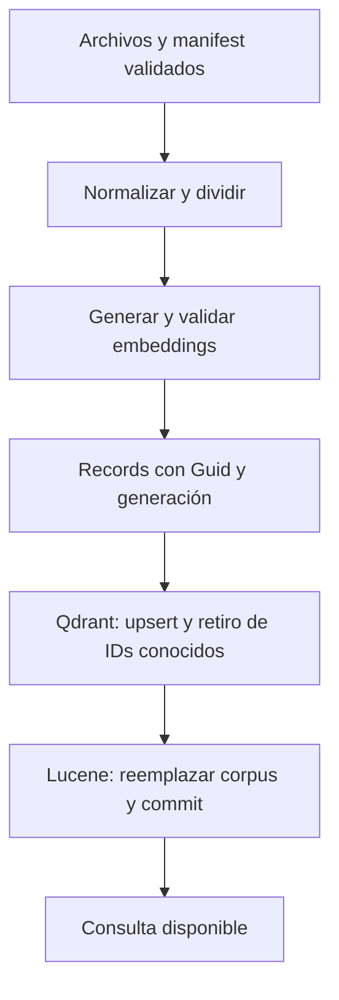

# Ingesta dual e identidad

DocumentIngestionService recibe generador MEAI, VectorStore e ILogger. IngestAsync recibe directorio, ruta Lucene, modelo y CancellationToken. Carga/divide una vez y adapta los mismos records a ambos motores.

## Pasos reales

1. Comprobar Qdrant, descubrir .md/.txt en orden ordinal y validar manifest.
2. Leer metadata e IDs del commit Lucene anterior, si existe, y cerrar ese reader.
3. DocumentText normaliza y divide en 500 unidades UTF-16, overlap 100. Generar embeddings por documento y validar forma/dimensión.
4. Construir DocumentRecord y asignar una Generation común nueva.
5. Upsert Qdrant y retirar sólo IDs anteriores ausentes en el corpus actual.
6. LuceneIndex.Rebuild usa OpenMode.CREATE, UpdateDocument por ID y Commit con esquema/modelo/dimensión/generación.

Se prepara todo antes de modificar motores. Lucene comprueba cancelación entre records y antes de Commit. Ante error ejecuta Rollback para no publicar cambios mediante Dispose.

## IDs e idempotencia

El Guid usa primeros 16 bytes de SHA-256 de Source + salto de línea + ChunkIndex. Se guarda como key Qdrant y StringField id Lucene. El texto no participa: cambiarlo en la misma posición conserva identidad.

Qdrant upsert reemplaza puntos. Lucene reconstruye el corpus lexical y confirma una publicación completa; repetir ingest no acumula duplicados. Retirar chunks los elimina del nuevo commit y de Qdrant usando IDs del commit anterior.

Renombrar la fuente cambia IDs. Cambiar chunking puede cambiar el contenido de cada posición. No son IDs globales de negocio ni hashes de contenido.

## Fallas y reconstrucción

No hay transacción entre motores. Qdrant se actualiza antes de publicar Lucene. Una falla parcial puede provocar Generation distinta en hits vectoriales y exigir reingesta; BM25 puede seguir leyendo el último commit válido. Tras ingest fallida repetí antes de comparar o usar RAG.

El control de hits no certifica igualdad exhaustiva. No soportamos ingestas simultáneas ni consultas durante publicación. Perder Lucene pierde el historial para retirar puntos Qdrant desconocidos: reiniciar ambos requiere acción deliberada.

La migración deja artifacts/hybrid-index.json sin uso. Ejecutá ingest para crear Lucene; si retiraste/renombraste documentos antes de migrar, reiniciá ambos para evitar puntos sin historial. No se borra almacenamiento automáticamente.

[Entorno y reinicio](08-entorno-y-ejecucion.md) · [Qdrant](01-qdrant-vector-search.md).

