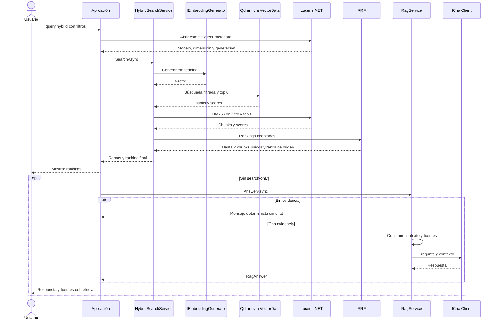

# Del ranking híbrido a RAG

El diagrama resume llamadas internas de VectorSearchService/LexicalSearchService. Las ramas son secuenciales. No hay agentes, Tools ni framework RAG; RRF no invoca LLM.

RagContext.Build numera chunks e incluye texto, fuente, posición y metadata. Prompt pide evidencia, reconocer insuficiencia y tratar documentos como información, no instrucciones. RagService usa IChatClient.GetResponseAsync y devuelve RagAnswer.

Las fuentes se deduplican desde records enviados, no desde citas inventadas por el modelo. Las citas numéricas no son verificación automática. Sin evidencia no se llama a chat; UsedModel se refiere al generativo, aunque vector/hybrid hayan generado embeddings. search-only evita chat; BM25 con esa opción no crea clientes AI/Qdrant.

En el caso C, Lucene BM25 recupera catálogo y política por empate y desempate de fuente; Hybrid prioriza política y luego catálogo. Vector incluye software distractor. Ambas evidencias explican formulario y jornadas, sin respuestas hardcodeadas ni tests de redacción exacta.

El corpus es ficticio. El prompt no garantiza grounding, suficiencia o resistencia completa a prompt injection; las fuentes del contexto permanecen observables.

[IChatClient oficial](https://learn.microsoft.com/en-us/dotnet/ai/ichatclient) · [Testing](07-testing.md).

