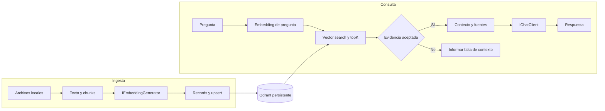

# RAG con Vector Store real

## Objetivo

Evolucionar el RAG de Labs 07–10 hacia una aplicación pequeña con un **Vector Store real y persistente**, sin perder de vista el mecanismo aprendido.

La pregunta es: **¿cómo reemplazamos el almacenamiento en memoria y la búsqueda lineal por infraestructura especializada?**

Esta es una implementación de referencia, sin numeración de Lab. No modifica el recorrido conceptual.

## Guía para entender el código

La carpeta `docs/` explica los artefactos de la solución, las decisiones de implementación y los flujos con diagramas Mermaid. Leela en este orden o elegí el tema que necesites:

1. [Mapa de la solución](docs/01-mapa-de-la-solucion.md): responsabilidades, archivos de soporte, corpus y dependencias.
2. [Configuración e infraestructura](docs/02-configuracion-e-infraestructura.md): `.env`, composición en `Program.cs`, recursos, cancelación y Docker.
3. [Documentos y chunking](docs/03-documentos-y-chunking.md): lectura, `DocumentChunk`, normalización, tamaño y overlap.
4. [Embeddings y registro vectorial](docs/04-embeddings-y-registro-vectorial.md): APIs, vectores, IDs estables, payload y esquema.
5. [Ingesta y persistencia](docs/05-ingesta-y-persistencia.md): secuencia desde el archivo hasta el upsert, idempotencia y límites.
6. [Consulta, contexto y respuesta](docs/06-consulta-contexto-y-respuesta.md): secuencia de retrieval, aceptación de evidencia, prompt y fuentes.
7. [Tests y diagnóstico](docs/07-tests-y-diagnostico.md): cobertura real, cliente de prueba, errores y códigos de salida.

Cada guía enlaza el código que explica y fuentes oficiales donde corresponde. `docs/` es documentación para el desarrollador; `data/` contiene los documentos de ejemplo que indexa la aplicación.

## Problema que resuelve

En Lab 10, `InMemoryVectorStore` conserva chunks y vectores en una lista, compara cada vector mediante `CosineSimilarity`, ordena y devuelve hasta `topK` candidatos. Al cerrar el proceso, el índice desaparece.

Aquí Qdrant guarda los registros y ejecuta la búsqueda. Ingesta y consulta son comandos independientes: consultar no vuelve a leer ni indexar todos los documentos.

## Conocimientos previos

- [Lab 07 — Embeddings](../../labs/lab-07-embeddings/README.md): texto → vector y cercanía semántica.
- [Lab 08 — Document Loading](../../labs/lab-08-document-loading/README.md): archivo → texto → chunks.
- [Lab 09 — RAG básico](../../labs/lab-09-rag-basico/README.md): retrieval → contexto → generación.
- [Lab 10 — Retrieval y calidad](../../labs/lab-10-retrieval-calidad/README.md): corpus, topK, evidencia aceptada y fuentes.

## Arquitectura general

Una Console App y un proyecto de tests. `Program.cs` compone dependencias por constructor, ejecuta el comando y presenta resultados. No necesitamos un contenedor de DI, factories adicionales ni repositorios genéricos.

`IngestionService` prepara e indexa documentos. `VectorSearchService` recupera candidatos. `RagService` decide qué evidencia acepta y llama a `IChatClient`. La lógica de chunking, records y contexto puede probarse sin infraestructura.

`CancellationToken` llega a lectura, embeddings, Qdrant y chat; Ctrl+C cancela la operación. Los clientes y colecciones se liberan con `using`. La salida de etapas permite diagnosticar este ejemplo de un comando por proceso; los errores van a stderr. No agregamos una infraestructura de logging sólo para esta consola.



## Librerías utilizadas y por qué se eligieron

Versiones fijadas y verificadas con .NET 10. Todas las versiones de esta tabla son **estables**, sin sufijo preview:

| Paquete | Versión | Qué es y qué responsabilidad resuelve aquí |
|---|---|---|
| [Microsoft.Extensions.AI.OpenAI](https://www.nuget.org/packages/Microsoft.Extensions.AI.OpenAI/10.10.1) | 10.10.1 | Adaptador del SDK OpenAI a `IChatClient` e `IEmbeddingGenerator`. Conserva las abstracciones de los labs y la estrategia de endpoints compatibles |
| [Microsoft.Extensions.VectorData.Abstractions](https://www.nuget.org/packages/Microsoft.Extensions.VectorData.Abstractions/10.10.0) | 10.10.0 | Contratos de store, colección, esquema, upsert y vector search. Lo fijamos explícitamente para usar la API actual |
| [CommunityToolkit.VectorData.Qdrant](https://www.nuget.org/packages/CommunityToolkit.VectorData.Qdrant/1.0.0) | 1.0.0 | Provider que traduce VectorData a Qdrant; evita escribir manualmente su mapeo y protocolo |
| [Qdrant.Client](https://www.nuget.org/packages/Qdrant.Client/1.19.0) | 1.19.0 | SDK .NET de Qdrant, usado para crear la conexión gRPC que recibe el provider |
| [DotNetEnv](https://www.nuget.org/packages/DotNetEnv/3.2.0) | 3.2.0 | Carga el `.env` común buscando hacia la raíz, como en los labs |
| [xunit.v3](https://www.nuget.org/packages/xunit.v3/4.0.2) | 4.0.2 | Pruebas deterministas de nuestra lógica, mediante Microsoft Testing Platform |

El adaptador de IA incorpora transitivamente `Microsoft.Extensions.AI.Abstractions` 10.10.1 y el SDK `OpenAI` 2.14.0. No hace falta el paquete completo `Microsoft.Extensions.AI` para estas operaciones, ni incorporamos un framework de agentes.

El provider recomendado actualmente es `CommunityToolkit.VectorData.Qdrant`, con namespace `CommunityToolkit.VectorData.Qdrant`. El paquete histórico `Microsoft.SemanticKernel.Connectors.Qdrant` está deprecado y **no se utiliza**. Algunos documentos conservan el nombre Semantic Kernel en su URL o el título Preview; el estado estable aquí corresponde a las versiones NuGet fijadas. [Guía Microsoft del conector](https://learn.microsoft.com/en-us/semantic-kernel/concepts/vector-store-connectors/out-of-the-box-connectors/qdrant-connector).

## Microsoft.Extensions.VectorData

Ofrece una API común para definir records y colecciones, guardar datos y buscar vectores con distintos providers. No es una base de datos ni genera persistencia por sí sola: esa responsabilidad sigue en Qdrant.

```text
Aplicación
    ↓
Microsoft.Extensions.VectorData
    ↓
CommunityToolkit.VectorData.Qdrant
    ↓
Qdrant.Client → Qdrant
```

Se complementa con `Microsoft.Extensions.AI`: una abstracción genera el vector; la otra permite almacenarlo y buscarlo. La API común no vuelve idénticos los esquemas, filtros, scores o capacidades de todas las bases. [Introducción oficial a VectorData](https://learn.microsoft.com/en-us/dotnet/ai/vector-stores/overview), [abstracciones de IA](https://learn.microsoft.com/en-us/dotnet/ai/microsoft-extensions-ai).

## Por qué Qdrant

[Qdrant](https://qdrant.tech/documentation/overview/) es una base de datos y motor de búsqueda vectorial. Almacena vectores junto con información asociada y permite encontrar registros cercanos a un vector de consulta.

Es una opción adecuada aquí por su ejecución local con Docker, volumen persistente, colecciones, payload, búsqueda y cliente .NET. También puede desplegarse externamente. No es una elección universal ni se compara como “la mejor base vectorial”.

| Concepto | En esta referencia |
|---|---|
| Collection | `dac_rag_documents`, conjunto de registros con un esquema vectorial |
| Point / record | Un chunk identificado por un Guid |
| Vector | Embedding numérico del chunk |
| Payload / metadata | Documento, fuente, posición y texto asociados al vector |
| Search | Consulta vectorial que devuelve hasta tres candidatos |
| Score | Medida devuelta por Qdrant para la métrica configurada |

Qdrant se ocupa de almacenamiento e indexación, con configuración HNSW para el vector. Con este corpus pequeño no pretendemos demostrar ventajas de rendimiento ni que cada búsqueda use una estrategia interna particular.

## Elección de abstracciones e infraestructura

Esta referencia aplica **RAG + Vector Store real** con Microsoft.Extensions.AI, Microsoft.Extensions.VectorData y Qdrant. Así podemos reconocer qué responsabilidad asume cada pieza: generar embeddings y respuestas, abstraer las operaciones vectoriales y persistir/buscar registros.

El caso se resuelve con esas responsabilidades. Microsoft Agent Framework se estudiará en `reference/agent-framework/`, aún planificada, después del Agent Loop explícito de Lab 13. La [estrategia de reference/](../README.md#estrategia-de-librerías-y-frameworks) explica cuándo incorporar la capa agéntica.

## Requisitos previos

- SDK de [.NET 10](https://dotnet.microsoft.com/download/dotnet/10.0).
- [Docker Desktop](https://docs.docker.com/desktop/) con contenedores Linux, o Docker Engine y Compose.
- Credencial y conexión a un proveedor que soporte **chat y embeddings** mediante la estrategia OpenAI-compatible ya utilizada en el repositorio.
- Los conceptos de Labs 07–10. No se requiere experiencia previa con Qdrant.

Qdrant funciona localmente; los embeddings y las respuestas requieren acceso al proveedor AI y pueden consumir cuota.

## Preparación del entorno

Desde la raíz del repositorio, prepará el `.env` común a partir de [.env.example](../../.env.example), si todavía no lo tenés. Conservá tus credenciales existentes; no las copies a archivos versionados.

Verificá herramientas y entrá en esta referencia:

```powershell
dotnet --version
docker --version
docker compose version
cd reference/rag-vector-store
```

En Docker Desktop, iniciá el motor y esperá a que esté disponible. `docker info` permite comprobarlo.

Luego ejecutá, desde esta carpeta:

```powershell
docker compose up -d
docker compose ps
dotnet restore
dotnet build
dotnet test
dotnet run --project src/RagVectorStore -- ingest
dotnet run --project src/RagVectorStore -- query "¿Qué función cumple IChatClient en Microsoft.Extensions.AI?"
```

## Configuración y variables de entorno

Usamos `Env.TraversePath().Load()`. Ejecutando desde esta carpeta o desde el proyecto se encuentra el `.env` de la raíz. `AppConfiguration` valida las entradas antes de crear clientes.

Ejemplo que conserva las convenciones del proyecto:

```env
AI_PROVIDER=openai
AI_MODEL=gpt-4o-mini
AI_EMBEDDING_MODEL=text-embedding-3-small
AI_API_KEY=tu-api-key
AI_URL=
QDRANT_ENDPOINT=http://localhost:6334
```

| Variable | Obligatoria | Significado |
|---|---|---|
| `AI_PROVIDER` | Sí | Identificación del proveedor; no selecciona otro SDK ni introduce modelos por defecto |
| `AI_MODEL` | Sí | Modelo generativo: contexto + pregunta → respuesta |
| `AI_EMBEDDING_MODEL` | Sí | Modelo de embeddings: texto → vector |
| `AI_API_KEY` | Sí | Credencial compartida por ambos clientes AI |
| `AI_URL` | No | Endpoint HTTP/HTTPS alternativo compatible con las operaciones utilizadas |
| `QDRANT_ENDPOINT` | No | **Nueva variable de esta referencia:** endpoint gRPC. Default explícito: `http://localhost:6334` |

Ambos comandos validan la configuración común; `ingest` no llama al modelo de chat. No hay defaults ocultos de modelos ni fallback de embeddings al modelo generativo.

`AI_MODEL` y `AI_EMBEDDING_MODEL` representan capacidades distintas. Compartir proveedor no implica que un mismo modelo soporte ambas. Sin `AI_URL` se utiliza el endpoint estándar del SDK OpenAI; con ella se conserva la posibilidad de un endpoint compatible.

También se verificó la configuración Gemini existente del repositorio: `gemini-embedding-001` para embeddings, `gemini-3.5-flash-lite` para chat y `https://generativelanguage.googleapis.com/v1beta/openai/` como `AI_URL`. No se infiere compatibilidad de otros modelos o proveedores.

El [.env.example local](.env.example) documenta el único parámetro adicional. **No lo copies como un segundo .env dentro de esta carpeta:** agregá `QDRANT_ENDPOINT` al `.env` raíz sólo si necesitás cambiar el valor local. Así evitás que un archivo más cercano oculte la configuración común.

## Infraestructura necesaria

[docker-compose.yml](docker-compose.yml) fija `qdrant/qdrant:v1.19.2` y un volumen nombrado `qdrant-data` montado en `/qdrant/storage`. Compose utiliza el proyecto `dac-rag-vector-store`.

| Puerto del host | Función |
|---|---|
| `127.0.0.1:6333` | REST, health check y dashboard |
| `127.0.0.1:6334` | gRPC, utilizado por la aplicación .NET |

No exponemos el puerto de comunicación de cluster. Los puertos se verificaron en la [documentación oficial de instalación](https://qdrant.tech/documentation/installation/). El [quickstart de Qdrant](https://qdrant.tech/documentation/quickstart/) explica también el uso de volúmenes en Windows.

Para comprobar el servicio:

```powershell
docker compose ps
docker compose logs qdrant
curl.exe http://localhost:6333/healthz
```

En Linux/macOS podés usar `curl`. El [dashboard local](http://localhost:6333/dashboard) permite inspeccionar la colección y sus puntos.

Para detener y quitar el contenedor **conservando los datos**:

```powershell
docker compose down
```

Una nueva ejecución de `docker compose up -d` recupera el volumen. Para reiniciar voluntariamente **todos los datos de esta referencia**, este comando elimina también su volumen:

```powershell
docker compose down --volumes
```

La aplicación nunca ejecuta ese borrado ni elimina la colección automáticamente.

La instalación no tiene autenticación y está limitada a loopback. Es para desarrollo local; no publiques estos puertos. Un despliegue de producción requeriría controles adicionales. [Seguridad oficial de Qdrant](https://qdrant.tech/documentation/tutorials-operations/secure-qdrant/).

## Modelo vectorial: Key, Data y Vector

[DocumentChunkRecord.cs](src/RagVectorStore/DocumentChunkRecord.cs) distingue explícitamente:

| Propiedad | Papel | Contenido |
|---|---|---|
| `Id` | Key | Guid estable del punto |
| `DocumentId` | Data | Identificador del documento; nombre de archivo en este corpus plano |
| `Source` | Data | Fuente que se muestra al lector |
| `ChunkIndex` | Data | Posición local del fragmento, desde cero |
| `Text` | Data | Texto que se recuperará como contexto |
| `Embedding` | Vector | `ReadOnlyMemory<float>` con el embedding |

`Definition(dimensions)` construye el esquema con `VectorStoreKeyProperty`, `VectorStoreDataProperty` y `VectorStoreVectorProperty`. La definición programática evita fijar la dimensión en un atributo: se obtiene del embedding real. La métrica configurada es `DistanceFunction.CosineSimilarity`.

La metadata viaja con los resultados sin tener que consultar los archivos originales. Esto prepara trazabilidad, filtros o agrupación futura; aquí sólo usamos procedencia, contenido y fuentes.

## Ingesta e idempotencia

```text
data/ → leer → normalizar → chunks → GenerateAsync → records → EnsureCollectionExistsAsync → UpsertAsync
```

Copiamos un corpus pequeño de [Lab 10b](../../labs/lab-10-retrieval-calidad/lab-10b-relevancia-threshold-fuentes/README.md) para mantener la referencia autocontenida: `dependency-injection.md`, `embeddings.md`, `microsoft-extensions-ai.md` y `rag.md`. Son material didáctico, no documentación contractual de las librerías. No hay dependencia runtime entre labs y reference.

Se descubren archivos `.md` y `.txt` de `data/`, sin subdirectorios, y se ordenan con `StringComparer.Ordinal`. El orden facilita observar la ingesta; no impone el ranking de Qdrant.

Conservamos chunking por caracteres/unidades UTF-16: tamaño 500 y overlap 100. Normalizamos saltos de línea y recortamos extremos del documento completo. Los cortes pueden dividir palabras. Los documentos vacíos se omiten; si no queda contenido se informa el error.

El ID se deriva de `DocumentId + "\n" + ChunkIndex` con SHA-256, tomando 16 bytes como Guid en orden big-endian. No incluye el texto: si cambia el contenido de esa posición, `UpsertAsync` reemplaza el mismo punto. Dos ingestas del mismo corpus no crean duplicados.

`EnsureCollectionExistsAsync` asegura existencia sin borrar datos. **No es un sistema completo de sincronización:** renombrar, eliminar o acortar un documento puede dejar puntos anteriores. No implementamos limpieza de chunks huérfanos ni seguimiento de cambios.

### Embeddings explícitos o automáticos

Elegimos mantener visible:

```csharp
GeneratedEmbeddings<Embedding<float>> embeddings =
    await embeddingGenerator.GenerateAsync(texts, cancellationToken: cancellationToken);

// El vector se asigna a DocumentChunkRecord.Embedding antes del upsert.
await collection.UpsertAsync(records, cancellationToken);
```

VectorData también admite un `IEmbeddingGenerator`, por ejemplo mediante `VectorStoreCollectionDefinition.EmbeddingGenerator`, y una propiedad vectorial de texto para que el provider invoque el generador al guardar o buscar. Esa automatización existe, pero aquí ocultaría una transición que acabamos de aprender. Qdrant no llama automáticamente al LLM de esta aplicación. [API y generación de embeddings](https://learn.microsoft.com/en-us/dotnet/ai/vector-stores/overview).

No imprimimos vectores completos. La consola muestra documentos, posiciones, IDs, cantidad de chunks y dimensión real.

## Consulta, score y evidencia

```text
pregunta → embedding → SearchAsync(top: 3) → candidatos → aceptación → contexto → IChatClient → respuesta + fuentes
```

La búsqueda real utiliza la abstracción `VectorStoreCollection<Guid, DocumentChunkRecord>`:

```csharp
await foreach (VectorSearchResult<DocumentChunkRecord> result in collection.SearchAsync(
    queryVector, top: RagSettings.TopK, cancellationToken: cancellationToken))
{
    // result.Record conserva texto y metadata; result.Score proviene del store.
}
```

No recorremos los puntos para calcular coseno en .NET. Tampoco pedimos los vectores completos de vuelta para construir contexto.

**Top K es 3.** Limita candidatos, no demuestra relevancia. Qdrant devuelve un score cuya interpretación depende de la métrica configurada. Para esta colección Cosine, valores mayores indican mayor cercanía; no son porcentajes de relevancia o probabilidades de respuesta correcta. No trasladamos esta interpretación a cualquier provider o métrica.

`RagSettings.MinimumScore = 0.65` es un umbral experimental de esta referencia. Se eligió y comprobó con el corpus y las tres preguntas siguientes usando `gemini-embedding-001`; no copiamos el mínimo de Lab 10 ni lo presentamos como universal. Mostramos los candidatos antes de filtrarlos para observar la decisión. No rellenamos los descartados con otros puntos.

Si no queda evidencia aceptada, no llamamos al modelo generativo. Si queda, el prompt pide responder sólo desde ese contexto e indicar insuficiencia cuando corresponda. Un score alto no garantiza que el fragmento contenga la respuesta.

Las fuentes mostradas provienen de los registros **aceptados y enviados en el contexto**, deduplicadas por fuente. El modelo no construye esa lista. Esto no verifica cada afirmación ni demuestra que haya usado todos los fragmentos.

## Cómo ejecutar y casos manuales

Desde `reference/rag-vector-store/`:

```powershell
dotnet run --project src/RagVectorStore -- ingest
dotnet run --project src/RagVectorStore -- query "¿Qué función cumple IChatClient en Microsoft.Extensions.AI?"
dotnet run --project src/RagVectorStore -- query "¿Cómo se relacionan los embeddings con un sistema RAG?"
dotnet run --project src/RagVectorStore -- query "¿Cuáles son las principales características de la fotosíntesis en las plantas?"
```

| Caso | Qué observar |
|---|---|
| A: función de IChatClient | Evidencia claramente presente en `microsoft-extensions-ai.md` |
| B: embeddings y RAG | Chunks de distintos documentos compiten por los mismos tres lugares |
| C: fotosíntesis | Hay mejores candidatos disponibles, pero falta evidencia suficiente para responder |

En B no forzamos diversidad: otro modelo puede recuperar tres chunks de la misma fuente. En C se espera el rechazo con la configuración verificada; al cambiar modelo o corpus hay que recalibrar. No existe una regla por texto de pregunta.

Salida conceptual; los valores se calculan:

```text
=== INGESTA ===
Documento: embeddings.md | Chunks generados: <cantidad>
  Upsert: chunk 0 | Id: <Guid estable>
...
Dimensión: <dimensión real> | Chunks procesados: <total>
Colección actualizada: dac_rag_documents

=== RETRIEVAL ===
Top K: 3 | Score mínimo experimental: 0.65
score: <score> | source: <archivo> | document: <documento> | chunk: <posición>
=== CONTEXTO ACEPTADO ===
<fragmentos aceptados>
=== RESPUESTA ===
<respuesta generada o aviso de evidencia insuficiente>
=== FUENTES DEL CONTEXTO ENVIADO ===
- <fuente aceptada>
```

## Estado de los datos y persistencia

Ahora existen dos estados separados:

```text
archivos fuente en data/           índice vectorial persistido en Qdrant
             └──── nueva ingesta ────────────────┘
```

Editar los archivos no actualiza mágicamente el índice. El proyecto copia `data/` al output y resuelve la ruta con `AppContext.BaseDirectory`. Después de editar, ejecutá `dotnet run ... -- ingest` con build para actualizar esa copia; `--no-build` reutiliza el output anterior.

Para observar persistencia, terminá la ingesta y ejecutá `query` en otro proceso, sin reingestar. También podés hacer `docker compose down`, levantar Qdrant otra vez y consultar: el volumen conserva los registros.

Para verificar idempotencia, ejecutá `ingest` dos veces e inspeccioná el número de puntos en el dashboard o mediante REST:

```powershell
Invoke-RestMethod -Method Post -ContentType 'application/json' -Body '{"exact":true}' http://localhost:6333/collections/dac_rag_documents/points/count
```

La API REST sirve aquí para inspección; la aplicación ingesta y busca mediante VectorData/gRPC.

Usá el **mismo modelo, configuración y dimensión** para documentos y preguntas. Cambiar el modelo exige reconstruir deliberadamente el índice, incluso si conserva la dimensión. La aplicación no identifica por sí sola espacios incompatibles de igual dimensión. Tampoco migra esquemas; un error de dimensión no dispara un borrado automático.

## Tests

Desde esta carpeta:

```powershell
dotnet test
```

[El proyecto de tests](tests/RagVectorStore.Tests/RagVectorStore.Tests.csproj) prueba overlap, límites y validaciones, lectura y errores de archivos, IDs estables ante cambios de texto, mapeo de records, esquema dinámico, configuración, contexto, deduplicación de fuentes y ausencia de llamada al chat cuando no hay evidencia aceptada.

Usamos funciones pequeñas y la abstracción existente `IChatClient` con un cliente de prueba que registra solicitudes. No agregamos interfaces propias para mockear ni comprobamos textos exactos de un LLM real o scores exactos del store.

`global.json` selecciona Microsoft Testing Platform **sólo dentro de esta referencia**, como requiere xUnit actual con .NET 10. Ejecutá `dotnet test` desde aquí; no hace falta cambiar la configuración general del repositorio.

Los unit tests no necesitan `.env`, credenciales, red, Docker ni Qdrant. No prueban internamente SDKs o infraestructura. Las comprobaciones de integración se ejecutan mediante los comandos reales de ingesta, consulta, conteo y recreación de contenedor documentados arriba; no agregamos un segundo proyecto de integración ni filtros ficticios.

## Validación realizada

Con .NET SDK 10.0.401, Qdrant v1.19.2 y la configuración Gemini indicada:

- `dotnet restore` y `dotnet build` correctos, con cero errores y cero advertencias.
- 31 pruebas unitarias aprobadas, también con Qdrant detenido.
- Cuatro documentos, 16 chunks por documento: 64 puntos con dimensión 3072.
- Dos ingestas: 64 puntos antes y después.
- Persistencia: 64 puntos y consulta RAG correcta en otro proceso, también después de `docker compose down` y `up -d`, sin reingestar.
- Consulta A: tres chunks de `microsoft-extensions-ai.md` y respuesta generada.
- Consulta B: evidencia de `rag.md` y `embeddings.md`, con respuesta y ambas fuentes.
- Consulta C: candidatos debajo de 0.65, sin invocación del modelo generativo.
- Mensajes comprobados para colección inexistente y Qdrant detenido.

Estas cantidades describen la prueba, no defaults del esquema ni promesas para otros modelos. La dimensión del modelo OpenAI del ejemplo puede ser distinta.

## Recorrido del código y estructura

```text
rag-vector-store/
├── .env.example
├── docker-compose.yml
├── global.json
├── RagVectorStore.slnx
├── README.md
├── docs/
│   ├── 01-mapa-de-la-solucion.md
│   ├── 02-configuracion-e-infraestructura.md
│   ├── 03-documentos-y-chunking.md
│   ├── 04-embeddings-y-registro-vectorial.md
│   ├── 05-ingesta-y-persistencia.md
│   ├── 06-consulta-contexto-y-respuesta.md
│   └── 07-tests-y-diagnostico.md
├── data/
│   ├── dependency-injection.md
│   ├── embeddings.md
│   ├── microsoft-extensions-ai.md
│   └── rag.md
├── src/RagVectorStore/
│   ├── RagVectorStore.csproj
│   ├── Program.cs
│   ├── AppConfiguration.cs
│   ├── DocumentText.cs
│   ├── DocumentChunkRecord.cs
│   ├── EmbeddingGeneration.cs
│   ├── IngestionService.cs
│   ├── VectorSearchService.cs
│   ├── RagSettings.cs
│   ├── RagContext.cs
│   └── RagService.cs
└── tests/RagVectorStore.Tests/
    ├── RagVectorStore.Tests.csproj
    ├── AppConfigurationTests.cs
    ├── DocumentChunkRecordTests.cs
    ├── DocumentTextTests.cs
    └── RagServiceTests.cs
```

Empezá por [Program.cs](src/RagVectorStore/Program.cs), seguí [IngestionService](src/RagVectorStore/IngestionService.cs) y [VectorSearchService](src/RagVectorStore/VectorSearchService.cs). Después mirá [DocumentChunkRecord](src/RagVectorStore/DocumentChunkRecord.cs), [RagContext](src/RagVectorStore/RagContext.cs) y [RagService](src/RagVectorStore/RagService.cs). [RagSettings](src/RagVectorStore/RagSettings.cs) reúne las constantes del experimento.

## Qué cambia respecto de Labs 07–10

| Labs 07–10 | Implementación de referencia |
|---|---|
| Colección en memoria | Colección Qdrant persistente |
| Búsqueda lineal con `CosineSimilarity` explícita | Vector search delegado al store |
| Índice durante la vida del proceso | Índice durante la vida del volumen |
| Reindexación al ejecutar el ejemplo | Comandos separados de ingesta y consulta |
| Metadata mínima en objetos | Key + payload + vector en records persistidos |
| Mecanismo deliberadamente visible | Parte delegada a abstracciones y provider |

Los labs enseñan el mecanismo. La referencia presupone esa comprensión y muestra responsabilidades que podemos delegar.

## Qué NO cambió

```text
documento → chunk → embedding → retrieval → contexto → LLM
```

Seguimos distinguiendo chat de embeddings, topK de relevancia y fuentes recuperadas de citas inventadas. El criterio de aceptar evidencia sigue en la aplicación. La tecnología cambia; el patrón RAG permanece reconocible.

## Errores y limitaciones

| Situación | Diagnóstico |
|---|---|
| Qdrant apagado o puerto incorrecto | Iniciar Compose y revisar `QDRANT_ENDPOINT` gRPC, no el puerto REST |
| Falta configuración AI | El mensaje identifica la variable faltante |
| Colección inexistente | Ejecutar `ingest` antes de `query` |
| Error de embeddings | Revisar modelo de embeddings, credencial y endpoint |
| Sin documentos o contenido | Revisar `data/` y reconstruir el output |
| Vector o esquema incompatible | Revisar modelo/dimensión y reconstruir deliberadamente la colección |

No se vuelcan credenciales, respuestas crudas de los SDK ni vectores completos en errores.

El corpus es pequeño y el chunking simple. El umbral requiere evaluación; un prompt de grounding no garantiza exactitud. La ingesta no es transaccional entre documentos y puede quedar parcial si falla. Upsert evita duplicados de los mismos IDs, pero no elimina puntos huérfanos ni implementa change tracking.

No incorporamos Semantic Kernel, Agent Framework, MCP, GraphRAG, reranking, hybrid search, sparse/multi-vector, filtros avanzados, watchers, OCR, autenticación, Qdrant Cloud ni clustering.

## Posibles siguientes pasos

Evaluación de retrieval y sincronización explícita de documentos son mejoras que responderían a límites observados de esta referencia. En el carril agéntico, la siguiente referencia planificada es `reference/agent-framework/`: aplicará Microsoft Agent Framework al tipo de problema comprendido en Lab 13, sin ampliar aquí el alcance del RAG.

[Índice de implementaciones de referencia](../README.md) · [README principal](../../README.md) · [Roadmap](../../ROADMAP.md#implementaciones-de-referencia).
