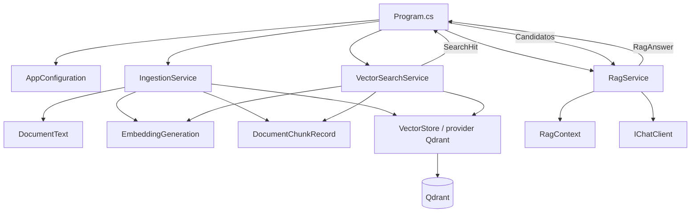

# Mapa de la solución

Esta guía permite seguir la aplicación desde el comando hasta la respuesta. Empezá por este mapa y elegí después el recorrido de ingesta o consulta. Los comandos para preparar el entorno están en el [README](../README.md#preparación-del-entorno).

## Dos comandos, un índice compartido

`ingest` convierte documentos locales en registros persistidos. `query` busca en esos registros y, si hay evidencia aceptada, solicita una respuesta al modelo generativo. Son ejecuciones independientes: no hay un servidor .NET esperando preguntas ni una ingesta automática antes de cada consulta.

Las flechas muestran uso o intercambio de datos. Qdrant es un proceso externo; los demás componentes de la aplicación viven en la misma consola.

## Archivos de aplicación

Todos están en [`src/RagVectorStore/`](../src/RagVectorStore/).

| Archivo | Responsabilidad | Dónde profundizar |
|---|---|---|
| [Program.cs](../src/RagVectorStore/Program.cs) | Valida el comando, crea clientes y servicios, muestra resultados y maneja errores | [Composición y configuración](02-configuracion-e-infraestructura.md) |
| [AppConfiguration.cs](../src/RagVectorStore/AppConfiguration.cs) | Carga y valida variables externas | [Configuración](02-configuracion-e-infraestructura.md#appconfiguration) |
| [RagSettings.cs](../src/RagVectorStore/RagSettings.cs) | Reúne nombre de colección, ventana de chunking, topK y umbral | [Texto](03-documentos-y-chunking.md), [consulta](06-consulta-contexto-y-respuesta.md) |
| [DocumentText.cs](../src/RagVectorStore/DocumentText.cs) | Lee texto y crea `DocumentChunk` con origen y posición | [Documentos y chunking](03-documentos-y-chunking.md) |
| [EmbeddingGeneration.cs](../src/RagVectorStore/EmbeddingGeneration.cs) | Invoca el generador y comprueba cantidad y dimensiones | [Embeddings y records](04-embeddings-y-registro-vectorial.md) |
| [DocumentChunkRecord.cs](../src/RagVectorStore/DocumentChunkRecord.cs) | Convierte chunks en records con ID estable y define el esquema vectorial | [Registro vectorial](04-embeddings-y-registro-vectorial.md#documentchunkrecord) |
| [IngestionService.cs](../src/RagVectorStore/IngestionService.cs) | Coordina lectura, chunking, embeddings y upsert por documento | [Ingesta](05-ingesta-y-persistencia.md) |
| [VectorSearchService.cs](../src/RagVectorStore/VectorSearchService.cs) | Genera el vector de la pregunta y devuelve candidatos `SearchHit` | [Consulta](06-consulta-contexto-y-respuesta.md) |
| [RagContext.cs](../src/RagVectorStore/RagContext.cs) | Construye texto de contexto, fuentes y prompt | [Contexto](06-consulta-contexto-y-respuesta.md#ragcontext) |
| [RagService.cs](../src/RagVectorStore/RagService.cs) | Acepta evidencia, decide si llamar al chat y devuelve `RagAnswer` | [Respuesta](06-consulta-contexto-y-respuesta.md#ragservice) |

## Artefactos de soporte

| Artefacto | Para qué existe |
|---|---|
| [RagVectorStore.slnx](../RagVectorStore.slnx) | Agrupa aplicación y tests; permite restore y build desde esta carpeta |
| [RagVectorStore.csproj](../src/RagVectorStore/RagVectorStore.csproj) | Define consola .NET 10, dependencias y copia de `data/` al output |
| [RagVectorStore.Tests.csproj](../tests/RagVectorStore.Tests/RagVectorStore.Tests.csproj) | Define ejecutable de tests xUnit y referencia al proyecto de aplicación |
| [global.json](../global.json) | Selecciona Microsoft Testing Platform para `dotnet test`; no fija una versión del SDK |
| [.env.example](../.env.example) | Documenta `QDRANT_ENDPOINT` y recuerda las variables AI del `.env` raíz; no contiene credenciales reales |
| [docker-compose.yml](../docker-compose.yml) | Ejecuta Qdrant con puertos locales y volumen persistente |
| [README.md](../README.md) | Preparación, comandos, dependencias, validación y límites del ejemplo |
| `docs/` | Explicaciones para el desarrollador; no se indexan ni se copian como corpus |
| `tests/RagVectorStore.Tests/` | Pruebas de configuración, chunking, records y decisiones RAG; [guía de tests](07-tests-y-diagnostico.md) |

`ImplicitUsings` habilita imports comunes. `Nullable` ayuda a detectar usos potencialmente nulos. `TreatWarningsAsErrors` exige corregir advertencias en ambos proyectos. Ninguna de estas opciones agrega infraestructura en ejecución.

## Corpus: datos que el modelo podrá recibir

Los cuatro documentos de `data/` son material didáctico y neutral:

| Archivo | Tema |
|---|---|
| [dependency-injection.md](../data/dependency-injection.md) | Dependencias y responsabilidades |
| [embeddings.md](../data/embeddings.md) | Representación vectorial de texto |
| [microsoft-extensions-ai.md](../data/microsoft-extensions-ai.md) | Abstracciones de IA en .NET |
| [rag.md](../data/rag.md) | Recuperación y generación con contexto |

Son entradas del ejercicio, no documentación oficial de las APIs. La documentación para entender el código vive aquí, en `docs/`. Editar `data/` requiere reconstruir la aplicación para actualizar su copia de salida y volver a ejecutar `ingest` para actualizar Qdrant.

## Qué delegamos

`IEmbeddingGenerator` genera vectores y `IChatClient` genera respuestas. `VectorStore` y `VectorStoreCollection` abstraen almacenamiento y búsqueda; el provider traduce sus operaciones al cliente Qdrant. La aplicación conserva el chunking, la identidad de los records, el umbral de aceptación y el contexto.

No hay un contenedor de DI: `Program.cs` pasa las dependencias a los constructores. Por ejemplo, `new RagService(chatClient)` permite usar un cliente real o el cliente de prueba sin cambiar `RagService`.

Fuentes oficiales: [abstracciones de IA de Microsoft](https://learn.microsoft.com/en-us/dotnet/ai/microsoft-extensions-ai), [VectorData y vector stores](https://learn.microsoft.com/en-us/dotnet/ai/vector-stores/overview).

Siguiente: [Configuración e infraestructura](02-configuracion-e-infraestructura.md).
