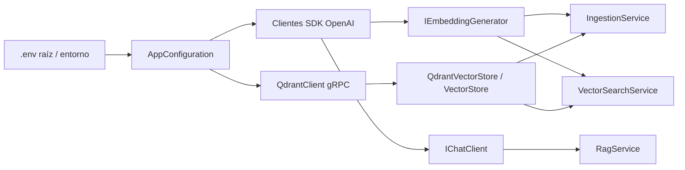

# Configuración, composición e infraestructura

## AppConfiguration

[`AppConfiguration`](../src/RagVectorStore/AppConfiguration.cs) es un `record`: agrupa los valores validados que necesita la aplicación. `Load()` carga el `.env` mediante `Env.TraversePath().Load()` y delega en `Parse(Environment.GetEnvironmentVariable)`.

La búsqueda parte del directorio de trabajo hacia sus padres. Ejecutá los comandos desde `reference/rag-vector-store/`, como indica el README. Un `.env` más cercano puede ocultar el de la raíz; el archivo local `.env.example` es sólo una guía y no debe convertirse en un segundo `.env`.

`Parse` recibe una función que obtiene un valor por nombre. En ejecución es la lectura del entorno; en los tests es un diccionario. Así probamos las mismas validaciones sin modificar variables globales ni cargar credenciales.

| Variable | Propiedad | Uso |
|---|---|---|
| `AI_PROVIDER` | `ProviderName` | Nombre informativo; no selecciona un SDK mediante un switch |
| `AI_MODEL` | `Model` | Modelo de chat: pregunta + contexto → respuesta |
| `AI_EMBEDDING_MODEL` | `EmbeddingModel` | Modelo de embeddings: texto → vector |
| `AI_API_KEY` | `ApiKey` | Credencial de ambos clientes AI |
| `AI_URL` | `Endpoint` | URL alternativa opcional; sin ella se conserva el endpoint estándar del SDK |
| `QDRANT_ENDPOINT` | `QdrantEndpoint` | URL gRPC; si falta se utiliza `http://localhost:6334` |

Las primeras cuatro variables son obligatorias para ambos comandos. `ingest` valida `AI_MODEL` como parte de la configuración común, aunque no utiliza chat. Los nombres de modelos no tienen defaults ni fallback entre capacidades. Un modelo de chat no es automáticamente un modelo de embeddings.

Las URLs deben ser absolutas HTTP/HTTPS y no contener credenciales en `UserInfo`. La de Qdrant tampoco acepta ruta distinta de `/`, query ni fragmento. Esto valida la forma de la configuración; no comprueba conectividad, credenciales ni compatibilidad de modelos.

## Program.cs: el punto de composición

[`Program.cs`](../src/RagVectorStore/Program.cs) usa instrucciones de nivel superior de C#. Primero acepta únicamente `ingest` o `query` con una pregunta. Un comando inválido muestra el uso y sale con código 1 antes de cargar configuración o crear clientes.

Después crea las dependencias concretas y las entrega a los servicios:

`EmbeddingClient.AsIEmbeddingGenerator()` y `ChatClient.AsIChatClient()` adaptan los clientes concretos a las abstracciones usadas por la aplicación. `AI_URL` cambia su endpoint compartido; la compatibilidad debe existir realmente en ese endpoint. `AI_PROVIDER` por sí solo no modifica este comportamiento.

El generador y Qdrant se crean para ambos comandos. El cliente de chat se crea sólo en `query`, después de recuperar candidatos. Crear ese cliente no envía una petición: `RagService` determina si corresponde llamar a `GetResponseAsync`.

### Vida útil y cancelación

`using` libera los objetos al salir del ámbito, también cuando ocurre una excepción. `QdrantVectorStore` recibe `ownsClient: false` porque `Program.cs` conserva y libera el `QdrantClient`; se evita asignar su propiedad a dos componentes.

Ctrl+C cancela el `CancellationTokenSource` en lugar de terminar inmediatamente el proceso. El token se propaga a lectura de archivos, embeddings, Qdrant y chat. El `finally` desregistra el manejador del evento. El timeout gRPC de diez segundos pertenece al cliente Qdrant; no limita la duración total del comando ni las llamadas AI.

## Docker y almacenamiento

[`docker-compose.yml`](../docker-compose.yml) fija Qdrant `v1.19.2` y el proyecto Compose `dac-rag-vector-store`.

| Elemento | Función |
|---|---|
| `127.0.0.1:6333` | REST, health check y dashboard; la app no usa este puerto para vector search |
| `127.0.0.1:6334` | gRPC, utilizado por `QdrantClient` |
| `qdrant-data:/qdrant/storage` | Volumen nombrado donde persisten los datos |

El índice permanece al cerrar la consola .NET. `docker compose down` quita el contenedor y conserva el volumen; `up -d` vuelve a utilizarlo. `down --volumes` también elimina los datos: es una operación deliberada de reinicio, no un paso rutinario de ejecución. La aplicación no borra automáticamente colecciones.

Este despliegue local no tiene autenticación y publica sólo en loopback. No es una configuración de producción. Preparación y comandos completos: [infraestructura en el README](../README.md#infraestructura-necesaria).

## Qué contiene el build

El [proyecto de aplicación](../src/RagVectorStore/RagVectorStore.csproj) copia `data/**/*` al output con `PreserveNewest`. `Path.Combine(AppContext.BaseDirectory, "data")` resuelve esa copia junto al ejecutable. La ruta del corpus es independiente del directorio de trabajo; la búsqueda del `.env` sigue dependiendo de ese directorio.

`bin/` y `obj/` son resultados generados por .NET. No son componentes fuente ni deben editarse para cambiar el corpus. Modificá `data/`, reconstruí y ejecutá `ingest`.

Fuentes oficiales: [DotNetEnv y búsqueda de .env](https://github.com/tonerdo/dotnet-env), [SDK .NET de Qdrant](https://github.com/qdrant/qdrant-dotnet), [instalación de Qdrant](https://qdrant.tech/documentation/installation/), [volúmenes de Docker](https://docs.docker.com/engine/storage/volumes/).

[Mapa](01-mapa-de-la-solucion.md) · [Documentos y chunking](03-documentos-y-chunking.md).
