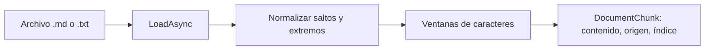

# Documentos, texto y chunks

## DocumentText.LoadAsync

[`DocumentText`](../src/RagVectorStore/DocumentText.cs) reúne dos transformaciones pequeñas: archivo → texto y texto → chunks. `LoadAsync` exige que el archivo exista, acepta `.md` o `.txt` sin distinguir mayúsculas y utiliza `File.ReadAllTextAsync` con el token de cancelación.

Se conserva Markdown como texto, incluyendo títulos y listas. No hay parsing de estructura, PDF, OCR ni detección semántica. La lectura estándar usa UTF-8 por defecto y puede reconocer marcas de orden de bytes; para este corpus usamos archivos de texto UTF-8. [API oficial de File.ReadAllTextAsync](https://learn.microsoft.com/en-us/dotnet/api/system.io.file.readalltextasync).

## DocumentChunk

En el mismo archivo se declara:

```csharp
public sealed record DocumentChunk(string Content, string Source, int Index);
```

Un `record` ofrece una forma breve de agrupar datos. `Content` es el fragmento, `Source` su archivo de origen e `Index` su posición desde cero dentro de ese documento. El índice se reinicia para cada archivo: dos documentos pueden tener un chunk 0.

Este objeto todavía no tiene vector ni ID persistente. Esos datos se agregan al construir [`DocumentChunkRecord`](04-embeddings-y-registro-vectorial.md#documentchunkrecord).

## DocumentText.Split

`Split(text, source, chunkSize, overlap)` valida que el texto no sea nulo, el origen tenga contenido, `chunkSize > 0` y `0 <= overlap < chunkSize`.

Normaliza saltos de línea a `\n` y aplica `Trim()` al documento completo. No recorta cada chunk: hacerlo podría alterar los caracteres superpuestos. Si el texto normalizado queda vacío, devuelve una colección vacía.

El avance es `chunkSize - overlap`. Con tamaño 5 y overlap 2, cada inicio avanza tres posiciones:

```text
Texto:     abcdefghijkl
Chunk 0:   abcde          inicio 0, longitud 5
Chunk 1:      defgh       inicio 3, longitud 5
Chunk 2:         ghijk    inicio 6, longitud 5
Chunk 3:            jkl   inicio 9, longitud 3
```

`Math.Min` permite que el último chunk sea más corto. El `break` detiene la división cuando un chunk alcanza el final; evita crear otro fragmento compuesto únicamente por la cola ya cubierta.



## Parámetros y límites

[`RagSettings`](../src/RagVectorStore/RagSettings.cs) establece tamaño 500 y overlap 100: los inicios avanzan 400 unidades. Son parámetros del ejemplo, no reglas universales. Más overlap repite más texto y puede aumentar la cantidad de vectores y el costo de generarlos.

En C#, `string.Length` y `Substring` trabajan con unidades UTF-16. Aquí llamamos caracteres a esa unidad práctica; no equivale a tokens ni siempre a caracteres visuales completos. Un corte puede dividir palabras o incluso una pareja sustituta de Unicode. El chunker no preserva perfectamente oraciones, párrafos ni Markdown.

El overlap conserva parte del contexto en los límites, pero no garantiza que cada chunk contenga una idea completa. Elegimos este mecanismo visible para observar tamaño, solapamiento y secuencia antes de estudiar estrategias más complejas.

La ingesta descubre sólo archivos en el nivel superior de `data/`. Los ordena con `StringComparer.Ordinal` para que la ejecución sea fácil de comparar; ese orden no determina la similitud ni el ranking de una consulta.

[Mapa](01-mapa-de-la-solucion.md) · [Embeddings y registro vectorial](04-embeddings-y-registro-vectorial.md).
