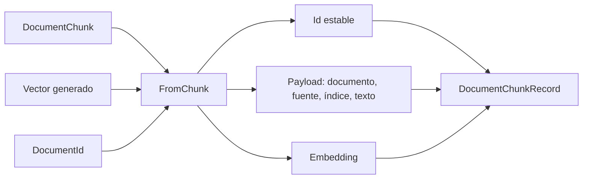

# Embeddings y registro vectorial

## EmbeddingGeneration

[`EmbeddingGeneration.GenerateAsync`](../src/RagVectorStore/EmbeddingGeneration.cs) recibe un `IEmbeddingGenerator<string, Embedding<float>>`, una lista no vacía de textos y un token de cancelación. El contrato expresa texto como entrada y embeddings de números `float` como salida. El generador concreto se adapta en `Program.cs`; este helper no elige proveedor ni modelo.

La llamada real es:

```csharp
GeneratedEmbeddings<Embedding<float>> embeddings =
    await generator.GenerateAsync(texts, cancellationToken: cancellationToken);
ReadOnlyMemory<float> vector = embeddings[0].Vector;
```

`GeneratedEmbeddings` agrupa los resultados; `Embedding<float>` contiene el vector de un texto y `Vector` permite acceder a sus números. `ReadOnlyMemory<float>` representa una región de memoria de sólo lectura; no es un identificador ni una consulta a Qdrant.

La aplicación empareja el resultado de posición `i` con el texto de posición `i`. Comprueba que haya un resultado por texto, que los vectores no estén vacíos y que tengan la misma dimensión. La ingesta comprueba además que esa dimensión no cambie entre documentos. Estas validaciones no demuestran que los vectores tengan significado útil.

El helper traduce errores HTTP y de conexión en mensajes específicos de embeddings, conservando la excepción original como causa. No imprime credenciales ni vectores completos.

La dimensión se obtiene del resultado real: no hay un tamaño fijo por proveedor. Usar igual dimensión tampoco vuelve compatibles dos modelos diferentes. Ingesta y consulta deben utilizar el mismo modelo y configuración de embeddings. [Contrato oficial de IEmbeddingGenerator](https://learn.microsoft.com/en-us/dotnet/ai/iembeddinggenerator).

## DocumentChunkRecord

[`DocumentChunkRecord`](../src/RagVectorStore/DocumentChunkRecord.cs) es el objeto que el provider mapea a un punto de Qdrant:

| Propiedad | Papel en VectorData | Significado |
|---|---|---|
| `Id` | Key | Guid que identifica el punto |
| `DocumentId` | Data | Identidad del documento; aquí su nombre de archivo |
| `Source` | Data | Nombre mostrado como fuente |
| `ChunkIndex` | Data | Posición dentro del documento |
| `Text` | Data | Contenido que podremos recuperar |
| `Embedding` | Vector | Representación numérica usada en la búsqueda |

`DocumentId` y `Source` coinciden en este corpus plano, pero expresan identidad y procedencia respectivamente. No hay rutas recursivas ni IDs globales de documentos. Las propiedades Data forman el payload: información almacenada junto al vector que vuelve con los resultados.



### FromChunk y la identidad estable

`FromChunk` valida documento, chunk, índice no negativo y vector no vacío. Calcula SHA-256 de `DocumentId + "\n" + ChunkIndex`, codificado en UTF-8; toma los primeros 16 bytes y construye un Guid con orden big-endian.

La cultura invariante del índice y el orden de bytes explícito mantienen la conversión estable. SHA-256 se usa como mecanismo determinista de identidad, no para cifrar contenido. Al truncar el hash a 16 bytes no obtenemos una garantía matemática de ausencia de colisiones.

El texto no forma parte del ID. Si cambia el contenido del chunk 2 de `rag.md`, el nuevo record tiene el mismo ID y el upsert reemplaza ese punto. Renombrar el archivo cambia sus IDs; eliminar o acortar un documento no borra automáticamente los puntos viejos. [Semántica de puntos e idempotencia en Qdrant](https://qdrant.tech/documentation/manage-data/points/).

### Definition y el esquema

`Definition(dimensions)` devuelve un `VectorStoreCollectionDefinition` con una Key, cuatro propiedades Data y una propiedad Vector. Se construye en código para usar la dimensión real, en lugar de fijarla en un atributo. Configura `CosineSimilarity` e índice `Hnsw`.

`GetCollection<Guid, DocumentChunkRecord>(nombre, definición)` crea el objeto de acceso tipado. `EnsureCollectionExistsAsync` asegura la colección remota, pero no migra una colección existente ni certifica que pertenezca al mismo modelo. Qdrant puede rechazar dimensiones incompatibles; dos modelos con igual dimensión requieren igualmente una reindexación deliberada.

HNSW configura el índice vectorial. La estrategia interna utilizada en una búsqueda concreta depende de Qdrant y del tamaño de la colección; este ejemplo pequeño no demuestra rendimiento ni búsqueda exacta universal.

Los embeddings se generan explícitamente antes del upsert. Qdrant almacena y busca vectores; no llama al modelo AI de esta aplicación. Fuentes oficiales: [abstracciones VectorData](https://learn.microsoft.com/en-us/dotnet/ai/vector-stores/overview), [provider Qdrant y capacidades admitidas](https://learn.microsoft.com/en-us/semantic-kernel/concepts/vector-store-connectors/out-of-the-box-connectors/qdrant-connector). El nombre histórico Semantic Kernel en esa URL no significa que esta aplicación use ese framework.

[Mapa](01-mapa-de-la-solucion.md) · [Ingesta y persistencia](05-ingesta-y-persistencia.md).
