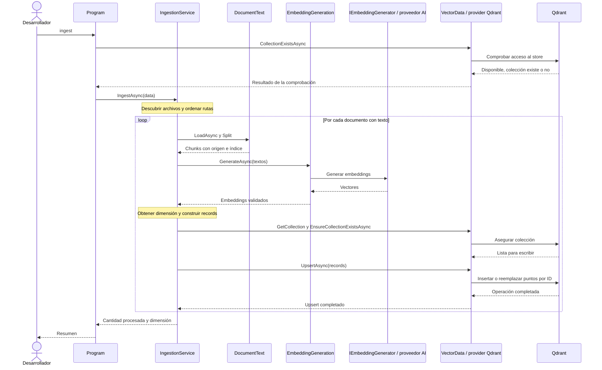

# Ingesta y persistencia

`ingest` prepara el índice para consultas posteriores. [`IngestionService`](../src/RagVectorStore/IngestionService.cs) recibe por constructor el generador de embeddings y el `VectorStore`; no crea clientes ni lee variables de entorno.

## Recorrido

1. `Program.cs` consulta si existe la colección para comprobar conectividad con Qdrant antes de consumir embeddings. Que todavía no exista no es un error para la ingesta.
2. `IngestAsync` comprueba `data/`, descubre `.md` y `.txt` en su nivel superior y ordena las rutas con `StringComparer.Ordinal`.
3. Por cada documento, obtiene su nombre, lee y divide el texto. Omite los documentos que quedan vacíos.
4. Envía los textos de ese documento juntos a `EmbeddingGeneration.GenerateAsync`.
5. Obtiene la dimensión real, comprueba consistencia entre documentos y accede a la colección con ese esquema.
6. Asegura que exista la colección, empareja cada chunk con su vector y ejecuta un `UpsertAsync` con los records del documento.

El diagrama agrupa adaptadores y transporte para hacer visible la secuencia principal. Un error interrumpe el comando y llega al manejo de errores de `Program.cs`.

## Qué significa upsert

Upsert combina insertar y actualizar: con un ID nuevo se inserta un punto; con uno existente se reemplaza. Como el ID depende del documento y la posición, ejecutar dos veces la ingesta del mismo corpus no agrega duplicados. [Operaciones de puntos en Qdrant](https://qdrant.tech/documentation/manage-data/points/).

No se compara el texto para decidir si generar embeddings: una nueva ingesta vuelve a generarlos y puede consumir cuota aunque los IDs sean los mismos. Tampoco existe una transacción global para todos los archivos: un error después del primer documento puede dejar una ingesta parcial.

No implementamos sincronización completa. Si se elimina, renombra o acorta un documento, pueden quedar puntos huérfanos. Cambiar tamaño u overlap también modifica la correspondencia entre posiciones y texto. Este ejemplo no elimina esas entradas ni mantiene versiones de corpus o modelo.

## Persistencia y cambio de modelo

El volumen Docker conserva records, payload y vectores. `query` puede ejecutarse en otro proceso sin volver a leer documentos ni llamar a `ingest`.

Usá el mismo modelo de embeddings al escribir y consultar. Si lo cambiás, planificá reconstruir el índice completo: igual dimensión no significa igual espacio semántico. `EnsureCollectionExistsAsync` no migra ni vacía una colección existente. El nombre fijo `dac_rag_documents` tampoco contiene una versión del modelo.

Para observar idempotencia y persistencia, seguí las [comprobaciones manuales del README](../README.md#estado-de-los-datos-y-persistencia). Si necesitás reiniciar los datos, revisá primero el efecto destructivo de `down --volumes` en [infraestructura](02-configuracion-e-infraestructura.md#docker-y-almacenamiento).

## Qué muestra la consola

Por archivo se muestran la cantidad de chunks y cada ID actualizado. Al final aparecen dimensión y cantidad total **procesada en esta ejecución**. Ese total no es un conteo remoto de todos los puntos: la colección puede conservar registros anteriores.

No se imprimen todos los números de los vectores. Para inspeccionar los puntos persistidos se puede usar el dashboard local de Qdrant, como indica el README.

[Mapa](01-mapa-de-la-solucion.md) · [Consulta, contexto y respuesta](06-consulta-contexto-y-respuesta.md).
