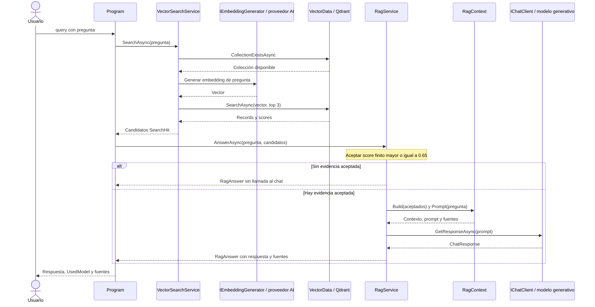

# Consulta, contexto y respuesta

La consulta tiene dos decisiones distintas: **qué candidatos recupera el store** y **qué evidencia acepta la aplicación**. Después, el modelo generativo recibe sólo el contexto aceptado.

## VectorSearchService

[`VectorSearchService.SearchAsync`](../src/RagVectorStore/VectorSearchService.cs) valida la pregunta y comprueba que exista la colección antes de pedir su embedding. Si falta, indica ejecutar `ingest`.

Genera un embedding para la pregunta con el mismo generador configurado para los documentos. Obtiene la colección usando la dimensión real y ejecuta:

```csharp
await foreach (VectorSearchResult<DocumentChunkRecord> result in collection.SearchAsync(
    queryVector, top: RagSettings.TopK, cancellationToken: cancellationToken))
{
    // El resultado contiene el record recuperado y el score del store.
}
```

`await foreach` consume resultados asíncronos conforme están disponibles. La aplicación conserva aquellos cuyo score existe y es finito, y los transforma en `SearchHit(Record, Score)`. No calcula coseno en .NET ni vuelve a leer los archivos. No solicita los vectores de los resultados: texto y procedencia bastan para construir el contexto.

`RagSettings.TopK = 3` limita la cantidad de candidatos. No asegura tres resultados, diversidad de documentos ni relevancia. La búsqueda mantiene el orden recibido; no hay un segundo ranking en la aplicación. Para esta colección Cosine, un score mayor indica más cercanía; no representa una probabilidad de respuesta correcta. [Vector search en .NET](https://learn.microsoft.com/en-us/dotnet/ai/vector-stores/overview), [búsqueda en Qdrant](https://qdrant.tech/documentation/search/search/).

## RagService

[`RagService.AnswerAsync`](../src/RagVectorStore/RagService.cs) recibe los candidatos y retiene scores finitos mayores o iguales a `RagSettings.MinimumScore` (0.65). Es un valor experimental para el corpus y modelo verificados, no una constante universal de RAG.

Si ningún candidato supera el umbral, devuelve `RagAnswer` con un mensaje de falta de contexto, fuentes vacías y `UsedModel = false`. No llama a chat; la búsqueda sí utilizó embeddings. Por eso `UsedModel` informa específicamente sobre el **modelo generativo**, no sobre cualquier consumo de IA.

Si hay candidatos aceptados, construye `RagContext`, muestra el contexto y llama una vez a `IChatClient.GetResponseAsync`. No completa los puestos descartados con una nueva búsqueda ni implementa re-ranking.

## RagContext

[`RagContext.Build`](../src/RagVectorStore/RagContext.cs) concatena los fragmentos aceptados, con una cabecera que identifica fuente, documento e índice. Mantiene el orden de entrada y deduplica la lista de fuentes mediante comparación ordinal.

`Prompt(question)` agrega instrucciones para responder desde ese contexto, tratarlo como información y reconocer falta de evidencia. Usa un literal de texto multilínea interpolado de C# para que el prompt sea visible en el código. Los delimitadores `<contexto>` son texto de organización, no una barrera de seguridad ni un formato XML validado.

El prompt completo se envía mediante la sobrecarga de `GetResponseAsync` que recibe texto. No hay historial conversacional, mensaje de sistema separado ni verificador posterior de la respuesta. La instrucción ayuda al grounding, pero no garantiza exactitud ni protección completa frente a instrucciones maliciosas presentes en documentos. [API oficial de IChatClient](https://learn.microsoft.com/en-us/dotnet/ai/ichatclient).

## Secuencia completa



Si la colección no existe o falla una dependencia, el comando termina por el camino de error; no devuelve una respuesta RAG de éxito.

## RagAnswer y trazabilidad

`RagAnswer(Text, Sources, UsedModel)` permite presentar el resultado sin reconstruir decisiones. `Sources` proviene de los records aceptados, no de nombres inventados por el modelo.

La lista indica qué fuentes se enviaron como contexto. No demuestra que cada afirmación de la respuesta esté respaldada ni que el modelo haya utilizado todos los fragmentos. Un score alto tampoco demuestra que el chunk contenga la respuesta: similitud y suficiencia de evidencia son criterios relacionados, pero diferentes.

Para seguir el flujo con un depurador, ubicá puntos de interrupción al obtener `hits` en `Program.cs`, después del filtro `accepted` y antes de `GetResponseAsync` en `RagService.cs`. Podrás comparar candidatos, contexto enviado y respuesta sin inspeccionar los vectores completos.

[Mapa](01-mapa-de-la-solucion.md) · [Tests y diagnóstico](07-tests-y-diagnostico.md).
